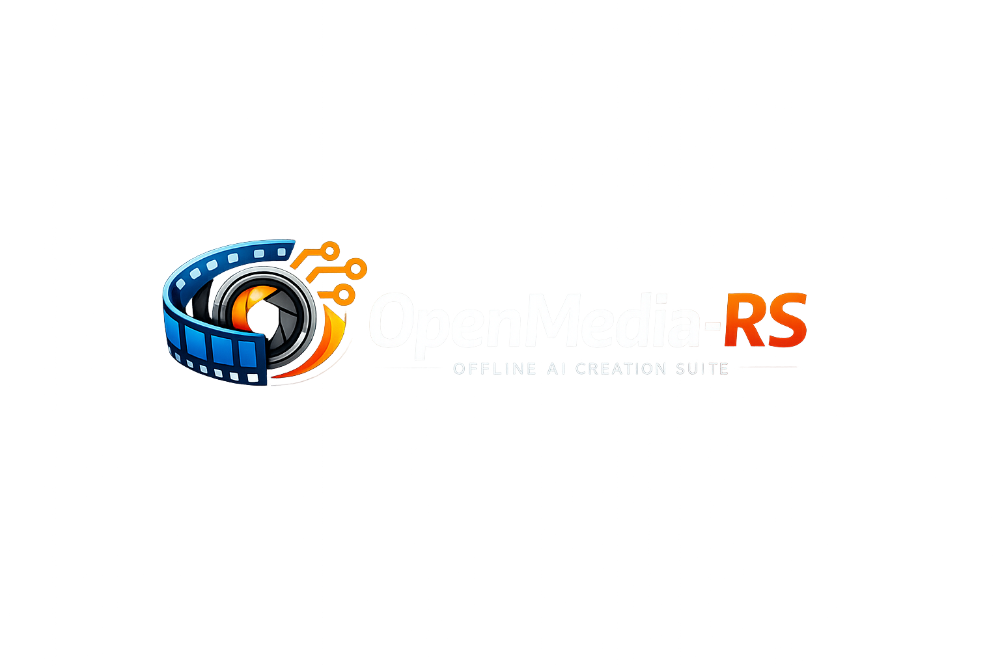

# OpenMedia-RS

<p align="center">
  
</p>

> **A Rust-native Model Context Protocol (MCP) server suite that gives AI agents the power to generate, process, and refine images, videos, SVGs, and animations — entirely offline, on consumer hardware.**

Vibecoded by **Aswin** 🚀

---

## 🎨 Inspiration
The inspiration for OpenMedia-RS comes from:
1. **Remotion**: The revolutionary Node-based React-to-video framework. We wanted to build a Rust-pure, super lightweight, offline-first equivalent that compiles to a single binary.
2. **Native Offline AI Tools**: Eliminating Python virtual environments and complex system dependencies (like `diffusers`, `torch`, `npm`, `venv`) in favor of direct execution using efficient Rust-native ML backends.

---

## ⚡ What We Have Done (v0.0.16 Advanced Transitions & Charts)
* **Advanced Transitions & Charts (v0.0.16)**: Added support for Blur (2-pass horizontal/vertical box filter), Glitch (RGB split displacement and scanline static noise), and Radial Wipe (clock-reveal boundary checks) transition blending natively in `openmedia-video`. Implemented Area (translucent filled polygon path), Scatter (coordinate circle markers), and Radar ( spiderweb grid spokes and polar paths) chart layout engines in `openmedia-svg`.
* **Custom Video Template CRUD Tools (`template_*`)**: Added `template_create`, `template_read`, `template_update`, and `template_delete` MCP tools allowing AI agents to dynamically build, inspect, update, and delete customized reusable video templates.
* **Dynamic Template Interpolation (`video_from_template`)**: Configured custom templates to read definitions from `assets/templates/`, interpolate variables (like colors, texts) with string placeholder substitutions, and render them in the video pipeline.
* **Native Vector Chart Rendering Support**: Implemented proper data parsing and chart generation in `generate_chart` (in `openmedia-svg`), resolving a previous placeholder stub. Chart elements can now parse JSON data correctly and delegate to internal `create_chart` layouts.
* **Custom Transition Easing & Duration Overrides**: Extended the transition engine to support customizable easing overrides (`linear`, `ease_in`, `ease_out`, `ease_in_out`, and case-insensitive matching). Allowed overriding default durations and easing in templates via JSON parameters (`transition_type`, `transition_duration`, `transition_easing`).
* **Dynamic Font Loading & SVG Integration**: Added support for loading local `.ttf`/`.otf` files and downloading remote fonts. Configured `resvg`'s `fontdb` database dynamically in the frame rendering pipeline.
* **High-Performance Font Caching**: Designed thread-safe caches for system font databases, HTML base64 CSS declarations, and transient download failures (with 60s TTL) to maximize video rendering frame rates.
* **Telemetry Progress Isolation**: Configured a thread-safe `StderrProgressReporter` to emit per-byte streaming progress metrics directly to `stderr`, preserving the integrity of standard output (`stdout`) for clean MCP JSON-RPC stdio transport communication.
* **Production Dockerization**: Set up a multi-stage production `Dockerfile` creating a lightweight Debian-slim container pre-configured with headless Chrome and FFmpeg runtime requirements.
* **CI/CD & GitHub Actions Release Automation**: Added `.github/workflows/release.yml` with a cross-compilation pipeline matrix building and publishing optimized assets for Linux (x86_64), macOS (x86_64, aarch64), and Windows (x86_64) on tag pushes.
* **Release Profile Optimizations**: Configured optimized release settings (`opt-level = 3`, LTO, codegen-units, panic abort, strip) inside the workspace [Cargo.toml](Cargo.toml) to minimize binary sizes and maximize speed.
* **Model Download MCP Tool**: Registered the `model_download` tool over the stdio interface, enabling AI agents to pull models on-demand.
* **Multi-Crate Workspace Architecture**: Created an 8-crate workspace spanning core engine, image, video, SVG, animate, process, quality improvement, and MCP server crates.
* **Dyn Compatible Trait Architecture**: Annotated [DiffusionPipeline](crates/openmedia-image/src/lib.rs) and [FrameRenderer](crates/openmedia-video/src/lib.rs) with `#[async_trait]` to resolve compiler object safety blockers.
* **JSON-RPC Stdio Loop**: Fully wired [OpenMediaServer](crates/openmedia-mcp/src/lib.rs) with the `rmcp` SDK macros (`#[tool_router(server_handler)]` and `#[tool]`), running completely over stdio transport.
* **Layout-to-Image Engines**:
  * **SVG Rasterizer (`rasterize_svg`)**: Powered by `resvg` + `tiny-skia` to convert SVG vector strings or files into PNG, JPEG, and WebP images on the CPU in $<20$ms.
  * **HTML/CSS Snapshotter (`html_to_image`)**: Integrates `chromiumoxide` to launch headless Chrome, render complex web templates, and capture screenshots.
* **SVG Animation Engine (`openmedia-animate`)**:
  * **SMIL XML Writer**: Generates `<animate>`, `<animateTransform>`, `<animateMotion>`, `<set>` elements with target `href` links and duration/delay triggers.
  * **CSS @keyframes Generator**: Handles keyframe percentages, target classes, iteration counts, fill modes, and animation shorthand.
  * **Path Morphing**: Parses, equalizes vertex counts using collapse logic, and interpolates between two path data strings.
  * **Sequencing Timeline**: Orchestrates sequential, parallel, and staggered animations by resolving absolute timings.
  * **Lottie Converter**: Imports Lottie JSON and translates shape layers/keyframes into animated SVGs.
* **Video Scene Composition Engine (`openmedia-video`)**:
  * **JSON-based Scene DSL**: Parses and validates multi-track visual element layers (Text, Image, Shape, SVG, Chart, Code, HTML) and layouts.
  * **Unified Compositor**: Layer-composites elements with alpha opacity/premultiplication correction on the CPU or handles complex layouts via headless Chromium rendering.
  * **Transitions Blender**: Implements frame-level crossfades, slides, and wipes between scene clips.
  * **Piped Video Encoder**: Encodes raw frame streams using an optimized FFmpeg pipe over stdin, outputting H.264/AAC MP4 files.
  * **Audio Track Mixer**: Dynamically mixes background narration and music tracks with configurable offsets, volumes, and fade timings.
* **Scoring & Self-Improvement System (`openmedia-improve`)**:
  * **CLIP Scorer**: Computes cosine similarity between image and text embeddings using `ort` (ONNX Runtime) session execution with Lanczos3 image scaling and BPE tokenization.
  * **Generation History Database**: Logs all tool outputs, request inputs, aesthetic scores, and generation parameters to a version-controlled SQLite database schema.
  * **Prompt Refiner**: Applies quality-boosting modifier tokens and default defect-reducing negative prompts based on quality score feedback.
  * **Iterative Refinement Loop**: Runs auto-refine feedback chains (generate → score → refine → rebuild) using fallback vector rendering.
* **28 MCP Tools Registered**: Integrated 6 animation tools, 12 video and template tools, 5 quality self-improvement tools, model download, Mermaid diagram generation, and the new SVG canvas/chart/icon builder tools.
* **Tested & Sandbox Verified**: Built robust unit and integration tests verifying MCP tool bindings, schema generation, image encoding, video compilation, transitions, audio mixing, history database inserts, prompt refinement, and registry model downloads. Tests pass cleanly with `cargo test --workspace`.
* **Mermaid Integration Verification**: Verification suite includes native Mermaid parser output tests and rasterized diagram image format tests.
* **Refined Lightweight Architecture**: Re-scoped the project to focus on a strictly lightweight vector rendering, diagram compilation, and layout animation engine (< 50MB RAM/ROM footprint). Bypassed heavy local AI diffusion models in favor of online LLM/multimodal agents acting as the visual code designers.
* **JSON-to-SVG Canvas Engine (`openmedia-svg`)**: Implemented deserialization schema rules for structured canvas shapes (Rects, Circles, Texts) to compile JSON arrays into standard SVG vector markup natively.
* **Custom Chart Engine (`create_chart`)**: Built vertical bars charting, smooth bezier curve plotting, and polar coordinates pie slice drawing (using arc paths) with configurable legend keys and titles.
* **Embedded Vector Icon Library (`create_icon`)**: Bundled 20 popular Feather/Lucide vector paths (e.g. home, user, settings, play, check) to scale and style on demand.
* **Mermaid Diagram Engine (`openmedia-svg`)**: Integrated native Mermaid diagram compilation using `mermaid-rs-renderer`, enabling offline flowchart, sequence diagram, and architecture graph generation natively in Rust without browser or network dependencies.
* **Mermaid MCP Tool (`diagram_generate_mermaid`)**: Registered the `diagram_generate_mermaid` tool to compile Mermaid string definitions, saving them to the output directory as SVG, PNG, JPEG, or WebP.
* **Model Auto-Download Experience (`openmedia-core`)**: Integrated registry streams to download CLIP text, CLIP vision, and LAION Aesthetic predictor models directly from the Hugging Face Hub, utilizing `reqwest` chunk-by-chunk streams.
* **Telemetry Progress Isolation**: Configured a thread-safe `StderrProgressReporter` to emit per-byte streaming progress metrics directly to `stderr`, preserving the integrity of standard output (`stdout`) for clean MCP JSON-RPC stdio transport communication.
* **Production Dockerization**: Set up a multi-stage production `Dockerfile` creating a lightweight Debian-slim container pre-configured with headless Chrome and FFmpeg runtime requirements.
* **CI/CD & GitHub Actions Release Automation**: Added `.github/workflows/release.yml` with a cross-compilation pipeline matrix building and publishing optimized assets for Linux (x86_64), macOS (x86_64, aarch64), and Windows (x86_64) on tag pushes.
* **Release Profile Optimizations**: Configured optimized release settings (`opt-level = 3`, LTO, codegen-units, panic abort, strip) inside the workspace [Cargo.toml](Cargo.toml) to minimize binary sizes and maximize speed.
* **Model Download MCP Tool**: Registered the `model_download` tool over the stdio interface, enabling AI agents to pull models on-demand.
* **Multi-Crate Workspace Architecture**: Created an 8-crate workspace spanning core engine, image, video, SVG, animate, process, quality improvement, and MCP server crates.
* **Dyn Compatible Trait Architecture**: Annotated [DiffusionPipeline](crates/openmedia-image/src/lib.rs) and [FrameRenderer](crates/openmedia-video/src/lib.rs) with `#[async_trait]` to resolve compiler object safety blockers.
* **JSON-RPC Stdio Loop**: Fully wired [OpenMediaServer](crates/openmedia-mcp/src/lib.rs) with the `rmcp` SDK macros (`#[tool_router(server_handler)]` and `#[tool]`), running completely over stdio transport.
* **Layout-to-Image Engines**:
  * **SVG Rasterizer (`rasterize_svg`)**: Powered by `resvg` + `tiny-skia` to convert SVG vector strings or files into PNG, JPEG, and WebP images on the CPU in $<20$ms.
  * **HTML/CSS Snapshotter (`html_to_image`)**: Integrates `chromiumoxide` to launch headless Chrome, render complex web templates, and capture screenshots.
* **SVG Animation Engine (`openmedia-animate`)**:
  * **SMIL XML Writer**: Generates `<animate>`, `<animateTransform>`, `<animateMotion>`, `<set>` elements with target `href` links and duration/delay triggers.
  * **CSS @keyframes Generator**: Handles keyframe percentages, target classes, iteration counts, fill modes, and animation shorthand.
  * **Path Morphing**: Parses, equalizes vertex counts using collapse logic, and interpolates between two path data strings.
  * **Sequencing Timeline**: Orchestrates sequential, parallel, and staggered animations by resolving absolute timings.
  * **Lottie Converter**: Imports Lottie JSON and translates shape layers/keyframes into animated SVGs.
* **Video Scene Composition Engine (`openmedia-video`)**:
  * **JSON-based Scene DSL**: Parses and validates multi-track visual element layers (Text, Image, Shape, SVG, Chart, Code, HTML) and layouts.
  * **Unified Compositor**: Layer-composites elements with alpha opacity/premultiplication correction on the CPU or handles complex layouts via headless Chromium rendering.
  * **Transitions Blender**: Implements frame-level crossfades, slides, and wipes between scene clips.
  * **Piped Video Encoder**: Encodes raw frame streams using an optimized FFmpeg pipe over stdin, outputting H.264/AAC MP4 files.
  * **Audio Track Mixer**: Dynamically mixes background narration and music tracks with configurable offsets, volumes, and fade timings.
* **Scoring & Self-Improvement System (`openmedia-improve`)**:
  * **CLIP Scorer**: Computes cosine similarity between image and text embeddings using `ort` (ONNX Runtime) session execution with Lanczos3 image scaling and BPE tokenization.
  * **Generation History Database**: Logs all tool outputs, request inputs, aesthetic scores, and generation parameters to a version-controlled SQLite database schema.
  * **Prompt Refiner**: Applies quality-boosting modifier tokens and default defect-reducing negative prompts based on quality score feedback.
  * **Iterative Refinement Loop**: Runs auto-refine feedback chains (generate → score → refine → rebuild) using fallback vector rendering.
* **24 MCP Tools Registered**: Integrated 6 animation tools, 8 video tools, 5 quality self-improvement tools, model download, Mermaid diagram generation, and the new SVG canvas/chart/icon builder tools.
* **Tested & Sandbox Verified**: Built robust unit and integration tests verifying MCP tool bindings, schema generation, image encoding, video compilation, transitions, audio mixing, history database inserts, prompt refinement, and registry model downloads. Tests pass cleanly with `cargo test --workspace`.
* **Mermaid Integration Verification**: Verification suite includes native Mermaid parser output tests and rasterized diagram image format tests.

---

## 🖼️ Render Showcase

Here are the sample media assets generated natively, offline, and entirely in Rust using the OpenMedia-RS engine.

### 🎥 Promotional Videos & Trailer

We have generated high-quality cinematic advertisement videos to showcase the layout composition and transitions blending. They are rendered entirely using OpenMedia-RS.

#### 🎬 Official Launch Trailer (30s, 24fps)
> [!TIP]
> The trailer features zero stock assets. Every visual, chart, icon, and background animation is generated by OpenMedia-RS itself.
> If the player below does not load, you can [▶️ Play/Download the Trailer directly](https://github.com/aswin402/openmedia-rs/raw/main/assets/openmedia_promo.mp4).

<video src="https://github.com/aswin402/openmedia-rs/raw/main/assets/openmedia_promo.mp4" width="100%" controls muted autoplay loop poster="https://github.com/aswin402/openmedia-rs/raw/main/assets/sample_image.png">
  Your browser does not support the video tag. You can view the video directly [here](https://github.com/aswin402/openmedia-rs/raw/main/assets/openmedia_promo.mp4).
</video>

#### 💻 SaaS UI Feature Showcase (30s, 15fps)
> [!TIP]
> If the player below does not load, you can [▶️ Play/Download the Feature Showcase directly](https://github.com/aswin402/openmedia-rs/raw/main/assets/openmedia_sample.mp4).

<video src="https://github.com/aswin402/openmedia-rs/raw/main/assets/openmedia_sample.mp4" width="100%" controls muted loop poster="https://github.com/aswin402/openmedia-rs/raw/main/assets/sample_image.png">
  Your browser does not support the video tag. You can view the video directly [here](https://github.com/aswin402/openmedia-rs/raw/main/assets/openmedia_sample.mp4).
</video>

---

### 🖼️ Generated Layout Images & Mockups
These graphics are generated and rasterized natively via the OpenMedia-RS layout composition and SVG engines (using the `rasterize` tool).

| Asset | Preview | Description |
| :--- | :--- | :--- |
| **Sample Image (PNG)** |  | High-performance CPU-rasterized PNG from an SVG layout. |

---

### 🌀 Custom SVGs & Vector Graphics
Clean vector diagrams, charts, and loaders generated natively via OpenMedia-RS's SVG and canvas engines.

| Asset | Preview | Description |
| :--- | :--- | :--- |
| **Animated Network** |  | Neural network visualization with pulsing nodes and interconnected lines. |
| **MCP Flow Diagram** |  | Pipeline flowchart from the AI Agent through the MCP server to output badges. |
| **Architecture Diagram** |  | Layout demonstrating how OpenMedia MCP handles vectors, animations, and video. |
| **Animated SVG** |  | Vector containing animated rotating ring and pulsing center parameters. |
| **Animated Chart** |  | A dynamic line graph showcasing performance growth over time. |
| **Loading Spinner** |  | Loading sequence SVG with rotating ring segments. |
| **Mermaid Flowchart** |  | Flowchart diagram compiled from Mermaid syntax offline on the CPU. |

---

### 🎨 Custom Icons Set
A set of 10 custom Lucide icons styled and rendered using the `create_icon` tool with glow filters:

<p align="center">
  
  
  
  
  
  
  
  
  
  
</p>

---

### ⏱️ Logo Reveal Timeline Sequence (`logo_reveal_timeline.json`)
The coordinated camera movement and visual effects sequence:

```json
{
  "timeline": {
    "sequence": [
      { "name": "particle_assemble", "start": 0.0, "duration": 2.0 },
      { "name": "glow_pulse", "start": 2.0, "duration": 1.5 },
      { "name": "path_draw", "start": 3.0, "duration": 1.5 },
      { "name": "camera_push", "start": 4.0, "duration": 1.0 }
    ],
    "total_duration": 5.0
  }
}
```

---

## 🚀 What It Will Do (Features & Tools)

OpenMedia-RS exposes the following Model Context Protocol (MCP) tools directly to AI coding agents:

### 1. AI Image Generation (`openmedia-image`)
* **`generate_image`** (txt2img): Generates images using quantized models (like SDXL GGUF or FLUX Schnell).
* **`transform_image`** (img2img): Transforms an existing image guided by a text prompt and strength factor.
* **`inpaint_image`**: Fills white masked regions of an image guided by a text prompt.
* **`upscale_image`**: 2x or 4x super-resolution upscaling using Real-ESRGAN ONNX models.
* **`remove_background`**: Segment and isolate image foregrounds using U2-Net.

### 2. Video Composition (`openmedia-video`)
* **`html_to_image`** (Active 🟢): Renders HTML/CSS layout templates or files to PNG, JPEG, or WebP screenshots.
* **`video_create`** (Active 🟢): Renders frame-by-frame scenes defined using a JSON Scene DSL (HTML/CSS layout or SVG) and compiles them into H.264 videos using native FFmpeg pipeline hooks.
* **`video_preview`** (Active 🟢): Renders a preview frame at a specific timestamp.
* **`video_create_slideshow`** (Active 🟢): Compiles an image sequence with transitions (crossfade, slide, wipe) and mixes background audio.
* **`video_add_transition`** (Active 🟢): Adds scene transitions inside the DSL description.
* **`video_add_audio`** (Active 🟢): Fuses audio tracks into existing video containers or JSON descriptions.
* **`video_from_template`** (Active 🟢): Instantiates videos from prebuilt templates (supports `"background_music"` and `"audio_tracks"` overlays mixing).
* **`template_create`** (Active 🟢): Save a new custom video scene template containing parameter placeholders.
* **`template_read`** (Active 🟢): Read a specific custom template definition, or list all available custom and built-in templates.
* **`template_update`** (Active 🟢): Update an existing custom template definition.
* **`template_delete`** (Active 🟢): Delete a custom template definition.
* **`video_extract_frames`** (Active 🟢): Extracts keyframe images from a video at specific time offsets.
* **`video_trim`** (Active 🟢): Trims a video file to a specific time range.

### 3. SVG Vector & Diagram Generation (`openmedia-svg`)
* **`rasterize_svg`** (Active 🟢): Converts SVG vector strings or files directly to PNG, JPEG, or WebP images.
* **`diagram_generate_mermaid`** (Active 🟢): Compiles flowcharts, sequence diagrams, and architecture graphs from Mermaid markdown text into SVG, PNG, JPEG, or WebP.
* **`create_svg`** (Active 🟢): Generate custom SVG layouts from a list of JSON-defined shapes and primitives.
* **`create_chart`** (Active 🟢): Generate customizable bar, line, and pie charts from raw JSON data.
* **`create_icon`** (Active 🟢): Retrieve styled vector interface icons from an embedded library.
* **`create_diagram`**: Renders auto-laid-out Flowcharts, UML sequence, architecture, and ER diagrams.

### 4. SVG Animation (`openmedia-animate`)
* **`animate_svg`** (Active 🟢): Apply animation presets (such as fade_in, spin, bounce, pulse, typewriter, draw_path) to SVG elements.
* **`animate_create_timeline`** (Active 🟢): Sequentially or concurrently coordinate animations of multiple elements.
* **`animate_morph_paths`** (Active 🟢): Interpolate morph frames between two path data strings.
* **`animate_generate_spinner`** (Active 🟢): Generate beautiful animated loading spinner SVGs.
* **`animate_from_lottie`** (Active 🟢): Import Lottie JSON and convert to an animated SVG.
* **`animate_to_lottie`** (Active 🟢): Export SVG to Lottie JSON.

### 5. Quality Evaluation & Self-Improvement (`openmedia-improve`)
* **`improve_score_image`** (Active 🟢): Score an image's alignment to a text prompt using CLIP and visual aesthetic predictor models.
* **`improve_refine_prompt`** (Active 🟢): Get prompt refinement modifications and recommendations based on quality parameters.
* **`improve_auto_refine`** (Active 🟢): Refine generated assets iteratively, evaluating intermediate output quality and logging historical chains.
* **`improve_feedback`** (Active 🟢): Log manual rating scores and artifact description comments on specific generations.
* **`improve_quality_report`** (Active 🟢): Fetch comprehensive quality database statistics and trends over time.

### 6. Model Management & Downloads (`openmedia-core`)
* **`model_download`** (Active 🟢): Download a specified model file (CLIP text/vision or Aesthetic predictor) from Hugging Face Hub with progress tracking directly to stderr.

---


## 💻 System Requirements

| Component | Minimum | Recommended |
| :--- | :--- | :--- |
| **Processor** | Dual-Core CPU (with AVX2 or ARM NEON support) | 4+ Core CPU (AVX-512 preferred) |
| **RAM** | 4 GB Total (fits under 1 GB for CLIP/Aesthetic scoring) | 8 GB+ Total |
| **ROM (Storage)** | < 1 GB (for optimized binary & base CLIP/Aesthetic models) | 10 GB+ (if downloading large diffusion models) |
| **Runtime** | Rust 1.82+ (Zero Python/Node.js required) | Rust 1.82+ |
| **Optional Extras**| FFmpeg (for video encoding/muxing), Chromium | FFmpeg, Vulkan SDK / CUDA Toolkit / Metal |

---

## ⚖️ Comparison to Other Tools

| Dimension | OpenMedia-RS | Remotion (Node.js) | HeyGen Hyperframes | Python Diffusers Suite |
| :--- | :--- | :--- | :--- | :--- |
| **Runtime Size** | **~60MB** (Stripped release binary) | 500MB+ (Node modules + package) | 500MB+ (Node modules + package) | 5GB+ (PyTorch, virtualenv, CUDA libraries) |
| **Tech Stack** | **Pure Rust** (resvg, tiny-skia, FFmpeg) | TypeScript, React, Puppeteer, FFmpeg | JavaScript, HTML/CSS, Headless Chrome | Python, PyTorch, Diffusers |
| **Rendering Flow** | **Hybrid / Offline-first**: CPU Vector Engine (resvg) in $<20$ms; Headless Chromium only as opt-in | Headless Browser screenshotting (Puppeteer) | Headless Browser screenshotting (deterministic Chrome) | Deep Learning Diffusion execution |
| **MCP Integration**| **Native** (Built-in JSON-RPC, 20+ tools) | Requires custom Node wrapper | Requires custom wrapper | Requires custom Python wrap scripts |
| **Architecture** | Agent-native Model Context Protocol | Developer-centric React API | Agent-native HTML/CSS DSL | Deep Learning Models |
| **Hardware Fit** | **Ultra-low-spec friendly** (<1GB RAM/ROM footprint, SIMD CPU fallback) | Moderate (CPU-bound) | Moderate (CPU-bound) | High-spec required (8GB+ VRAM typical) |

---

## 🛡️ License
Licensed under either of [Apache License, Version 2.0](LICENSE-APACHE) or [MIT license](LICENSE-MIT) at your option.
