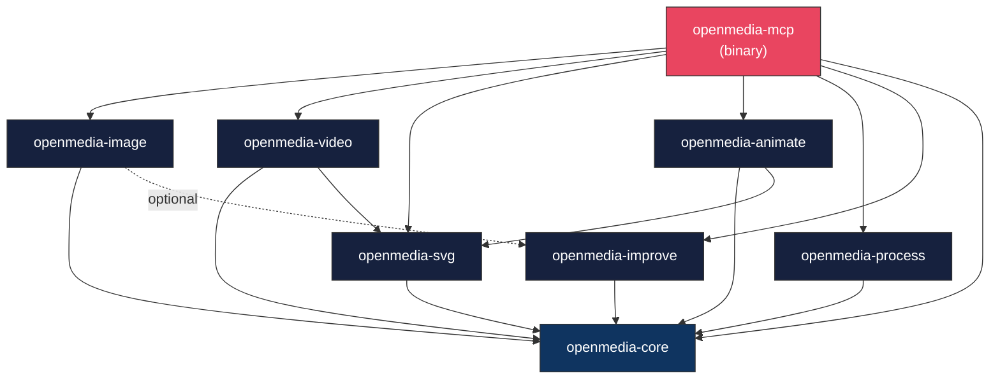

# OpenMedia-RS — Core Architecture

> **Complete Rust type system, trait definitions, and implementation patterns for every crate in the workspace.**

---

## Table of Contents

1. [Workspace Structure](#1-workspace-structure)
2. [openmedia-core](#2-openmedia-core)
3. [openmedia-image](#3-openmedia-image)
4. [openmedia-video](#4-openmedia-video)
5. [openmedia-svg](#5-openmedia-svg)
6. [openmedia-animate](#6-openmedia-animate)
7. [openmedia-process](#7-openmedia-process)
8. [openmedia-improve](#8-openmedia-improve)
9. [openmedia-mcp](#9-openmedia-mcp)
10. [Configuration Schema](#10-configuration-schema)
11. [SQLite Database Schema](#11-sqlite-database-schema)
12. [WGSL Shader Catalog](#12-wgsl-shader-catalog)

---

## 1. Workspace Structure

### 1.1 Directory Tree

```
openmedia-rs/
├── Cargo.toml                          # Workspace manifest
├── Cargo.lock
├── config.toml                         # Default server configuration
├── README.md
├── LICENSE-MIT
├── LICENSE-APACHE
├── crates/
│   ├── openmedia-core/
│   │   ├── Cargo.toml
│   │   └── src/
│   │       ├── lib.rs                  # Re-exports
│   │       ├── config.rs               # Configuration types
│   │       ├── error.rs                # Error enum
│   │       ├── hardware.rs             # Hardware detection
│   │       ├── model.rs                # Model registry
│   │       ├── output.rs               # Output types (ImageOutput, VideoSpec, etc.)
│   │       ├── progress.rs             # Progress reporting trait
│   │       └── quality.rs              # Quality scoring types
│   ├── openmedia-image/
│   │   ├── Cargo.toml
│   │   └── src/
│   │       ├── lib.rs
│   │       ├── pipeline.rs             # DiffusionPipeline trait
│   │       ├── request.rs              # Request structs
│   │       ├── scheduler.rs            # Noise schedulers
│   │       ├── backend/
│   │       │   ├── mod.rs
│   │       │   ├── candle.rs           # Candle backend
│   │       │   ├── onnx.rs             # ONNX Runtime backend
│   │       │   └── diffusion_rs.rs     # diffusion_rs GGUF backend
│   │       ├── upscale.rs              # Real-ESRGAN upscaler
│   │       └── background.rs           # U2-Net background removal
│   ├── openmedia-video/
│   │   ├── Cargo.toml
│   │   └── src/
│   │       ├── lib.rs
│   │       ├── scene.rs                # Scene DSL types
│   │       ├── element.rs              # Scene elements
│   │       ├── timeline.rs             # Keyframes and transitions
│   │       ├── renderer/
│   │       │   ├── mod.rs              # FrameRenderer trait + select_renderer
│   │       │   ├── svg_renderer.rs     # Tier-1: resvg
│   │       │   ├── native_renderer.rs  # Tier-2: hyper_render
│   │       │   └── browser_renderer.rs # Tier-3: headless Chrome
│   │       ├── encoder.rs              # FFmpeg encoder
│   │       ├── audio.rs                # Audio mixing
│   │       └── css_parser.rs           # CSS animation parsing
│   ├── openmedia-svg/
│   │   ├── Cargo.toml
│   │   └── src/
│   │       ├── lib.rs
│   │       ├── builder.rs              # SvgBuilder fluent API
│   │       ├── chart.rs                # Chart generation
│   │       ├── diagram.rs              # Diagram generation
│   │       ├── icon.rs                 # Icon set
│   │       ├── optimizer.rs            # SVG optimization
│   │       └── rasterizer.rs           # SVG → raster conversion
│   ├── openmedia-animate/
│   │   ├── Cargo.toml
│   │   └── src/
│   │       ├── lib.rs
│   │       ├── smil.rs                 # SMIL animation types
│   │       ├── css.rs                  # CSS @keyframes
│   │       ├── easing.rs               # Easing functions
│   │       ├── timeline.rs             # Animation timeline
│   │       ├── morph.rs                # Path morphing
│   │       ├── preset.rs               # Animation presets
│   │       └── lottie.rs               # Lottie conversion
│   ├── openmedia-process/
│   │   ├── Cargo.toml
│   │   └── src/
│   │       ├── lib.rs
│   │       ├── gpu.rs                  # wgpu GPU pipeline
│   │       ├── cpu.rs                  # CPU fallback
│   │       ├── operation.rs            # Operation enum
│   │       └── blend.rs                # Blend modes
│   ├── openmedia-improve/
│   │   ├── Cargo.toml
│   │   └── src/
│   │       ├── lib.rs
│   │       ├── clip.rs                 # CLIP scoring
│   │       ├── aesthetic.rs            # Aesthetic scoring
│   │       ├── history.rs              # SQLite generation history
│   │       ├── refiner.rs              # Prompt refinement
│   │       └── feedback.rs             # Feedback collection
│   └── openmedia-mcp/
│       ├── Cargo.toml
│       └── src/
│           ├── main.rs                 # Entry point
│           ├── server.rs               # MCP server struct
│           ├── tools/
│           │   ├── mod.rs
│           │   ├── image.rs            # Image generation tools
│           │   ├── video.rs            # Video tools
│           │   ├── svg.rs              # SVG tools
│           │   ├── animation.rs        # Animation tools
│           │   ├── process.rs          # Image processing tools
│           │   ├── improve.rs          # Self-improvement tools
│           │   └── utility.rs          # Utility tools
│           └── resources.rs            # MCP resources
├── shaders/
│   ├── blur.wgsl
│   ├── sharpen.wgsl
│   ├── color.wgsl
│   ├── blend.wgsl
│   ├── resize.wgsl
│   └── transform.wgsl
├── tests/
│   ├── integration/
│   │   ├── image_gen_test.rs
│   │   ├── video_test.rs
│   │   ├── svg_test.rs
│   │   └── mcp_test.rs
│   └── fixtures/
│       ├── test_image.png
│       ├── test_mask.png
│       └── test_scene.json
└── docs/
    ├── SPEC.md
    └── CORE.md
```

### 1.2 Crate Dependency Diagram



### 1.3 Workspace Cargo.toml

```toml
[workspace]
resolver = "2"
members = [
    "crates/openmedia-core",
    "crates/openmedia-image",
    "crates/openmedia-video",
    "crates/openmedia-svg",
    "crates/openmedia-animate",
    "crates/openmedia-process",
    "crates/openmedia-improve",
    "crates/openmedia-mcp",
]

[workspace.package]
version = "0.1.0"
edition = "2024"
license = "MIT OR Apache-2.0"
rust-version = "1.82"

[workspace.dependencies]
# Internal crates
openmedia-core = { path = "crates/openmedia-core" }
openmedia-image = { path = "crates/openmedia-image" }
openmedia-video = { path = "crates/openmedia-video" }
openmedia-svg = { path = "crates/openmedia-svg" }
openmedia-animate = { path = "crates/openmedia-animate" }
openmedia-process = { path = "crates/openmedia-process" }
openmedia-improve = { path = "crates/openmedia-improve" }

# Shared dependencies
tokio = { version = "1.42", features = ["full"] }
serde = { version = "1.0", features = ["derive"] }
serde_json = "1.0"
thiserror = "2.0"
tracing = "0.1"
image = "0.25"
uuid = { version = "1.11", features = ["v7"] }
```

---

## 2. openmedia-core

### 2.1 Configuration (`config.rs`)

```rust
use serde::{Deserialize, Serialize};
use std::path::PathBuf;

/// Root configuration for the OpenMedia server.
/// Loaded from config.toml, environment variables, and CLI defaults.
#[derive(Debug, Clone, Serialize, Deserialize)]
pub struct Config {
    /// Server identification and metadata
    pub server: ServerConfig,

    /// File system paths for models, outputs, and data
    pub paths: PathConfig,

    /// Hardware and compute backend preferences
    pub compute: ComputeConfig,

    /// Image generation defaults
    pub image: ImageConfig,

    /// Video generation defaults
    pub video: VideoConfig,

    /// SVG generation defaults
    pub svg: SvgConfig,

    /// Image processing defaults
    pub processing: ProcessingConfig,

    /// Self-improvement system configuration
    pub improve: ImproveConfig,

    /// Resource limits and safety bounds
    pub limits: LimitsConfig,

    /// Logging and diagnostics
    pub logging: LoggingConfig,
}

#[derive(Debug, Clone, Serialize, Deserialize)]
pub struct ServerConfig {
    /// Server name reported via MCP
    pub name: String,
    /// Server version
    pub version: String,
    /// Whether to enable progress notifications
    pub progress_notifications: bool,
}

#[derive(Debug, Clone, Serialize, Deserialize)]
pub struct PathConfig {
    /// Root directory for model storage
    /// Default: ~/.openmedia/models/
    pub model_dir: PathBuf,

    /// Root directory for generated outputs
    /// Default: ~/.openmedia/output/
    pub output_dir: PathBuf,

    /// SQLite database path for generation history
    /// Default: ~/.openmedia/history.db
    pub history_db: PathBuf,

    /// Subdirectory for image outputs
    /// Default: images/
    pub image_subdir: String,

    /// Subdirectory for video outputs
    /// Default: videos/
    pub video_subdir: String,

    /// Subdirectory for SVG outputs
    /// Default: svgs/
    pub svg_subdir: String,

    /// Model checksum file
    /// Default: ~/.openmedia/models/checksums.sha256
    pub checksum_file: PathBuf,
}

#[derive(Debug, Clone, Serialize, Deserialize)]
pub struct ComputeConfig {
    /// Preferred compute backend
    pub preferred_backend: ComputeBackend,

    /// Maximum CPU threads for inference
    /// Default: num_cpus / 2
    pub max_cpu_threads: usize,

    /// Maximum GPU memory to use (bytes)
    /// Default: 0 (auto-detect)
    pub max_gpu_memory: u64,

    /// Enable GPU acceleration for image processing
    pub gpu_processing: bool,

    /// CUDA device index (for multi-GPU systems)
    pub cuda_device: u32,

    /// Enable memory-mapped model loading
    pub mmap_models: bool,
}

#[derive(Debug, Clone, Copy, PartialEq, Eq, Serialize, Deserialize)]
pub enum ComputeBackend {
    /// Automatic selection based on hardware
    Auto,
    /// Candle framework (CPU/CUDA/Metal)
    Candle,
    /// diffusion_rs for GGUF quantized models
    DiffusionRs,
    /// ONNX Runtime
    Ort,
    /// CPU-only (force no GPU)
    CpuOnly,
}

#[derive(Debug, Clone, Serialize, Deserialize)]
pub struct ImageConfig {
    /// Default model for txt2img when "auto"
    pub default_model: String,
    /// Default image width
    pub default_width: u32,
    /// Default image height
    pub default_height: u32,
    /// Default number of denoising steps
    pub default_steps: u32,
    /// Default classifier-free guidance scale
    pub default_cfg_scale: f32,
    /// Default noise scheduler
    pub default_scheduler: String,
    /// Default output format
    pub default_format: String,
    /// Default output quality (JPEG/WebP)
    pub default_quality: u8,
    /// Default CLIP skip layers
    pub default_clip_skip: u32,
    /// Enable auto-refine by default
    pub auto_refine: bool,
    /// Default max refinement rounds
    pub max_refine_rounds: u32,
}

#[derive(Debug, Clone, Serialize, Deserialize)]
pub struct VideoConfig {
    /// Default FPS for video output
    pub default_fps: u32,
    /// Default video codec
    pub default_codec: String,
    /// Default encoding quality preset
    pub default_quality: String,
    /// Default renderer selection
    pub default_renderer: String,
    /// Path to FFmpeg binary
    pub ffmpeg_path: Option<PathBuf>,
    /// Path to Chrome/Chromium binary
    pub chrome_path: Option<PathBuf>,
    /// Number of parallel render threads
    pub render_threads: usize,
}

#[derive(Debug, Clone, Serialize, Deserialize)]
pub struct SvgConfig {
    /// Default SVG width
    pub default_width: u32,
    /// Default SVG height
    pub default_height: u32,
    /// Enable SVG optimization by default
    pub optimize_by_default: bool,
    /// Default coordinate precision (decimal places)
    pub default_precision: u8,
    /// Default chart theme
    pub default_chart_theme: String,
    /// Default diagram direction
    pub default_diagram_direction: String,
}

#[derive(Debug, Clone, Serialize, Deserialize)]
pub struct ProcessingConfig {
    /// Prefer GPU for image processing
    pub prefer_gpu: bool,
    /// Default resize method
    pub default_resize_method: String,
    /// Default output format
    pub default_format: String,
    /// Default JPEG/WebP quality
    pub default_quality: u8,
}

#[derive(Debug, Clone, Serialize, Deserialize)]
pub struct ImproveConfig {
    /// Enable generation history logging
    pub enable_history: bool,
    /// Enable CLIP scoring on image generations
    pub enable_clip_scoring: bool,
    /// Enable aesthetic scoring
    pub enable_aesthetic_scoring: bool,
    /// CLIP score threshold for refinement suggestions
    pub clip_threshold: f32,
    /// Aesthetic score threshold for refinement suggestions
    pub aesthetic_threshold: f32,
    /// Maximum database size in bytes
    pub max_db_size: u64,
}

#[derive(Debug, Clone, Serialize, Deserialize)]
pub struct LimitsConfig {
    /// Maximum image dimension (width or height)
    pub max_image_dimension: u32,
    /// Maximum video duration in seconds
    pub max_video_duration: f64,
    /// Maximum video resolution width
    pub max_video_width: u32,
    /// Maximum video resolution height
    pub max_video_height: u32,
    /// Maximum batch size for image generation
    pub max_batch_size: u32,
    /// Maximum concurrent operations
    pub max_concurrent_ops: usize,
    /// Maximum output file size in bytes
    pub max_output_file_size: u64,
    /// Maximum input file size in bytes
    pub max_input_file_size: u64,
}

#[derive(Debug, Clone, Serialize, Deserialize)]
pub struct LoggingConfig {
    /// Log level: trace, debug, info, warn, error
    pub level: String,
    /// Log format: json, pretty, compact
    pub format: String,
    /// Log to file (path) in addition to stderr
    pub file: Option<PathBuf>,
}

impl Config {
    /// Load configuration with priority: env vars > config file > defaults
    pub fn load() -> Result<Self, OpenMediaError> {
        todo!()
    }

    /// Resolve the full output path for a given category and filename
    pub fn output_path(&self, category: &str, filename: &str) -> PathBuf {
        self.paths.output_dir.join(category).join(filename)
    }

    /// Resolve the model path for a given model ID
    pub fn model_path(&self, category: &str, filename: &str) -> PathBuf {
        self.paths.model_dir.join(category).join(filename)
    }
}

impl Default for Config {
    fn default() -> Self {
        Self {
            server: ServerConfig {
                name: "openmedia".into(),
                version: env!("CARGO_PKG_VERSION").into(),
                progress_notifications: true,
            },
            paths: PathConfig {
                model_dir: dirs::home_dir().unwrap().join(".openmedia/models"),
                output_dir: dirs::home_dir().unwrap().join(".openmedia/output"),
                history_db: dirs::home_dir().unwrap().join(".openmedia/history.db"),
                image_subdir: "images".into(),
                video_subdir: "videos".into(),
                svg_subdir: "svgs".into(),
                checksum_file: dirs::home_dir().unwrap().join(".openmedia/models/checksums.sha256"),
            },
            compute: ComputeConfig {
                preferred_backend: ComputeBackend::Auto,
                max_cpu_threads: num_cpus::get() / 2,
                max_gpu_memory: 0,
                gpu_processing: true,
                cuda_device: 0,
                mmap_models: true,
            },
            image: ImageConfig {
                default_model: "auto".into(),
                default_width: 512,
                default_height: 512,
                default_steps: 20,
                default_cfg_scale: 7.5,
                default_scheduler: "dpm++".into(),
                default_format: "png".into(),
                default_quality: 95,
                default_clip_skip: 1,
                auto_refine: false,
                max_refine_rounds: 3,
            },
            video: VideoConfig {
                default_fps: 30,
                default_codec: "h264".into(),
                default_quality: "balanced".into(),
                default_renderer: "auto".into(),
                ffmpeg_path: None,
                chrome_path: None,
                render_threads: num_cpus::get().min(8),
            },
            svg: SvgConfig {
                default_width: 800,
                default_height: 600,
                optimize_by_default: true,
                default_precision: 2,
                default_chart_theme: "dark".into(),
                default_diagram_direction: "TB".into(),
            },
            processing: ProcessingConfig {
                prefer_gpu: true,
                default_resize_method: "lanczos3".into(),
                default_format: "png".into(),
                default_quality: 95,
            },
            improve: ImproveConfig {
                enable_history: true,
                enable_clip_scoring: true,
                enable_aesthetic_scoring: true,
                clip_threshold: 0.25,
                aesthetic_threshold: 4.5,
                max_db_size: 1_073_741_824, // 1 GB
            },
            limits: LimitsConfig {
                max_image_dimension: 4096,
                max_video_duration: 600.0,
                max_video_width: 3840,
                max_video_height: 2160,
                max_batch_size: 4,
                max_concurrent_ops: 2,
                max_output_file_size: 2_147_483_648, // 2 GB
                max_input_file_size: 536_870_912,    // 512 MB
            },
            logging: LoggingConfig {
                level: "info".into(),
                format: "compact".into(),
                file: None,
            },
        }
    }
}
```

### 2.2 Hardware Detection (`hardware.rs`)

```rust
/// Comprehensive hardware information for backend selection
#[derive(Debug, Clone, Serialize, Deserialize)]
pub struct HardwareInfo {
    pub cpu: CpuInfo,
    pub gpu: Option<GpuInfo>,
    pub ram: RamInfo,
    pub available_backends: Vec<ComputeBackend>,
    pub ffmpeg_available: bool,
    pub ffmpeg_version: Option<String>,
    pub chrome_available: bool,
    pub chrome_version: Option<String>,
}

#[derive(Debug, Clone, Serialize, Deserialize)]
pub struct CpuInfo {
    /// CPU brand string (e.g., "Intel(R) Core(TM) i7-12700")
    pub brand: String,
    /// Number of physical cores
    pub physical_cores: usize,
    /// Number of logical cores (with hyperthreading)
    pub logical_cores: usize,
    /// CPU architecture
    pub arch: String,
    /// Supported instruction sets
    pub features: CpuFeatures,
}

#[derive(Debug, Clone, Serialize, Deserialize)]
pub struct CpuFeatures {
    pub avx: bool,
    pub avx2: bool,
    pub avx512f: bool,
    pub sse4_1: bool,
    pub sse4_2: bool,
    pub fma: bool,
    pub neon: bool,  // ARM
}

#[derive(Debug, Clone, Serialize, Deserialize)]
pub struct GpuInfo {
    /// GPU name (e.g., "NVIDIA GeForce RTX 3060")
    pub name: String,
    /// GPU vendor
    pub vendor: GpuVendor,
    /// Total VRAM in bytes
    pub vram_total: u64,
    /// Available VRAM in bytes (estimated)
    pub vram_available: u64,
    /// Supported graphics APIs
    pub api_support: GpuApiSupport,
    /// CUDA compute capability (NVIDIA only)
    pub cuda_compute: Option<(u32, u32)>,
}

#[derive(Debug, Clone, Copy, PartialEq, Eq, Serialize, Deserialize)]
pub enum GpuVendor {
    Nvidia,
    Amd,
    Intel,
    Apple,
    Unknown,
}

#[derive(Debug, Clone, Serialize, Deserialize)]
pub struct GpuApiSupport {
    pub vulkan: bool,
    pub vulkan_version: Option<String>,
    pub metal: bool,
    pub dx12: bool,
    pub cuda: bool,
    pub cuda_version: Option<String>,
    pub opencl: bool,
}

#[derive(Debug, Clone, Serialize, Deserialize)]
pub struct RamInfo {
    /// Total system RAM in bytes
    pub total: u64,
    /// Available RAM in bytes
    pub available: u64,
}

impl HardwareInfo {
    /// Detect current hardware capabilities
    pub async fn detect() -> Self {
        todo!()
    }

    /// Select the best compute backend for a given model and operation
    pub fn select_backend(
        &self,
        model_format: &str,
        preferred: ComputeBackend,
    ) -> ComputeBackend {
        todo!()
    }

    /// Estimate max image resolution achievable with current hardware
    pub fn max_resolution_for_model(&self, model_id: &str) -> (u32, u32) {
        todo!()
    }
}
```

### 2.3 Model Registry (`model.rs`)

```rust
use std::path::PathBuf;

/// Information about a single model file
#[derive(Debug, Clone, Serialize, Deserialize)]
pub struct ModelInfo {
    /// Unique model identifier (e.g., "sd-1.5-q8_0")
    pub id: String,
    /// Human-readable name
    pub name: String,
    /// Model category
    pub category: ModelCategory,
    /// File path on disk
    pub path: PathBuf,
    /// File size in bytes
    pub size_bytes: u64,
    /// Model format
    pub format: ModelFormat,
    /// Quantization level (if applicable)
    pub quantization: Option<String>,
    /// SHA-256 checksum
    pub checksum: Option<String>,
    /// Whether the model is verified (checksum matches)
    pub verified: bool,
    /// Minimum VRAM required (bytes), 0 for CPU-only
    pub min_vram: u64,
    /// Supported resolutions
    pub supported_resolutions: Vec<(u32, u32)>,
    /// Default resolution
    pub default_resolution: (u32, u32),
}

#[derive(Debug, Clone, Copy, PartialEq, Eq, Serialize, Deserialize)]
pub enum ModelCategory {
    Diffusion,
    Upscale,
    Segmentation,
    Clip,
    Aesthetic,
    Vae,
}

#[derive(Debug, Clone, Copy, PartialEq, Eq, Serialize, Deserialize)]
pub enum ModelFormat {
    Gguf,
    Onnx,
    SafeTensors,
    Bin,
}

/// Registry of all available models on disk
pub struct ModelRegistry {
    models: Vec<ModelInfo>,
    model_dir: PathBuf,
}

impl ModelRegistry {
    /// Scan model directory and build registry
    pub async fn scan(model_dir: &PathBuf) -> Result<Self, OpenMediaError> {
        todo!()
    }

    /// Get a model by ID
    pub fn get(&self, id: &str) -> Option<&ModelInfo> {
        self.models.iter().find(|m| m.id == id)
    }

    /// List all models, optionally filtered by category
    pub fn list(&self, category: Option<ModelCategory>) -> Vec<&ModelInfo> {
        match category {
            Some(cat) => self.models.iter().filter(|m| m.category == cat).collect(),
            None => self.models.iter().collect(),
        }
    }

    /// Select the best diffusion model given hardware constraints
    pub fn select_best_diffusion(&self, hardware: &HardwareInfo) -> Option<&ModelInfo> {
        todo!()
    }

    /// Verify a model's checksum
    pub async fn verify_model(&self, id: &str) -> Result<bool, OpenMediaError> {
        todo!()
    }
}
```

### 2.4 Output Types (`output.rs`)

```rust
use std::path::PathBuf;

/// Output from an image generation operation
#[derive(Debug, Clone, Serialize, Deserialize)]
pub struct ImageOutput {
    /// Path to the generated image file
    pub path: PathBuf,
    /// Image width in pixels
    pub width: u32,
    /// Image height in pixels
    pub height: u32,
    /// RNG seed used for generation
    pub seed: u64,
    /// Image format (png, jpeg, webp)
    pub format: String,
    /// File size in bytes
    pub file_size: u64,
    /// Generation UUID
    pub generation_id: String,
    /// CLIP alignment score (if scoring enabled)
    pub clip_score: Option<f32>,
    /// Aesthetic quality score (if scoring enabled)
    pub aesthetic_score: Option<f32>,
    /// Model used for generation
    pub model_used: String,
    /// Backend used (candle, diffusion_rs, ort)
    pub backend_used: String,
    /// Wall-clock generation time in seconds
    pub generation_time: f64,
}

/// Specification for a video output
#[derive(Debug, Clone, Serialize, Deserialize)]
pub struct VideoSpec {
    /// Output file path
    pub path: PathBuf,
    /// Video width
    pub width: u32,
    /// Video height
    pub height: u32,
    /// Duration in seconds
    pub duration: f64,
    /// Frames per second
    pub fps: u32,
    /// Codec used
    pub codec: String,
    /// File size in bytes
    pub file_size: u64,
    /// Generation UUID
    pub generation_id: String,
    /// Renderer used (svg, native, browser)
    pub renderer_used: String,
    /// Total frames rendered
    pub total_frames: u32,
    /// Wall-clock generation time
    pub generation_time: f64,
}

/// Output from SVG generation
#[derive(Debug, Clone, Serialize, Deserialize)]
pub struct SvgOutput {
    /// Path to the SVG file
    pub path: PathBuf,
    /// SVG width
    pub width: u32,
    /// SVG height: u32,
    pub height: u32,
    /// Raw SVG content (for inline use)
    pub content: Option<String>,
    /// File size in bytes
    pub file_size: u64,
    /// Generation UUID
    pub generation_id: String,
}

/// Output from animated SVG generation
#[derive(Debug, Clone, Serialize, Deserialize)]
pub struct AnimatedSvgOutput {
    /// Path to the animated SVG file
    pub path: PathBuf,
    /// SVG width
    pub width: u32,
    /// SVG height
    pub height: u32,
    /// Total animation duration in seconds
    pub duration: f64,
    /// Number of animation elements
    pub animation_count: u32,
    /// File size in bytes
    pub file_size: u64,
    /// Generation UUID
    pub generation_id: String,
}

/// Quality scores for a generated image
#[derive(Debug, Clone, Copy, Serialize, Deserialize)]
pub struct QualityScore {
    /// CLIP text-image alignment score (0.0–1.0)
    pub clip_score: Option<f32>,
    /// Aesthetic quality prediction (1.0–10.0)
    pub aesthetic_score: Option<f32>,
    /// Whether the scores suggest refinement would help
    pub needs_refinement: bool,
}
```

### 2.5 Error Types (`error.rs`)

```rust
use thiserror::Error;

/// Unified error type for all OpenMedia operations
#[derive(Debug, Error)]
pub enum OpenMediaError {
    // === Configuration Errors ===
    #[error("Configuration error: {0}")]
    ConfigError(String),

    #[error("Invalid configuration value for '{key}': {reason}")]
    ConfigValueError { key: String, reason: String },

    // === Model Errors ===
    #[error("Model not found: '{0}'. Run model download first.")]
    ModelNotFound(String),

    #[error("Failed to load model '{model}': {reason}")]
    ModelLoadFailed { model: String, reason: String },

    #[error("Model checksum mismatch for '{model}': expected {expected}, got {actual}")]
    ChecksumMismatch {
        model: String,
        expected: String,
        actual: String,
    },

    // === Inference Errors ===
    #[error("Inference error in {backend}: {message}")]
    InferenceError { backend: String, message: String },

    #[error("No suitable backend available for model '{0}'")]
    BackendUnavailable(String),

    #[error("Out of memory: operation requires {required} bytes, {available} available")]
    OutOfMemory { required: u64, available: u64 },

    // === Image Errors ===
    #[error("Failed to decode image: {0}")]
    ImageDecodeError(String),

    #[error("Failed to encode image to {format}: {reason}")]
    ImageEncodeError { format: String, reason: String },

    #[error("Invalid image dimensions: {width}x{height}. {reason}")]
    InvalidDimensions {
        width: u32,
        height: u32,
        reason: String,
    },

    // === Video Errors ===
    #[error("Video rendering error in frame {frame}: {message}")]
    RenderingError { frame: u32, message: String },

    #[error("Video encoding error: {0}")]
    EncodingError(String),

    #[error("FFmpeg not found. Install FFmpeg 6.0+ for video encoding.")]
    FfmpegNotFound,

    #[error("Chrome not found. Install Chrome/Chromium 120+ for Tier-3 rendering.")]
    ChromeNotFound,

    #[error("Invalid scene definition: {0}")]
    InvalidScene(String),

    // === SVG Errors ===
    #[error("Invalid SVG input: {0}")]
    InvalidSvgInput(String),

    #[error("Chart data error: {0}")]
    ChartDataError(String),

    #[error("Diagram layout error: {0}")]
    DiagramLayoutError(String),

    // === GPU Errors ===
    #[error("GPU pipeline error: {0}")]
    GpuError(String),

    #[error("WGSL shader compilation error in '{shader}': {message}")]
    ShaderError { shader: String, message: String },

    // === Scoring Errors ===
    #[error("Scoring model error: {0}")]
    ScoringError(String),

    // === Storage Errors ===
    #[error("Database error: {0}")]
    DatabaseError(String),

    #[error("Cannot write to output path '{path}': {reason}")]
    OutputPathError { path: String, reason: String },

    #[error("Input file not found: '{0}'")]
    InputFileNotFound(String),

    #[error("File too large: {size} bytes exceeds limit of {limit} bytes")]
    FileTooLarge { size: u64, limit: u64 },

    // === Parameter Validation ===
    #[error("Invalid parameter '{param}': {reason}")]
    InvalidParameter { param: String, reason: String },

    // === Generic ===
    #[error("I/O error: {0}")]
    IoError(#[from] std::io::Error),

    #[error("Internal error: {0}")]
    Internal(String),
}

impl OpenMediaError {
    /// Convert to MCP error code
    pub fn mcp_error_code(&self) -> i32 {
        match self {
            Self::ModelNotFound(_) => 1001,
            Self::ModelLoadFailed { .. } | Self::ChecksumMismatch { .. } => 1002,
            Self::InferenceError { .. } => 1003,
            Self::BackendUnavailable(_) | Self::OutOfMemory { .. } => 1004,
            Self::RenderingError { .. } => 2001,
            Self::EncodingError(_) => 2002,
            Self::FfmpegNotFound => 2003,
            Self::ChromeNotFound => 2004,
            Self::InvalidSvgInput(_) => 3001,
            Self::ChartDataError(_) => 3002,
            Self::DiagramLayoutError(_) => 3003,
            Self::GpuError(_) | Self::ShaderError { .. } => 4001,
            Self::ImageDecodeError(_) => 4002,
            Self::ImageEncodeError { .. } => 4003,
            Self::ScoringError(_) => 5001,
            Self::DatabaseError(_) => 5002,
            Self::OutputPathError { .. } => 6001,
            Self::InputFileNotFound(_) => 6002,
            Self::FileTooLarge { .. } => 6003,
            Self::InvalidParameter { .. } => -32602,
            _ => -32603,
        }
    }
}

/// Result type alias for OpenMedia operations
pub type Result<T> = std::result::Result<T, OpenMediaError>;
```

### 2.6 Progress Reporting (`progress.rs`)

```rust
use std::sync::Arc;
use tokio::sync::watch;

/// Trait for reporting progress of long-running operations
#[trait_variant::make(Send)]
pub trait ProgressReporter: Send + Sync {
    /// Report progress update
    async fn report(&self, progress: u64, total: u64, message: &str);

    /// Report completion
    async fn complete(&self, message: &str);

    /// Report failure
    async fn fail(&self, error: &str);

    /// Get a unique token for this progress session
    fn token(&self) -> &str;
}

/// MCP-compatible progress reporter that emits JSON-RPC notifications
pub struct McpProgressReporter {
    token: String,
    sender: Arc<watch::Sender<ProgressUpdate>>,
}

#[derive(Debug, Clone)]
pub struct ProgressUpdate {
    pub token: String,
    pub progress: u64,
    pub total: u64,
    pub message: String,
    pub completed: bool,
    pub failed: bool,
}

impl McpProgressReporter {
    pub fn new(token: String) -> (Self, watch::Receiver<ProgressUpdate>) {
        let initial = ProgressUpdate {
            token: token.clone(),
            progress: 0,
            total: 0,
            message: String::new(),
            completed: false,
            failed: false,
        };
        let (sender, receiver) = watch::channel(initial);
        (
            Self {
                token,
                sender: Arc::new(sender),
            },
            receiver,
        )
    }
}

impl ProgressReporter for McpProgressReporter {
    async fn report(&self, progress: u64, total: u64, message: &str) {
        let _ = self.sender.send(ProgressUpdate {
            token: self.token.clone(),
            progress,
            total,
            message: message.to_string(),
            completed: false,
            failed: false,
        });
    }

    async fn complete(&self, message: &str) {
        let _ = self.sender.send(ProgressUpdate {
            token: self.token.clone(),
            progress: 100,
            total: 100,
            message: message.to_string(),
            completed: true,
            failed: false,
        });
    }

    async fn fail(&self, error: &str) {
        let _ = self.sender.send(ProgressUpdate {
            token: self.token.clone(),
            progress: 0,
            total: 0,
            message: error.to_string(),
            completed: false,
            failed: true,
        });
    }

    fn token(&self) -> &str {
        &self.token
    }
}

/// No-op progress reporter for operations that don't need progress tracking
pub struct NullProgressReporter;

impl ProgressReporter for NullProgressReporter {
    async fn report(&self, _progress: u64, _total: u64, _message: &str) {}
    async fn complete(&self, _message: &str) {}
    async fn fail(&self, _error: &str) {}
    fn token(&self) -> &str {
        ""
    }
}
```

---

## 3. openmedia-image

### 3.1 Diffusion Pipeline Trait (`pipeline.rs`)

```rust
use openmedia_core::*;
use std::sync::Arc;

/// Core trait for diffusion model inference backends.
/// Each backend (Candle, diffusion_rs, ORT) implements this trait.
#[trait_variant::make(Send)]
pub trait DiffusionPipeline: Send + Sync {
    /// Generate an image from a text prompt
    async fn txt2img(
        &self,
        request: &Txt2ImgRequest,
        progress: Arc<dyn ProgressReporter>,
    ) -> Result<ImageOutput>;

    /// Transform an existing image guided by a text prompt
    async fn img2img(
        &self,
        request: &Img2ImgRequest,
        progress: Arc<dyn ProgressReporter>,
    ) -> Result<ImageOutput>;

    /// Fill masked regions of an image guided by a text prompt
    async fn inpaint(
        &self,
        request: &InpaintRequest,
        progress: Arc<dyn ProgressReporter>,
    ) -> Result<ImageOutput>;

    /// Get the name of this backend
    fn backend_name(&self) -> &str;

    /// Check if this backend supports a given model
    fn supports_model(&self, model: &ModelInfo) -> bool;

    /// Get estimated VRAM usage for a given request
    fn estimate_vram(&self, width: u32, height: u32, model: &ModelInfo) -> u64;

    /// Unload the current model from memory
    async fn unload(&mut self) -> Result<()>;

    /// Check if a model is currently loaded
    fn is_loaded(&self) -> bool;
}
```

### 3.2 Request Types (`request.rs`)

```rust
/// Parameters for text-to-image generation
#[derive(Debug, Clone, Serialize, Deserialize)]
pub struct Txt2ImgRequest {
    pub prompt: String,
    pub negative_prompt: String,
    pub model: String,
    pub width: u32,
    pub height: u32,
    pub steps: u32,
    pub cfg_scale: f32,
    pub seed: Option<u64>,
    pub scheduler: SchedulerType,
    pub batch_size: u32,
    pub output_format: OutputFormat,
    pub output_quality: u8,
    pub clip_skip: u32,
    pub auto_refine: bool,
    pub max_refine_rounds: u32,
}

/// Parameters for image-to-image transformation
#[derive(Debug, Clone, Serialize, Deserialize)]
pub struct Img2ImgRequest {
    pub input_image: ImageInput,
    pub prompt: String,
    pub negative_prompt: String,
    pub strength: f32,
    pub model: String,
    pub steps: u32,
    pub cfg_scale: f32,
    pub seed: Option<u64>,
    pub scheduler: SchedulerType,
    pub output_format: OutputFormat,
    pub output_quality: u8,
}

/// Parameters for inpainting
#[derive(Debug, Clone, Serialize, Deserialize)]
pub struct InpaintRequest {
    pub input_image: ImageInput,
    pub mask_image: ImageInput,
    pub prompt: String,
    pub negative_prompt: String,
    pub mask_blur: u32,
    pub inpaint_full: bool,
    pub model: String,
    pub steps: u32,
    pub cfg_scale: f32,
    pub seed: Option<u64>,
    pub scheduler: SchedulerType,
    pub output_format: OutputFormat,
    pub output_quality: u8,
}

/// Input image source
#[derive(Debug, Clone, Serialize, Deserialize)]
pub enum ImageInput {
    /// File path on disk
    Path(std::path::PathBuf),
    /// Base64-encoded image data
    Base64 { data: String, format: String },
}

/// Supported output image formats
#[derive(Debug, Clone, Copy, PartialEq, Eq, Serialize, Deserialize)]
pub enum OutputFormat {
    Png,
    Jpeg,
    Webp,
}

impl OutputFormat {
    pub fn extension(&self) -> &str {
        match self {
            Self::Png => "png",
            Self::Jpeg => "jpg",
            Self::Webp => "webp",
        }
    }

    pub fn supports_alpha(&self) -> bool {
        matches!(self, Self::Png | Self::Webp)
    }
}
```

### 3.3 Noise Schedulers (`scheduler.rs`)

```rust
/// Type of noise scheduler for diffusion inference
#[derive(Debug, Clone, Copy, PartialEq, Eq, Serialize, Deserialize)]
pub enum SchedulerType {
    Ddim,
    DpmPlusPlus,
    Euler,
    EulerAncestral,
    Lcm,
}

/// Trait for noise scheduler implementations
pub trait DiffusionScheduler: Send + Sync {
    /// Initialize the scheduler with a number of inference steps
    fn set_timesteps(&mut self, num_steps: u32);

    /// Get the current timestep schedule
    fn timesteps(&self) -> &[f64];

    /// Perform one denoising step
    fn step(
        &self,
        model_output: &[f32],
        timestep: f64,
        sample: &[f32],
    ) -> Vec<f32>;

    /// Get initial noise scale
    fn init_noise_sigma(&self) -> f64;

    /// Scale model input for the current timestep
    fn scale_model_input(&self, sample: &[f32], timestep: f64) -> Vec<f32>;

    /// Name of this scheduler
    fn name(&self) -> &str;
}

/// DDIM (Denoising Diffusion Implicit Models) scheduler
pub struct DdimScheduler {
    alphas_cumprod: Vec<f64>,
    timesteps: Vec<f64>,
    eta: f64,
}

impl DdimScheduler {
    pub fn new(num_train_timesteps: u32, beta_start: f64, beta_end: f64) -> Self {
        todo!()
    }
}

/// DPM++ 2M scheduler (recommended default)
pub struct DpmPlusPlusScheduler {
    sigmas: Vec<f64>,
    timesteps: Vec<f64>,
    last_sample: Option<Vec<f32>>,
}

impl DpmPlusPlusScheduler {
    pub fn new(num_train_timesteps: u32, beta_start: f64, beta_end: f64) -> Self {
        todo!()
    }
}

/// Euler discrete scheduler
pub struct EulerScheduler {
    sigmas: Vec<f64>,
    timesteps: Vec<f64>,
}

/// Euler ancestral scheduler (adds stochasticity)
pub struct EulerAncestralScheduler {
    sigmas: Vec<f64>,
    timesteps: Vec<f64>,
}

/// LCM (Latent Consistency Models) scheduler for few-step inference
pub struct LcmScheduler {
    timesteps: Vec<f64>,
    num_inference_steps: u32,
}

/// Create a scheduler from a SchedulerType enum
pub fn create_scheduler(
    scheduler_type: SchedulerType,
    num_train_timesteps: u32,
) -> Box<dyn DiffusionScheduler> {
    match scheduler_type {
        SchedulerType::Ddim => Box::new(DdimScheduler::new(num_train_timesteps, 0.00085, 0.012)),
        SchedulerType::DpmPlusPlus => Box::new(DpmPlusPlusScheduler::new(num_train_timesteps, 0.00085, 0.012)),
        SchedulerType::Euler => Box::new(EulerScheduler { sigmas: vec![], timesteps: vec![] }),
        SchedulerType::EulerAncestral => Box::new(EulerAncestralScheduler { sigmas: vec![], timesteps: vec![] }),
        SchedulerType::Lcm => Box::new(LcmScheduler { timesteps: vec![], num_inference_steps: 4 }),
    }
}
```

### 3.4 Backend Implementations (`backend/`)

```rust
// === backend/candle.rs ===

use candle_core::{Device, DType, Tensor};
use openmedia_core::*;

/// Candle-based diffusion backend supporting CPU, CUDA, and Metal
pub struct CandleBackend {
    device: Device,
    dtype: DType,
    unet: Option<candle_nn::VarBuilder>,
    vae: Option<candle_nn::VarBuilder>,
    text_encoder: Option<candle_nn::VarBuilder>,
    model_info: Option<ModelInfo>,
    loaded: bool,
}

impl CandleBackend {
    pub fn new(device: Device) -> Self {
        Self {
            device,
            dtype: DType::F16,
            unet: None,
            vae: None,
            text_encoder: None,
            model_info: None,
            loaded: false,
        }
    }

    /// Load a model from a safetensors file
    pub async fn load_model(&mut self, model: &ModelInfo) -> Result<()> {
        todo!()
    }

    /// Select the best available device
    pub fn select_device() -> Device {
        #[cfg(feature = "cuda")]
        if let Ok(device) = Device::cuda(0) {
            return device;
        }

        #[cfg(feature = "metal")]
        if let Ok(device) = Device::new_metal(0) {
            return device;
        }

        Device::Cpu
    }
}

impl DiffusionPipeline for CandleBackend {
    async fn txt2img(
        &self,
        request: &Txt2ImgRequest,
        progress: Arc<dyn ProgressReporter>,
    ) -> Result<ImageOutput> {
        todo!()
    }

    async fn img2img(
        &self,
        request: &Img2ImgRequest,
        progress: Arc<dyn ProgressReporter>,
    ) -> Result<ImageOutput> {
        todo!()
    }

    async fn inpaint(
        &self,
        request: &InpaintRequest,
        progress: Arc<dyn ProgressReporter>,
    ) -> Result<ImageOutput> {
        todo!()
    }

    fn backend_name(&self) -> &str { "candle" }

    fn supports_model(&self, model: &ModelInfo) -> bool {
        matches!(model.format, ModelFormat::SafeTensors)
    }

    fn estimate_vram(&self, width: u32, height: u32, _model: &ModelInfo) -> u64 {
        // Rough estimate: UNet + VAE + text encoder + activations
        let pixels = (width as u64) * (height as u64);
        let base_model = 2_000_000_000; // ~2GB for FP16 SD model
        let activations = pixels * 4 * 2; // 4 channels, 2 bytes per element
        base_model + activations * 64 // latent space multiplier
    }

    async fn unload(&mut self) -> Result<()> {
        self.unet = None;
        self.vae = None;
        self.text_encoder = None;
        self.model_info = None;
        self.loaded = false;
        Ok(())
    }

    fn is_loaded(&self) -> bool { self.loaded }
}


// === backend/onnx.rs ===

use ort::Session;
use openmedia_core::*;

/// ONNX Runtime backend for cross-platform inference
pub struct OnnxBackend {
    session: Option<Session>,
    model_info: Option<ModelInfo>,
    execution_provider: OnnxExecutionProvider,
}

#[derive(Debug, Clone, Copy)]
pub enum OnnxExecutionProvider {
    Cpu,
    Cuda,
    DirectMl,
    CoreMl,
}

impl OnnxBackend {
    pub fn new(provider: OnnxExecutionProvider) -> Self {
        Self {
            session: None,
            model_info: None,
            execution_provider: provider,
        }
    }
}

impl DiffusionPipeline for OnnxBackend {
    async fn txt2img(
        &self,
        request: &Txt2ImgRequest,
        progress: Arc<dyn ProgressReporter>,
    ) -> Result<ImageOutput> {
        todo!()
    }

    async fn img2img(
        &self,
        request: &Img2ImgRequest,
        progress: Arc<dyn ProgressReporter>,
    ) -> Result<ImageOutput> {
        todo!()
    }

    async fn inpaint(
        &self,
        request: &InpaintRequest,
        progress: Arc<dyn ProgressReporter>,
    ) -> Result<ImageOutput> {
        todo!()
    }

    fn backend_name(&self) -> &str { "ort" }

    fn supports_model(&self, model: &ModelInfo) -> bool {
        matches!(model.format, ModelFormat::Onnx)
    }

    fn estimate_vram(&self, width: u32, height: u32, _model: &ModelInfo) -> u64 {
        let pixels = (width as u64) * (height as u64);
        2_500_000_000 + pixels * 512
    }

    async fn unload(&mut self) -> Result<()> {
        self.session = None;
        self.model_info = None;
        Ok(())
    }

    fn is_loaded(&self) -> bool { self.session.is_some() }
}


// === backend/diffusion_rs.rs ===

use openmedia_core::*;

/// diffusion_rs backend for GGUF quantized model inference (CPU-optimized)
pub struct DiffusionRsBackend {
    model_path: Option<std::path::PathBuf>,
    model_info: Option<ModelInfo>,
    loaded: bool,
}

impl DiffusionRsBackend {
    pub fn new() -> Self {
        Self {
            model_path: None,
            model_info: None,
            loaded: false,
        }
    }
}

impl DiffusionPipeline for DiffusionRsBackend {
    async fn txt2img(
        &self,
        request: &Txt2ImgRequest,
        progress: Arc<dyn ProgressReporter>,
    ) -> Result<ImageOutput> {
        todo!()
    }

    async fn img2img(
        &self,
        request: &Img2ImgRequest,
        progress: Arc<dyn ProgressReporter>,
    ) -> Result<ImageOutput> {
        todo!()
    }

    async fn inpaint(
        &self,
        request: &InpaintRequest,
        progress: Arc<dyn ProgressReporter>,
    ) -> Result<ImageOutput> {
        todo!()
    }

    fn backend_name(&self) -> &str { "diffusion_rs" }

    fn supports_model(&self, model: &ModelInfo) -> bool {
        matches!(model.format, ModelFormat::Gguf)
    }

    fn estimate_vram(&self, _width: u32, _height: u32, _model: &ModelInfo) -> u64 {
        0 // CPU-only, no VRAM needed
    }

    async fn unload(&mut self) -> Result<()> {
        self.model_path = None;
        self.model_info = None;
        self.loaded = false;
        Ok(())
    }

    fn is_loaded(&self) -> bool { self.loaded }
}
```

### 3.5 Upscaler & Background Remover

```rust
// === upscale.rs ===

use ort::Session;
use openmedia_core::*;

/// Real-ESRGAN super-resolution upscaler via ONNX Runtime
pub struct RealEsrganUpscaler {
    session: Option<Session>,
    scale: u32,
    tile_size: u32,
}

impl RealEsrganUpscaler {
    pub fn new(scale: u32) -> Self {
        Self {
            session: None,
            scale,
            tile_size: 512,
        }
    }

    /// Load the ONNX model
    pub async fn load(&mut self, model_path: &std::path::Path) -> Result<()> {
        todo!()
    }

    /// Upscale an image
    pub async fn upscale(
        &self,
        input: &image::DynamicImage,
        tile_size: u32,
        progress: Arc<dyn ProgressReporter>,
    ) -> Result<image::DynamicImage> {
        todo!()
    }

    /// Process a single tile
    fn process_tile(&self, tile: &image::DynamicImage) -> Result<image::DynamicImage> {
        todo!()
    }
}


// === background.rs ===

use ort::Session;
use openmedia_core::*;

/// U2-Net background removal via ONNX Runtime
pub struct U2NetBackgroundRemover {
    session: Option<Session>,
}

impl U2NetBackgroundRemover {
    pub fn new() -> Self {
        Self { session: None }
    }

    /// Load the U2-Net ONNX model
    pub async fn load(&mut self, model_path: &std::path::Path) -> Result<()> {
        todo!()
    }

    /// Remove background from an image
    pub async fn remove_background(
        &self,
        input: &image::DynamicImage,
        threshold: f32,
        feather: u32,
    ) -> Result<image::DynamicImage> {
        todo!()
    }

    /// Generate the foreground mask
    pub async fn generate_mask(
        &self,
        input: &image::DynamicImage,
        threshold: f32,
    ) -> Result<image::GrayImage> {
        todo!()
    }
}
```

---

## 4. openmedia-video

### 4.1 Scene Types (`scene.rs`)

```rust
/// Complete video scene description
#[derive(Debug, Clone, Serialize, Deserialize)]
pub struct VideoScene {
    /// Video width in pixels
    pub width: u32,
    /// Video height in pixels
    pub height: u32,
    /// Frames per second
    pub fps: u32,
    /// Total duration in seconds
    pub duration: f64,
    /// Background color (hex)
    pub background: String,
    /// Ordered list of scenes
    pub scenes: Vec<Scene>,
    /// Transitions between scenes
    pub transitions: Vec<SceneTransition>,
    /// Audio tracks
    pub audio: Option<AudioConfig>,
}

/// A single scene within a video
#[derive(Debug, Clone, Serialize, Deserialize)]
pub struct Scene {
    /// Unique scene identifier
    pub id: String,
    /// Start time in seconds
    pub start: f64,
    /// End time in seconds
    pub end: f64,
    /// Elements within this scene
    pub elements: Vec<SceneElement>,
}
```

### 4.2 Scene Elements (`element.rs`)

```rust
/// An element within a video scene
#[derive(Debug, Clone, Serialize, Deserialize)]
#[serde(tag = "type", rename_all = "snake_case")]
pub enum SceneElement {
    Text {
        content: String,
        style: TextStyle,
        position: Position,
        anchor: Anchor,
        timeline: Option<ElementTimeline>,
    },
    Image {
        src: String,
        position: Position,
        size: Size,
        fit: ObjectFit,
        timeline: Option<ElementTimeline>,
    },
    Shape {
        shape: ShapeType,
        size: Size,
        position: Position,
        style: ShapeStyle,
        timeline: Option<ElementTimeline>,
    },
    Svg {
        content: String,
        position: Position,
        size: Option<Size>,
        timeline: Option<ElementTimeline>,
    },
    Group {
        elements: Vec<SceneElement>,
        position: Position,
        transform: Option<Transform>,
        timeline: Option<ElementTimeline>,
    },
    Html {
        content: String,
        position: Position,
        size: Size,
        timeline: Option<ElementTimeline>,
    },
    Code {
        content: String,
        language: String,
        theme: String,
        position: Position,
        size: Size,
        font_size: f32,
        timeline: Option<ElementTimeline>,
    },
    Chart {
        chart_type: String,
        data: serde_json::Value,
        position: Position,
        size: Size,
        theme: String,
        timeline: Option<ElementTimeline>,
    },
}

#[derive(Debug, Clone, Serialize, Deserialize)]
pub struct Position {
    pub x: DimensionValue,
    pub y: DimensionValue,
}

#[derive(Debug, Clone, Serialize, Deserialize)]
#[serde(untagged)]
pub enum DimensionValue {
    Pixels(f64),
    Percentage(String),  // e.g., "50%"
}

#[derive(Debug, Clone, Serialize, Deserialize)]
pub struct Size {
    pub width: DimensionValue,
    pub height: DimensionValue,
}

#[derive(Debug, Clone, Copy, Serialize, Deserialize)]
#[serde(rename_all = "snake_case")]
pub enum Anchor {
    TopLeft, TopCenter, TopRight,
    CenterLeft, Center, CenterRight,
    BottomLeft, BottomCenter, BottomRight,
}

#[derive(Debug, Clone, Copy, Serialize, Deserialize)]
#[serde(rename_all = "snake_case")]
pub enum ObjectFit {
    Cover, Contain, Fill, ScaleDown,
}

#[derive(Debug, Clone, Copy, Serialize, Deserialize)]
#[serde(rename_all = "snake_case")]
pub enum ShapeType {
    Rect, RoundedRect, Circle, Ellipse, Polygon, Line,
}

#[derive(Debug, Clone, Serialize, Deserialize)]
pub struct TextStyle {
    pub font_family: String,
    pub font_size: f32,
    pub font_weight: u16,
    pub color: String,
    pub text_align: String,
    pub line_height: Option<f32>,
    pub letter_spacing: Option<f32>,
}

#[derive(Debug, Clone, Serialize, Deserialize)]
pub struct ShapeStyle {
    pub fill: Option<String>,
    pub stroke: Option<String>,
    pub stroke_width: Option<f32>,
    pub border_radius: Option<f32>,
    pub opacity: Option<f32>,
}

#[derive(Debug, Clone, Serialize, Deserialize)]
pub struct Transform {
    pub translate: Option<(f64, f64)>,
    pub rotate: Option<f64>,
    pub scale: Option<(f64, f64)>,
}
```

### 4.3 Timeline & Transitions (`timeline.rs`)

```rust
/// Animation timeline for a scene element
#[derive(Debug, Clone, Serialize, Deserialize)]
pub struct ElementTimeline {
    pub keyframes: Vec<Keyframe>,
}

/// A single keyframe in an element's animation
#[derive(Debug, Clone, Serialize, Deserialize)]
pub struct Keyframe {
    /// Time in seconds (relative to scene start)
    pub time: f64,
    /// Opacity (0.0–1.0)
    pub opacity: Option<f64>,
    /// X position offset
    pub x: Option<String>,
    /// Y position offset
    pub y: Option<String>,
    /// Uniform scale
    pub scale: Option<f64>,
    /// Horizontal scale
    pub scale_x: Option<f64>,
    /// Vertical scale
    pub scale_y: Option<f64>,
    /// Rotation in degrees
    pub rotation: Option<f64>,
    /// Easing function to reach this keyframe
    pub easing: Option<String>,
}

/// Transition between two scenes
#[derive(Debug, Clone, Serialize, Deserialize)]
pub struct SceneTransition {
    /// Source scene ID
    pub from: String,
    /// Target scene ID
    pub to: String,
    /// Transition type
    #[serde(rename = "type")]
    pub transition_type: TransitionType,
    /// Duration in seconds
    pub duration: f64,
    /// Easing function
    pub easing: Option<String>,
}

#[derive(Debug, Clone, Serialize, Deserialize)]
#[serde(rename_all = "snake_case")]
pub enum TransitionType {
    None,
    Crossfade,
    SlideLeft,
    SlideRight,
    SlideUp,
    SlideDown,
    ZoomIn,
    ZoomOut,
    WipeLeft,
    WipeRight,
    WipeUp,
    WipeDown,
    Dissolve,
    IrisIn,
    IrisOut,
}

/// Audio configuration for a video
#[derive(Debug, Clone, Serialize, Deserialize)]
pub struct AudioConfig {
    pub tracks: Vec<AudioTrack>,
}

#[derive(Debug, Clone, Serialize, Deserialize)]
pub struct AudioTrack {
    pub src: String,
    pub start: f64,
    pub volume: f32,
    pub fade_in: Option<f64>,
    pub fade_out: Option<f64>,
}
```

### 4.4 Frame Renderer (`renderer/mod.rs`)

```rust
use image::RgbaImage;
use openmedia_core::*;

/// Trait for rendering a single video frame from scene elements
#[trait_variant::make(Send)]
pub trait FrameRenderer: Send + Sync {
    /// Render a single frame at the given time
    async fn render_frame(
        &self,
        scene: &VideoScene,
        time: f64,
        width: u32,
        height: u32,
    ) -> Result<RgbaImage>;

    /// Whether this renderer supports JavaScript execution
    fn supports_js(&self) -> bool;

    /// Whether this renderer can render frames in parallel
    fn supports_parallel(&self) -> bool;

    /// The tier of this renderer (1, 2, or 3)
    fn tier(&self) -> u8;

    /// Name of this renderer
    fn name(&self) -> &str;
}

/// Tier-1: SVG-based renderer using resvg (pure Rust, no dependencies)
pub struct SvgRenderer {
    fontdb: resvg::usvg::fontdb::Database,
}

impl SvgRenderer {
    pub fn new() -> Self {
        let mut fontdb = resvg::usvg::fontdb::Database::new();
        fontdb.load_system_fonts();
        Self { fontdb }
    }
}

impl FrameRenderer for SvgRenderer {
    async fn render_frame(&self, scene: &VideoScene, time: f64, width: u32, height: u32) -> Result<RgbaImage> {
        todo!()
    }
    fn supports_js(&self) -> bool { false }
    fn supports_parallel(&self) -> bool { true }
    fn tier(&self) -> u8 { 1 }
    fn name(&self) -> &str { "svg" }
}

/// Tier-2: Native HTML/CSS renderer with CSS subset support
pub struct NativeRenderer {
    // Custom layout engine state
}

impl FrameRenderer for NativeRenderer {
    async fn render_frame(&self, scene: &VideoScene, time: f64, width: u32, height: u32) -> Result<RgbaImage> {
        todo!()
    }
    fn supports_js(&self) -> bool { false }
    fn supports_parallel(&self) -> bool { true }
    fn tier(&self) -> u8 { 2 }
    fn name(&self) -> &str { "native" }
}

/// Tier-3: Headless Chrome browser renderer with full web support
pub struct BrowserRenderer {
    chrome_path: std::path::PathBuf,
    // chromiumoxide browser handle
}

impl BrowserRenderer {
    pub async fn new(chrome_path: std::path::PathBuf) -> Result<Self> {
        todo!()
    }
}

impl FrameRenderer for BrowserRenderer {
    async fn render_frame(&self, scene: &VideoScene, time: f64, width: u32, height: u32) -> Result<RgbaImage> {
        todo!()
    }
    fn supports_js(&self) -> bool { true }
    fn supports_parallel(&self) -> bool { false } // Single browser instance
    fn tier(&self) -> u8 { 3 }
    fn name(&self) -> &str { "browser" }
}

/// Select the appropriate renderer based on scene complexity and available deps
pub fn select_renderer(
    scene: &VideoScene,
    config: &Config,
) -> Result<Box<dyn FrameRenderer>> {
    // Check if any element requires JS → Tier 3
    let needs_js = scene.scenes.iter().any(|s| {
        s.elements.iter().any(|e| matches!(e, SceneElement::Html { .. }))
    });

    if needs_js {
        if let Some(ref chrome_path) = config.video.chrome_path {
            return Ok(Box::new(tokio::runtime::Handle::current()
                .block_on(BrowserRenderer::new(chrome_path.clone()))?));
        }
        return Err(OpenMediaError::ChromeNotFound);
    }

    // Default to Tier-1 SVG renderer
    Ok(Box::new(SvgRenderer::new()))
}
```

### 4.5 FFmpeg Encoder (`encoder.rs`)

```rust
use std::path::PathBuf;
use std::process::Stdio;
use tokio::process::Command;

/// Video encoder wrapping FFmpeg for H.264/VP9/AV1 output
pub struct FfmpegEncoder {
    ffmpeg_path: PathBuf,
    codec: VideoCodec,
    quality: EncodingQuality,
}

#[derive(Debug, Clone, Copy, Serialize, Deserialize)]
pub enum VideoCodec {
    H264,
    Vp9,
    Av1,
    Raw,
}

#[derive(Debug, Clone, Copy, Serialize, Deserialize)]
pub enum EncodingQuality {
    Fast,
    Balanced,
    Quality,
}

impl FfmpegEncoder {
    pub fn new(ffmpeg_path: PathBuf, codec: VideoCodec, quality: EncodingQuality) -> Self {
        Self { ffmpeg_path, codec, quality }
    }

    /// Encode a sequence of frame images into a video
    pub async fn encode_frames(
        &self,
        frame_dir: &std::path::Path,
        output_path: &std::path::Path,
        fps: u32,
        audio: Option<&AudioConfig>,
        progress: Arc<dyn ProgressReporter>,
    ) -> Result<()> {
        todo!()
    }

    /// Build the FFmpeg command arguments
    fn build_args(
        &self,
        frame_dir: &std::path::Path,
        output_path: &std::path::Path,
        fps: u32,
    ) -> Vec<String> {
        todo!()
    }

    /// Check if FFmpeg is available and supports required codecs
    pub async fn check_ffmpeg(path: &std::path::Path) -> Result<String> {
        todo!()
    }
}
```

---

## 5. openmedia-svg

### 5.1 SVG Builder (`builder.rs`)

```rust
/// Fluent builder API for constructing SVG documents
pub struct SvgBuilder {
    width: u32,
    height: u32,
    viewbox: Option<String>,
    elements: Vec<SvgElement>,
    defs: Vec<SvgDef>,
    styles: Vec<String>,
}

enum SvgElement {
    Rect { x: f64, y: f64, width: f64, height: f64, rx: Option<f64>, ry: Option<f64>, attrs: Attributes },
    Circle { cx: f64, cy: f64, r: f64, attrs: Attributes },
    Ellipse { cx: f64, cy: f64, rx: f64, ry: f64, attrs: Attributes },
    Line { x1: f64, y1: f64, x2: f64, y2: f64, attrs: Attributes },
    Polyline { points: Vec<(f64, f64)>, attrs: Attributes },
    Polygon { points: Vec<(f64, f64)>, attrs: Attributes },
    Path { d: String, attrs: Attributes },
    Text { x: f64, y: f64, content: String, attrs: Attributes },
    Group { elements: Vec<SvgElement>, attrs: Attributes },
    Use { href: String, x: f64, y: f64, attrs: Attributes },
    Image { href: String, x: f64, y: f64, width: f64, height: f64, attrs: Attributes },
}

enum SvgDef {
    LinearGradient { id: String, x1: String, y1: String, x2: String, y2: String, stops: Vec<GradientStop> },
    RadialGradient { id: String, cx: String, cy: String, r: String, stops: Vec<GradientStop> },
    ClipPath { id: String, elements: Vec<SvgElement> },
    Filter { id: String, primitives: Vec<FilterPrimitive> },
    Symbol { id: String, viewbox: String, elements: Vec<SvgElement> },
}

#[derive(Debug, Clone)]
struct GradientStop {
    offset: String,
    color: String,
    opacity: Option<f64>,
}

type Attributes = std::collections::HashMap<String, String>;

impl SvgBuilder {
    /// Create a new SVG builder with given dimensions
    pub fn new(width: u32, height: u32) -> Self {
        Self {
            width,
            height,
            viewbox: None,
            elements: Vec::new(),
            defs: Vec::new(),
            styles: Vec::new(),
        }
    }

    /// Set custom viewBox
    pub fn viewbox(mut self, viewbox: &str) -> Self {
        self.viewbox = Some(viewbox.to_string());
        self
    }

    /// Add a rectangle
    pub fn rect(mut self, x: f64, y: f64, width: f64, height: f64) -> RectBuilder<'_> {
        todo!()
    }

    /// Add a circle
    pub fn circle(mut self, cx: f64, cy: f64, r: f64) -> CircleBuilder<'_> {
        todo!()
    }

    /// Add a text element
    pub fn text(mut self, x: f64, y: f64, content: &str) -> TextBuilder<'_> {
        todo!()
    }

    /// Add a path element
    pub fn path(mut self, d: &str) -> PathBuilder<'_> {
        todo!()
    }

    /// Start a group
    pub fn group(mut self) -> GroupBuilder<'_> {
        todo!()
    }

    /// Define a linear gradient
    pub fn linear_gradient(mut self, id: &str) -> GradientBuilder<'_> {
        todo!()
    }

    /// Define a radial gradient
    pub fn radial_gradient(mut self, id: &str) -> GradientBuilder<'_> {
        todo!()
    }

    /// Add inline CSS styles
    pub fn style(mut self, css: &str) -> Self {
        self.styles.push(css.to_string());
        self
    }

    /// Build the final SVG string
    pub fn build(self) -> String {
        todo!()
    }

    /// Build and write to a file
    pub fn build_to_file(self, path: &std::path::Path) -> Result<SvgOutput> {
        todo!()
    }
}
```

### 5.2 Chart Generation (`chart.rs`)

```rust
/// Chart type selection
#[derive(Debug, Clone, Copy, PartialEq, Eq, Serialize, Deserialize)]
#[serde(rename_all = "snake_case")]
pub enum ChartType {
    Bar,
    Line,
    Pie,
    Scatter,
    Radar,
    Heatmap,
    Treemap,
    Gauge,
}

/// Configuration for chart generation
#[derive(Debug, Clone, Serialize, Deserialize)]
pub struct ChartConfig {
    pub chart_type: ChartType,
    pub data: serde_json::Value,
    pub title: Option<String>,
    pub subtitle: Option<String>,
    pub width: u32,
    pub height: u32,
    pub theme: ChartTheme,
    pub legend: LegendConfig,
    pub grid: bool,
    pub animate: bool,
    pub padding: Padding,
}

#[derive(Debug, Clone, Serialize, Deserialize)]
pub struct ChartTheme {
    pub background: String,
    pub text_color: String,
    pub grid_color: String,
    pub axis_color: String,
    pub palette: Vec<String>,
    pub font_family: String,
    pub font_size: f32,
}

impl ChartTheme {
    pub fn dark() -> Self {
        Self {
            background: "#1a1a2e".into(),
            text_color: "#e0e0e0".into(),
            grid_color: "#333355".into(),
            axis_color: "#555577".into(),
            palette: vec![
                "#e94560".into(), "#0f3460".into(), "#16213e".into(),
                "#533483".into(), "#e94560".into(), "#f5b461".into(),
                "#61c0bf".into(), "#bbbbbb".into(),
            ],
            font_family: "Inter, sans-serif".into(),
            font_size: 14.0,
        }
    }

    pub fn light() -> Self {
        Self {
            background: "#ffffff".into(),
            text_color: "#333333".into(),
            grid_color: "#e0e0e0".into(),
            axis_color: "#999999".into(),
            palette: vec![
                "#2563eb".into(), "#dc2626".into(), "#16a34a".into(),
                "#9333ea".into(), "#ea580c".into(), "#0891b2".into(),
                "#4f46e5".into(), "#64748b".into(),
            ],
            font_family: "Inter, sans-serif".into(),
            font_size: 14.0,
        }
    }
}

#[derive(Debug, Clone, Serialize, Deserialize)]
pub struct LegendConfig {
    pub show: bool,
    pub position: LegendPosition,
}

#[derive(Debug, Clone, Copy, Serialize, Deserialize)]
#[serde(rename_all = "snake_case")]
pub enum LegendPosition {
    Top, Bottom, Left, Right,
}

#[derive(Debug, Clone, Serialize, Deserialize)]
pub struct Padding {
    pub top: f64,
    pub right: f64,
    pub bottom: f64,
    pub left: f64,
}

/// Diagram type for technical diagrams
#[derive(Debug, Clone, Copy, PartialEq, Eq, Serialize, Deserialize)]
#[serde(rename_all = "snake_case")]
pub enum DiagramType {
    Flowchart,
    Sequence,
    Architecture,
    ErDiagram,
    Tree,
    MindMap,
    Gantt,
    Timeline,
    Network,
}

/// Generate a chart as SVG
pub fn generate_chart(config: &ChartConfig) -> Result<String> {
    let chart_type_str = match config.chart_type {
        ChartType::Bar => "bar",
        ChartType::Line => "line",
        ChartType::Pie => "pie",
        _ => "bar",
    };
    let chart_points: Vec<ChartPoint> = serde_json::from_value(config.data.clone())
        .map_err(|e| OpenMediaError::InvalidParameter {
            param: "data".to_string(),
            reason: format!("Failed to parse chart data as ChartPoint array: {}", e),
        })?;
    create_chart(
        chart_type_str,
        config.title.as_deref(),
        &chart_points,
        config.width,
        config.height,
    )
}
```

---

## 6. openmedia-animate

### 6.1 SMIL Animation Types (`smil.rs`)

```rust
/// SMIL animation element types
#[derive(Debug, Clone, Serialize, Deserialize)]
pub enum SmilAnimation {
    /// <animate> — animate a single attribute
    Animate {
        attribute_name: String,
        from: String,
        to: String,
        dur: f64,
        begin: f64,
        fill: AnimationFill,
        repeat_count: RepeatCount,
        easing: Easing,
    },
    /// <animateTransform> — animate transform attribute
    AnimateTransform {
        transform_type: TransformType,
        from: String,
        to: String,
        dur: f64,
        begin: f64,
        fill: AnimationFill,
        repeat_count: RepeatCount,
        easing: Easing,
    },
    /// <animateMotion> — animate element along a path
    AnimateMotion {
        path: String,
        dur: f64,
        begin: f64,
        fill: AnimationFill,
        repeat_count: RepeatCount,
        rotate: MotionRotate,
    },
    /// <set> — set an attribute at a point in time
    Set {
        attribute_name: String,
        to: String,
        begin: f64,
    },
}

#[derive(Debug, Clone, Copy, Serialize, Deserialize)]
pub enum AnimationFill {
    Remove,
    Freeze,
}

#[derive(Debug, Clone, Copy, Serialize, Deserialize)]
pub enum RepeatCount {
    Definite(u32),
    Indefinite,
}

#[derive(Debug, Clone, Copy, Serialize, Deserialize)]
pub enum TransformType {
    Translate,
    Rotate,
    Scale,
    SkewX,
    SkewY,
}

#[derive(Debug, Clone, Serialize, Deserialize)]
pub enum MotionRotate {
    Auto,
    AutoReverse,
    Fixed(f64),
}
```

### 6.2 CSS Keyframes (`css.rs`)

```rust
/// CSS @keyframes animation definition
#[derive(Debug, Clone, Serialize, Deserialize)]
pub struct CssKeyframes {
    /// Animation name
    pub name: String,
    /// Keyframe steps (percentage → properties)
    pub steps: Vec<CssKeyframeStep>,
    /// Animation duration
    pub duration: f64,
    /// Timing function
    pub timing_function: String,
    /// Animation delay
    pub delay: f64,
    /// Iteration count
    pub iteration_count: CssIterationCount,
    /// Animation direction
    pub direction: CssDirection,
    /// Fill mode
    pub fill_mode: CssFillMode,
}

#[derive(Debug, Clone, Serialize, Deserialize)]
pub struct CssKeyframeStep {
    /// Percentage (0.0–100.0)
    pub percentage: f64,
    /// CSS properties at this step
    pub properties: std::collections::HashMap<String, String>,
}

#[derive(Debug, Clone, Serialize, Deserialize)]
pub enum CssIterationCount {
    Count(u32),
    Infinite,
}

#[derive(Debug, Clone, Copy, Serialize, Deserialize)]
pub enum CssDirection {
    Normal,
    Reverse,
    Alternate,
    AlternateReverse,
}

#[derive(Debug, Clone, Copy, Serialize, Deserialize)]
pub enum CssFillMode {
    None,
    Forwards,
    Backwards,
    Both,
}

impl CssKeyframes {
    /// Generate the CSS string for this animation
    pub fn to_css(&self) -> String {
        todo!()
    }
}
```

### 6.3 Easing Functions (`easing.rs`)

```rust
/// Easing function for animation timing
#[derive(Debug, Clone, Serialize, Deserialize)]
pub enum Easing {
    Linear,
    EaseInQuad,
    EaseOutQuad,
    EaseInOutQuad,
    EaseInCubic,
    EaseOutCubic,
    EaseInOutCubic,
    EaseInExpo,
    EaseOutExpo,
    EaseInOutExpo,
    EaseOutBounce,
    EaseInBack,
    EaseOutBack,
    EaseInElastic,
    EaseOutElastic,
    Spring { stiffness: f64, damping: f64, mass: f64 },
    CubicBezier(f64, f64, f64, f64),
}

impl Easing {
    /// Evaluate the easing function at time t (0.0–1.0) → value (0.0–1.0)
    pub fn evaluate(&self, t: f64) -> f64 {
        let t = t.clamp(0.0, 1.0);
        match self {
            Self::Linear => t,
            Self::EaseInQuad => t * t,
            Self::EaseOutQuad => t * (2.0 - t),
            Self::EaseInOutQuad => {
                if t < 0.5 { 2.0 * t * t }
                else { -1.0 + (4.0 - 2.0 * t) * t }
            }
            Self::EaseInCubic => t * t * t,
            Self::EaseOutCubic => {
                let t = t - 1.0;
                t * t * t + 1.0
            }
            Self::EaseInOutCubic => {
                if t < 0.5 { 4.0 * t * t * t }
                else {
                    let t = 2.0 * t - 2.0;
                    0.5 * t * t * t + 1.0
                }
            }
            Self::EaseInExpo => {
                if t == 0.0 { 0.0 } else { (2.0_f64).powf(10.0 * (t - 1.0)) }
            }
            Self::EaseOutExpo => {
                if t == 1.0 { 1.0 } else { 1.0 - (2.0_f64).powf(-10.0 * t) }
            }
            Self::EaseInOutExpo => {
                if t == 0.0 { return 0.0; }
                if t == 1.0 { return 1.0; }
                if t < 0.5 {
                    0.5 * (2.0_f64).powf(20.0 * t - 10.0)
                } else {
                    1.0 - 0.5 * (2.0_f64).powf(-20.0 * t + 10.0)
                }
            }
            Self::EaseOutBounce => bounce_out(t),
            Self::EaseInBack => {
                let s = 1.70158;
                t * t * ((s + 1.0) * t - s)
            }
            Self::EaseOutBack => {
                let s = 1.70158;
                let t = t - 1.0;
                t * t * ((s + 1.0) * t + s) + 1.0
            }
            Self::EaseInElastic => {
                if t == 0.0 || t == 1.0 { return t; }
                let p = 0.3;
                -(2.0_f64.powf(10.0 * (t - 1.0)) * ((t - 1.0 - p / 4.0) * std::f64::consts::TAU / p).sin())
            }
            Self::EaseOutElastic => {
                if t == 0.0 || t == 1.0 { return t; }
                let p = 0.3;
                2.0_f64.powf(-10.0 * t) * ((t - p / 4.0) * std::f64::consts::TAU / p).sin() + 1.0
            }
            Self::Spring { stiffness, damping, mass } => {
                spring_evaluate(t, *stiffness, *damping, *mass)
            }
            Self::CubicBezier(x1, y1, x2, y2) => {
                cubic_bezier_evaluate(t, *x1, *y1, *x2, *y2)
            }
        }
    }

    /// Convert to CSS timing-function string
    pub fn to_css(&self) -> String {
        match self {
            Self::Linear => "linear".into(),
            Self::CubicBezier(x1, y1, x2, y2) => {
                format!("cubic-bezier({x1},{y1},{x2},{y2})")
            }
            _ => "ease".into(), // Most don't have direct CSS equivalents
        }
    }
}

fn bounce_out(t: f64) -> f64 {
    if t < 1.0 / 2.75 {
        7.5625 * t * t
    } else if t < 2.0 / 2.75 {
        let t = t - 1.5 / 2.75;
        7.5625 * t * t + 0.75
    } else if t < 2.5 / 2.75 {
        let t = t - 2.25 / 2.75;
        7.5625 * t * t + 0.9375
    } else {
        let t = t - 2.625 / 2.75;
        7.5625 * t * t + 0.984375
    }
}

fn spring_evaluate(t: f64, stiffness: f64, damping: f64, mass: f64) -> f64 {
    let omega = (stiffness / mass).sqrt();
    let zeta = damping / (2.0 * (stiffness * mass).sqrt());
    if zeta < 1.0 {
        let omega_d = omega * (1.0 - zeta * zeta).sqrt();
        1.0 - (-zeta * omega * t).exp() * ((zeta * omega * t / omega_d).sin() * zeta * omega / omega_d + (omega_d * t).cos())
    } else {
        1.0 - (1.0 + omega * t) * (-omega * t).exp()
    }
}

fn cubic_bezier_evaluate(t: f64, x1: f64, y1: f64, x2: f64, y2: f64) -> f64 {
    // Newton-Raphson method to solve for t given x
    let mut guess = t;
    for _ in 0..8 {
        let x = cubic_bezier_x(guess, x1, x2) - t;
        let dx = cubic_bezier_dx(guess, x1, x2);
        if dx.abs() < 1e-7 { break; }
        guess -= x / dx;
    }
    cubic_bezier_y(guess, y1, y2)
}

fn cubic_bezier_x(t: f64, x1: f64, x2: f64) -> f64 {
    3.0 * (1.0 - t).powi(2) * t * x1 + 3.0 * (1.0 - t) * t.powi(2) * x2 + t.powi(3)
}

fn cubic_bezier_y(t: f64, y1: f64, y2: f64) -> f64 {
    3.0 * (1.0 - t).powi(2) * t * y1 + 3.0 * (1.0 - t) * t.powi(2) * y2 + t.powi(3)
}

fn cubic_bezier_dx(t: f64, x1: f64, x2: f64) -> f64 {
    3.0 * (1.0 - t).powi(2) * x1 + 6.0 * (1.0 - t) * t * (x2 - x1) + 3.0 * t.powi(2) * (1.0 - x2)
}
```

### 6.4 Timeline & Morphing

```rust
// === timeline.rs ===

/// Timeline for composing multiple animations
#[derive(Debug, Clone)]
pub struct AnimationTimeline {
    pub mode: TimelineMode,
    pub animations: Vec<TimelineEntry>,
    pub total_duration: f64,
}

#[derive(Debug, Clone, Copy, Serialize, Deserialize)]
pub enum TimelineMode {
    /// All animations play simultaneously
    Parallel,
    /// Animations play one after another
    Sequential,
    /// Animations are staggered with a delay
    Staggered { delay: f64 },
}

#[derive(Debug, Clone)]
pub struct TimelineEntry {
    pub element_selector: String,
    pub animation: SmilAnimation,
    pub offset: f64,
}

impl AnimationTimeline {
    pub fn new(mode: TimelineMode) -> Self {
        Self {
            mode,
            animations: Vec::new(),
            total_duration: 0.0,
        }
    }

    pub fn add(&mut self, selector: &str, animation: SmilAnimation) -> &mut Self {
        self.animations.push(TimelineEntry {
            element_selector: selector.to_string(),
            animation,
            offset: 0.0,
        });
        self.recalculate_duration();
        self
    }

    fn recalculate_duration(&mut self) {
        todo!()
    }

    /// Generate SVG animation elements for this timeline
    pub fn to_svg(&self) -> String {
        todo!()
    }
}


// === morph.rs ===

/// Morph between two SVG paths
pub fn morph_paths(
    from_d: &str,
    to_d: &str,
    steps: u32,
    easing: &Easing,
) -> Result<Vec<String>> {
    // 1. Parse both paths into segments
    // 2. Normalize segment counts (subdivide shorter path)
    // 3. Align start points
    // 4. Interpolate each segment pair for each step
    todo!()
}


// === preset.rs ===

/// Pre-built animation presets
#[derive(Debug, Clone, Copy, PartialEq, Eq, Serialize, Deserialize)]
#[serde(rename_all = "snake_case")]
pub enum AnimationPreset {
    FadeIn,
    FadeOut,
    SlideInLeft,
    SlideInRight,
    SlideInUp,
    SlideInDown,
    Bounce,
    Pulse,
    Spin,
    Shake,
    Wobble,
    Typewriter,
    DrawPath,
    Morph,
    GradientShift,
    ParallaxScroll,
    Stagger,
}

impl AnimationPreset {
    /// Generate the SMIL or CSS animation for this preset
    pub fn generate(
        &self,
        duration: f64,
        delay: f64,
        easing: &Easing,
        params: &serde_json::Value,
    ) -> Result<AnimationOutput> {
        todo!()
    }
}

/// Output from preset generation — could be SMIL, CSS, or both
pub enum AnimationOutput {
    Smil(Vec<SmilAnimation>),
    Css(CssKeyframes),
    Combined {
        smil: Vec<SmilAnimation>,
        css: CssKeyframes,
    },
}
```

---

## 7. openmedia-process

### 7.1 GPU Pipeline (`gpu.rs`)

```rust
use wgpu::{Device, Queue, ShaderModule, ComputePipeline, Buffer};

/// GPU-accelerated image processing pipeline using wgpu
pub struct GpuPipeline {
    device: Device,
    queue: Queue,
    shaders: HashMap<String, ShaderModule>,
    pipelines: HashMap<String, ComputePipeline>,
}

impl GpuPipeline {
    /// Initialize the GPU pipeline
    pub async fn new() -> Result<Self> {
        let instance = wgpu::Instance::new(&wgpu::InstanceDescriptor {
            backends: wgpu::Backends::all(),
            ..Default::default()
        });

        let adapter = instance
            .request_adapter(&wgpu::RequestAdapterOptions {
                power_preference: wgpu::PowerPreference::HighPerformance,
                ..Default::default()
            })
            .await
            .ok_or_else(|| OpenMediaError::GpuError("No suitable GPU adapter found".into()))?;

        let (device, queue) = adapter
            .request_device(&wgpu::DeviceDescriptor::default(), None)
            .await
            .map_err(|e| OpenMediaError::GpuError(e.to_string()))?;

        let mut pipeline = Self {
            device,
            queue,
            shaders: HashMap::new(),
            pipelines: HashMap::new(),
        };

        pipeline.load_shaders()?;
        Ok(pipeline)
    }

    /// Load and compile all WGSL shaders
    fn load_shaders(&mut self) -> Result<()> {
        let shader_sources = [
            ("blur", include_str!("../../shaders/blur.wgsl")),
            ("sharpen", include_str!("../../shaders/sharpen.wgsl")),
            ("color", include_str!("../../shaders/color.wgsl")),
            ("blend", include_str!("../../shaders/blend.wgsl")),
            ("resize", include_str!("../../shaders/resize.wgsl")),
            ("transform", include_str!("../../shaders/transform.wgsl")),
        ];

        for (name, source) in shader_sources {
            let module = self.device.create_shader_module(wgpu::ShaderModuleDescriptor {
                label: Some(name),
                source: wgpu::ShaderSource::Wgsl(source.into()),
            });
            self.shaders.insert(name.to_string(), module);
        }

        Ok(())
    }

    /// Apply a processing operation on the GPU
    pub async fn process(
        &self,
        input: &image::DynamicImage,
        operations: &[ProcessOperation],
    ) -> Result<image::DynamicImage> {
        todo!()
    }

    /// Upload an image to GPU texture
    fn upload_image(&self, img: &image::DynamicImage) -> Result<wgpu::Texture> {
        todo!()
    }

    /// Download result from GPU texture to image
    fn download_image(&self, texture: &wgpu::Texture, width: u32, height: u32) -> Result<image::DynamicImage> {
        todo!()
    }
}
```

### 7.2 Operations (`operation.rs`)

```rust
/// Image processing operations
#[derive(Debug, Clone, Serialize, Deserialize)]
#[serde(tag = "op", rename_all = "snake_case")]
pub enum ProcessOperation {
    GaussianBlur { radius: f32, sigma: Option<f32> },
    BoxBlur { radius: u32 },
    Sharpen { amount: f32, radius: f32, threshold: u8 },
    UnsharpMask { amount: f32, radius: f32, threshold: u8 },
    Brightness { value: i32 },
    Contrast { value: i32 },
    Saturation { value: i32 },
    HueRotate { degrees: f32 },
    Grayscale,
    Sepia { intensity: f32 },
    Invert,
    Threshold { value: u8 },
    ColorMatrix { matrix: [[f32; 5]; 4] },
    Resize { width: u32, height: u32, method: ResizeMethod },
    Crop { x: u32, y: u32, width: u32, height: u32 },
    Rotate { angle: f64, expand: bool },
    FlipHorizontal,
    FlipVertical,
    Pad { top: u32, right: u32, bottom: u32, left: u32, color: [u8; 4] },
    Composite { overlay: String, x: i32, y: i32, blend_mode: BlendMode, opacity: f32 },
}

/// Blend modes for compositing
#[derive(Debug, Clone, Copy, PartialEq, Eq, Serialize, Deserialize)]
#[serde(rename_all = "snake_case")]
pub enum BlendMode {
    Normal,
    Multiply,
    Screen,
    Overlay,
    Darken,
    Lighten,
    ColorDodge,
    ColorBurn,
    HardLight,
    SoftLight,
    Difference,
    Exclusion,
}

/// Image resize method
#[derive(Debug, Clone, Copy, PartialEq, Eq, Serialize, Deserialize)]
#[serde(rename_all = "snake_case")]
pub enum ResizeMethod {
    Nearest,
    Bilinear,
    Lanczos3,
}

impl BlendMode {
    /// Blend two pixel values (0.0–1.0)
    pub fn blend(&self, src: f32, dst: f32) -> f32 {
        match self {
            Self::Normal => src,
            Self::Multiply => src * dst,
            Self::Screen => 1.0 - (1.0 - src) * (1.0 - dst),
            Self::Overlay => {
                if dst < 0.5 { 2.0 * src * dst }
                else { 1.0 - 2.0 * (1.0 - src) * (1.0 - dst) }
            }
            Self::Darken => src.min(dst),
            Self::Lighten => src.max(dst),
            Self::ColorDodge => {
                if src >= 1.0 { 1.0 } else { (dst / (1.0 - src)).min(1.0) }
            }
            Self::ColorBurn => {
                if src <= 0.0 { 0.0 } else { 1.0 - ((1.0 - dst) / src).min(1.0) }
            }
            Self::HardLight => {
                if src < 0.5 { 2.0 * src * dst }
                else { 1.0 - 2.0 * (1.0 - src) * (1.0 - dst) }
            }
            Self::SoftLight => {
                if src < 0.5 {
                    dst - (1.0 - 2.0 * src) * dst * (1.0 - dst)
                } else {
                    let d = if dst <= 0.25 {
                        ((16.0 * dst - 12.0) * dst + 4.0) * dst
                    } else {
                        dst.sqrt()
                    };
                    dst + (2.0 * src - 1.0) * (d - dst)
                }
            }
            Self::Difference => (src - dst).abs(),
            Self::Exclusion => src + dst - 2.0 * src * dst,
        }
    }
}
```

---

## 8. openmedia-improve

### 8.1 CLIP Scorer (`clip.rs`)

```rust
use ort::Session;
use openmedia_core::*;

/// CLIP-based text-image alignment scorer
pub struct ClipScorer {
    visual_session: Session,
    text_session: Session,
}

impl ClipScorer {
    /// Load CLIP ViT-B/32 ONNX model
    pub async fn load(model_dir: &std::path::Path) -> Result<Self> {
        todo!()
    }

    /// Score alignment between an image and a text prompt
    pub async fn score(
        &self,
        image: &image::DynamicImage,
        prompt: &str,
    ) -> Result<f32> {
        // 1. Preprocess image (resize 224×224, normalize)
        // 2. Tokenize text prompt
        // 3. Run visual encoder
        // 4. Run text encoder
        // 5. Compute cosine similarity
        todo!()
    }

    /// Preprocess image for CLIP input
    fn preprocess_image(&self, image: &image::DynamicImage) -> Result<Vec<f32>> {
        todo!()
    }

    /// Tokenize text for CLIP input
    fn tokenize(&self, text: &str) -> Result<Vec<i64>> {
        todo!()
    }
}
```

### 8.2 Aesthetic Scorer (`aesthetic.rs`)

```rust
use ort::Session;
use openmedia_core::*;

/// Aesthetic quality predictor (linear probe on CLIP features)
pub struct AestheticScorer {
    session: Session,
}

impl AestheticScorer {
    /// Load aesthetic prediction model
    pub async fn load(model_path: &std::path::Path) -> Result<Self> {
        todo!()
    }

    /// Predict aesthetic score (1.0–10.0)
    pub async fn score(&self, image: &image::DynamicImage) -> Result<f32> {
        todo!()
    }
}
```

### 8.3 Generation History (`history.rs`)

```rust
use rusqlite::Connection;
use openmedia_core::*;
use std::sync::Mutex;

/// SQLite-backed generation history tracker
pub struct GenerationHistory {
    conn: Mutex<Connection>,
}

impl GenerationHistory {
    /// Open or create the history database
    pub fn open(db_path: &std::path::Path) -> Result<Self> {
        let conn = Connection::open(db_path)
            .map_err(|e| OpenMediaError::DatabaseError(e.to_string()))?;

        conn.execute_batch(include_str!("../sql/schema.sql"))
            .map_err(|e| OpenMediaError::DatabaseError(e.to_string()))?;

        Ok(Self { conn: Mutex::new(conn) })
    }

    /// Record a new generation
    pub fn record(&self, entry: &GenerationRecord) -> Result<()> {
        todo!()
    }

    /// Get a generation by ID
    pub fn get(&self, id: &str) -> Result<Option<GenerationRecord>> {
        todo!()
    }

    /// Query generation history with filters
    pub fn query(&self, filter: &HistoryFilter) -> Result<Vec<GenerationRecord>> {
        todo!()
    }

    /// Record feedback for a generation
    pub fn record_feedback(&self, feedback: &Feedback) -> Result<()> {
        todo!()
    }

    /// Get database statistics
    pub fn stats(&self) -> Result<HistoryStats> {
        todo!()
    }
}

#[derive(Debug, Clone, Serialize, Deserialize)]
pub struct GenerationRecord {
    pub id: String,
    pub created_at: String,
    pub tool_name: String,
    pub request_params: serde_json::Value,
    pub output_path: String,
    pub output_format: String,
    pub output_size: u64,
    pub width: Option<u32>,
    pub height: Option<u32>,
    pub duration: Option<f64>,
    pub model_used: Option<String>,
    pub backend_used: Option<String>,
    pub generation_time: f64,
    pub clip_score: Option<f32>,
    pub aesthetic_score: Option<f32>,
    pub refined_from: Option<String>,
    pub refinement_round: u32,
    pub metadata: Option<serde_json::Value>,
}

#[derive(Debug, Clone)]
pub struct HistoryFilter {
    pub tool_name: Option<String>,
    pub limit: u32,
    pub offset: u32,
    pub sort_by: String,
    pub sort_order: String,
    pub min_clip_score: Option<f32>,
    pub min_aesthetic: Option<f32>,
}

#[derive(Debug, Clone, Serialize)]
pub struct HistoryStats {
    pub total_generations: u64,
    pub total_size_bytes: u64,
    pub avg_clip_score: Option<f32>,
    pub avg_aesthetic_score: Option<f32>,
    pub db_size_bytes: u64,
}
```

### 8.4 Prompt Refiner (`refiner.rs`)

```rust
use openmedia_core::*;

/// Prompt refinement engine for improving generation quality
pub struct PromptRefiner {
    quality_suffixes: Vec<String>,
    negative_defaults: Vec<String>,
}

impl PromptRefiner {
    pub fn new() -> Self {
        Self {
            quality_suffixes: vec![
                "highly detailed".into(),
                "professional".into(),
                "sharp focus".into(),
                "studio lighting".into(),
                "8k uhd".into(),
                "masterpiece".into(),
            ],
            negative_defaults: vec![
                "blurry".into(),
                "low quality".into(),
                "distorted".into(),
                "deformed".into(),
                "disfigured".into(),
                "bad anatomy".into(),
                "watermark".into(),
                "text".into(),
                "signature".into(),
            ],
        }
    }

    /// Refine a prompt based on quality scores
    pub fn refine(
        &self,
        original_prompt: &str,
        original_negative: &str,
        scores: &QualityScore,
        round: u32,
    ) -> RefinedPrompt {
        todo!()
    }
}

#[derive(Debug, Clone)]
pub struct RefinedPrompt {
    pub prompt: String,
    pub negative_prompt: String,
    pub suggested_steps: u32,
    pub suggested_cfg_scale: f32,
    pub changes: Vec<String>,
}
```

### 8.5 Feedback (`feedback.rs`)

```rust
/// Feedback from an agent on a generated output
#[derive(Debug, Clone, Serialize, Deserialize)]
pub struct Feedback {
    /// Generation ID being rated
    pub generation_id: String,
    /// Agent's rating (0.0–1.0)
    pub rating: f32,
    /// Free-text feedback description
    pub feedback: Option<String>,
    /// Whether to keep the output file
    pub keep: bool,
    /// Timestamp
    pub created_at: String,
}
```

---

## 9. openmedia-mcp

### 9.1 Server Struct (`server.rs`)

```rust
use rmcp::{ServerHandler, model::*, tool};
use openmedia_core::*;
use openmedia_image::*;
use openmedia_video::*;
use openmedia_svg::*;
use openmedia_animate::*;
use openmedia_process::*;
use openmedia_improve::*;
use std::sync::Arc;
use tokio::sync::RwLock;

/// Main MCP server for OpenMedia
#[derive(Clone)]
pub struct OpenMediaServer {
    config: Arc<Config>,
    hardware: Arc<HardwareInfo>,
    model_registry: Arc<ModelRegistry>,
    history: Arc<GenerationHistory>,
    clip_scorer: Arc<Option<ClipScorer>>,
    aesthetic_scorer: Arc<Option<AestheticScorer>>,
    gpu_pipeline: Arc<Option<GpuPipeline>>,
    prompt_refiner: Arc<PromptRefiner>,
    active_backend: Arc<RwLock<Option<Box<dyn DiffusionPipeline>>>>,
}

impl OpenMediaServer {
    pub async fn new(config: Config) -> Result<Self> {
        let hardware = HardwareInfo::detect().await;
        let model_registry = ModelRegistry::scan(&config.paths.model_dir).await?;
        let history = GenerationHistory::open(&config.paths.history_db)?;

        let clip_scorer = if config.improve.enable_clip_scoring {
            ClipScorer::load(&config.paths.model_dir.join("clip")).await.ok()
        } else {
            None
        };

        let aesthetic_scorer = if config.improve.enable_aesthetic_scoring {
            AestheticScorer::load(&config.paths.model_dir.join("clip/aesthetic-predictor.onnx")).await.ok()
        } else {
            None
        };

        let gpu_pipeline = if config.compute.gpu_processing {
            GpuPipeline::new().await.ok()
        } else {
            None
        };

        Ok(Self {
            config: Arc::new(config),
            hardware: Arc::new(hardware),
            model_registry: Arc::new(model_registry),
            history: Arc::new(history),
            clip_scorer: Arc::new(clip_scorer),
            aesthetic_scorer: Arc::new(aesthetic_scorer),
            gpu_pipeline: Arc::new(gpu_pipeline),
            prompt_refiner: Arc::new(PromptRefiner::new()),
            active_backend: Arc::new(RwLock::new(None)),
        })
    }
}
```

### 9.2 Tool Registration

```rust
/// MCP tool implementations using the rmcp #[tool] macro
#[tool(tool_box)]
impl OpenMediaServer {
    #[tool(
        name = "generate_image",
        description = "Generate an image from a text prompt using AI diffusion models (txt2img)"
    )]
    async fn generate_image(
        &self,
        #[tool(param)]
        prompt: String,
        #[tool(param, default)]
        negative_prompt: Option<String>,
        #[tool(param, default)]
        model: Option<String>,
        #[tool(param, default)]
        width: Option<u32>,
        #[tool(param, default)]
        height: Option<u32>,
        #[tool(param, default)]
        steps: Option<u32>,
        #[tool(param, default)]
        cfg_scale: Option<f32>,
        #[tool(param, default)]
        seed: Option<u64>,
        #[tool(param, default)]
        scheduler: Option<String>,
        #[tool(param, default)]
        batch_size: Option<u32>,
        #[tool(param, default)]
        output_format: Option<String>,
        #[tool(param, default)]
        auto_refine: Option<bool>,
    ) -> Result<CallToolResult> {
        todo!()
    }

    #[tool(
        name = "transform_image",
        description = "Transform an existing image guided by a text prompt (img2img)"
    )]
    async fn transform_image(
        &self,
        #[tool(param)]
        input_image: String,
        #[tool(param)]
        prompt: String,
        #[tool(param, default)]
        strength: Option<f32>,
        #[tool(param, default)]
        negative_prompt: Option<String>,
        #[tool(param, default)]
        model: Option<String>,
    ) -> Result<CallToolResult> {
        todo!()
    }

    #[tool(
        name = "create_chart",
        description = "Generate a data visualization chart as SVG"
    )]
    async fn create_chart(
        &self,
        #[tool(param)]
        chart_type: String,
        #[tool(param)]
        data: serde_json::Value,
        #[tool(param, default)]
        title: Option<String>,
        #[tool(param, default)]
        width: Option<u32>,
        #[tool(param, default)]
        height: Option<u32>,
        #[tool(param, default)]
        theme: Option<String>,
    ) -> Result<CallToolResult> {
        todo!()
    }

    #[tool(
        name = "create_video",
        description = "Create a video from a scene description"
    )]
    async fn create_video(
        &self,
        #[tool(param)]
        scene: serde_json::Value,
        #[tool(param, default)]
        codec: Option<String>,
        #[tool(param, default)]
        quality: Option<String>,
        #[tool(param, default)]
        renderer: Option<String>,
    ) -> Result<CallToolResult> {
        todo!()
    }

    #[tool(
        name = "score_image",
        description = "Evaluate image quality with CLIP and aesthetic scoring"
    )]
    async fn score_image(
        &self,
        #[tool(param)]
        input_image: String,
        #[tool(param, default)]
        prompt: Option<String>,
    ) -> Result<CallToolResult> {
        todo!()
    }

    #[tool(
        name = "list_models",
        description = "List available AI models"
    )]
    async fn list_models(
        &self,
        #[tool(param, default)]
        category: Option<String>,
    ) -> Result<CallToolResult> {
        todo!()
    }

    #[tool(
        name = "get_system_info",
        description = "Get hardware and capability information"
    )]
    async fn get_system_info(&self) -> Result<CallToolResult> {
        todo!()
    }
}

#[tool(tool_box)]
impl ServerHandler for OpenMediaServer {
    fn get_info(&self) -> ServerInfo {
        ServerInfo {
            instructions: Some(
                "OpenMedia-RS: AI-powered media generation server. \
                 Generate images, videos, SVGs, charts, and animations."
                    .into(),
            ),
            capabilities: ServerCapabilities {
                tools: Some(ToolsCapability { list_changed: Some(true) }),
                resources: Some(ResourcesCapability {
                    subscribe: Some(true),
                    list_changed: Some(true),
                }),
                ..Default::default()
            },
            server_name: self.config.server.name.clone(),
            server_version: self.config.server.version.clone(),
            ..Default::default()
        }
    }
}
```

### 9.3 Entry Point (`main.rs`)

```rust
use openmedia_core::Config;
use openmedia_mcp::OpenMediaServer;
use rmcp::ServiceExt;
use tracing_subscriber::EnvFilter;

#[tokio::main]
async fn main() -> anyhow::Result<()> {
    // Initialize logging
    tracing_subscriber::fmt()
        .with_env_filter(
            EnvFilter::try_from_default_env()
                .unwrap_or_else(|_| EnvFilter::new("info")),
        )
        .with_writer(std::io::stderr)
        .init();

    tracing::info!("OpenMedia-RS v{}", env!("CARGO_PKG_VERSION"));

    // Load configuration
    let config = Config::load().unwrap_or_default();
    tracing::info!("Model directory: {:?}", config.paths.model_dir);
    tracing::info!("Output directory: {:?}", config.paths.output_dir);

    // Create server
    let server = OpenMediaServer::new(config).await?;
    tracing::info!("Server initialized, starting MCP transport...");

    // Start MCP stdio transport
    let service = server.serve(rmcp::transport::stdio()).await?;

    // Wait for shutdown
    service.waiting().await?;

    tracing::info!("Server shut down cleanly");
    Ok(())
}
```

---

## 10. Configuration Schema

Full `config.toml` with all fields and defaults:

```toml
# OpenMedia-RS Configuration

[server]
name = "openmedia"
version = "0.1.0"
progress_notifications = true

[paths]
model_dir = "~/.openmedia/models"
output_dir = "~/.openmedia/output"
history_db = "~/.openmedia/history.db"
image_subdir = "images"
video_subdir = "videos"
svg_subdir = "svgs"
checksum_file = "~/.openmedia/models/checksums.sha256"

[compute]
preferred_backend = "auto"  # auto, candle, diffusion_rs, ort, cpu_only
max_cpu_threads = 0         # 0 = auto (num_cpus / 2)
max_gpu_memory = 0          # 0 = auto-detect
gpu_processing = true
cuda_device = 0
mmap_models = true

[image]
default_model = "auto"
default_width = 512
default_height = 512
default_steps = 20
default_cfg_scale = 7.5
default_scheduler = "dpm++"
default_format = "png"
default_quality = 95
default_clip_skip = 1
auto_refine = false
max_refine_rounds = 3

[video]
default_fps = 30
default_codec = "h264"
default_quality = "balanced"
default_renderer = "auto"
# ffmpeg_path = "/usr/bin/ffmpeg"
# chrome_path = "/usr/bin/chromium"
render_threads = 4

[svg]
default_width = 800
default_height = 600
optimize_by_default = true
default_precision = 2
default_chart_theme = "dark"
default_diagram_direction = "TB"

[processing]
prefer_gpu = true
default_resize_method = "lanczos3"
default_format = "png"
default_quality = 95

[improve]
enable_history = true
enable_clip_scoring = true
enable_aesthetic_scoring = true
clip_threshold = 0.25
aesthetic_threshold = 4.5
max_db_size = 1073741824   # 1 GB

[limits]
max_image_dimension = 4096
max_video_duration = 600.0
max_video_width = 3840
max_video_height = 2160
max_batch_size = 4
max_concurrent_ops = 2
max_output_file_size = 2147483648   # 2 GB
max_input_file_size = 536870912     # 512 MB

[logging]
level = "info"
format = "compact"  # json, pretty, compact
# file = "/var/log/openmedia.log"
```

---

## 11. SQLite Database Schema

```sql
-- OpenMedia-RS Generation History Schema
-- Database: ~/.openmedia/history.db

-- Main generations table
CREATE TABLE IF NOT EXISTS generations (
    id              TEXT PRIMARY KEY,
    created_at      TEXT NOT NULL DEFAULT (strftime('%Y-%m-%dT%H:%M:%fZ', 'now')),
    tool_name       TEXT NOT NULL,
    request_params  TEXT NOT NULL,          -- JSON
    output_path     TEXT NOT NULL,
    output_format   TEXT NOT NULL,
    output_size     INTEGER NOT NULL,       -- bytes
    width           INTEGER,
    height          INTEGER,
    duration        REAL,                   -- seconds (video/animation)
    model_used      TEXT,
    backend_used    TEXT,
    generation_time REAL NOT NULL,          -- wall-clock seconds
    clip_score      REAL,
    aesthetic_score REAL,
    refined_from    TEXT REFERENCES generations(id),
    refinement_round INTEGER NOT NULL DEFAULT 0,
    metadata        TEXT                    -- additional JSON
);

-- Feedback table
CREATE TABLE IF NOT EXISTS feedback (
    id              INTEGER PRIMARY KEY AUTOINCREMENT,
    generation_id   TEXT NOT NULL REFERENCES generations(id) ON DELETE CASCADE,
    rating          REAL NOT NULL CHECK (rating >= 0.0 AND rating <= 1.0),
    feedback_text   TEXT,
    keep_output     INTEGER NOT NULL DEFAULT 1,
    created_at      TEXT NOT NULL DEFAULT (strftime('%Y-%m-%dT%H:%M:%fZ', 'now'))
);

-- Indexes for common queries
CREATE INDEX IF NOT EXISTS idx_gen_tool ON generations(tool_name);
CREATE INDEX IF NOT EXISTS idx_gen_created ON generations(created_at);
CREATE INDEX IF NOT EXISTS idx_gen_model ON generations(model_used);
CREATE INDEX IF NOT EXISTS idx_gen_refined ON generations(refined_from);
CREATE INDEX IF NOT EXISTS idx_gen_clip ON generations(clip_score);
CREATE INDEX IF NOT EXISTS idx_gen_aesthetic ON generations(aesthetic_score);
CREATE INDEX IF NOT EXISTS idx_feedback_gen ON feedback(generation_id);

-- View for generation statistics
CREATE VIEW IF NOT EXISTS generation_stats AS
SELECT
    tool_name,
    COUNT(*) as total_count,
    AVG(generation_time) as avg_time,
    AVG(clip_score) as avg_clip,
    AVG(aesthetic_score) as avg_aesthetic,
    SUM(output_size) as total_size,
    MIN(created_at) as first_gen,
    MAX(created_at) as last_gen
FROM generations
GROUP BY tool_name;

-- View for refinement chains
CREATE VIEW IF NOT EXISTS refinement_chains AS
SELECT
    g1.id as original_id,
    g1.prompt as original_prompt,
    g1.clip_score as original_clip,
    g1.aesthetic_score as original_aesthetic,
    g2.id as refined_id,
    g2.clip_score as refined_clip,
    g2.aesthetic_score as refined_aesthetic,
    g2.refinement_round as round
FROM generations g1
JOIN generations g2 ON g2.refined_from = g1.id
ORDER BY g1.created_at, g2.refinement_round;
```

---

## 12. WGSL Shader Catalog

### 12.1 Gaussian Blur (`blur.wgsl`)

```wgsl
// Gaussian blur compute shader
// Two-pass separable filter for performance

struct Params {
    width: u32,
    height: u32,
    radius: f32,
    sigma: f32,
    direction: u32, // 0 = horizontal, 1 = vertical
}

@group(0) @binding(0) var input_texture: texture_2d<f32>;
@group(0) @binding(1) var output_texture: texture_storage_2d<rgba8unorm, write>;
@group(0) @binding(2) var<uniform> params: Params;

fn gaussian(x: f32, sigma: f32) -> f32 {
    return exp(-(x * x) / (2.0 * sigma * sigma)) / (sqrt(2.0 * 3.14159265) * sigma);
}

@compute @workgroup_size(16, 16)
fn main(@builtin(global_invocation_id) global_id: vec3<u32>) {
    let x = global_id.x;
    let y = global_id.y;

    if (x >= params.width || y >= params.height) { return; }

    let radius = i32(params.radius);
    var color = vec4<f32>(0.0);
    var weight_sum = 0.0;

    for (var i = -radius; i <= radius; i++) {
        let w = gaussian(f32(i), params.sigma);
        var sample_pos: vec2<i32>;

        if (params.direction == 0u) {
            sample_pos = vec2<i32>(clamp(i32(x) + i, 0, i32(params.width) - 1), i32(y));
        } else {
            sample_pos = vec2<i32>(i32(x), clamp(i32(y) + i, 0, i32(params.height) - 1));
        }

        color += textureLoad(input_texture, sample_pos, 0) * w;
        weight_sum += w;
    }

    textureStore(output_texture, vec2<u32>(x, y), color / weight_sum);
}
```

### 12.2 Color Adjustments (`color.wgsl`)

```wgsl
// Color adjustment compute shader
// Supports brightness, contrast, saturation, hue rotation, and color matrix

struct ColorParams {
    width: u32,
    height: u32,
    operation: u32,  // 0=brightness, 1=contrast, 2=saturation, 3=hue, 4=grayscale, 5=sepia, 6=invert, 7=matrix
    value: f32,
    matrix: mat4x4<f32>,  // For color matrix operation
    matrix_offset: vec4<f32>,
}

@group(0) @binding(0) var input_texture: texture_2d<f32>;
@group(0) @binding(1) var output_texture: texture_storage_2d<rgba8unorm, write>;
@group(0) @binding(2) var<uniform> params: ColorParams;

fn rgb_to_hsl(rgb: vec3<f32>) -> vec3<f32> {
    let max_c = max(rgb.r, max(rgb.g, rgb.b));
    let min_c = min(rgb.r, min(rgb.g, rgb.b));
    let l = (max_c + min_c) / 2.0;
    if (max_c == min_c) { return vec3<f32>(0.0, 0.0, l); }
    let d = max_c - min_c;
    let s = select(d / (2.0 - max_c - min_c), d / (max_c + min_c), l > 0.5);
    var h = 0.0;
    if (max_c == rgb.r) { h = (rgb.g - rgb.b) / d + select(0.0, 6.0, rgb.g < rgb.b); }
    else if (max_c == rgb.g) { h = (rgb.b - rgb.r) / d + 2.0; }
    else { h = (rgb.r - rgb.g) / d + 4.0; }
    return vec3<f32>(h / 6.0, s, l);
}

@compute @workgroup_size(16, 16)
fn main(@builtin(global_invocation_id) global_id: vec3<u32>) {
    let x = global_id.x;
    let y = global_id.y;
    if (x >= params.width || y >= params.height) { return; }

    var color = textureLoad(input_texture, vec2<u32>(x, y), 0);

    switch params.operation {
        case 0u: { // Brightness
            let adj = params.value / 100.0;
            color = vec4<f32>(clamp(color.rgb + vec3<f32>(adj), vec3<f32>(0.0), vec3<f32>(1.0)), color.a);
        }
        case 1u: { // Contrast
            let factor = (259.0 * (params.value + 255.0)) / (255.0 * (259.0 - params.value));
            color = vec4<f32>(clamp((color.rgb - 0.5) * factor + 0.5, vec3<f32>(0.0), vec3<f32>(1.0)), color.a);
        }
        case 4u: { // Grayscale
            let gray = dot(color.rgb, vec3<f32>(0.2126, 0.7152, 0.0722));
            color = vec4<f32>(gray, gray, gray, color.a);
        }
        case 6u: { // Invert
            color = vec4<f32>(1.0 - color.rgb, color.a);
        }
        default: {}
    }

    textureStore(output_texture, vec2<u32>(x, y), color);
}
```

### 12.3 Blend Modes (`blend.wgsl`)

```wgsl
// Image compositing compute shader with blend modes

struct BlendParams {
    width: u32,
    height: u32,
    blend_mode: u32,
    opacity: f32,
    offset_x: i32,
    offset_y: i32,
}

@group(0) @binding(0) var base_texture: texture_2d<f32>;
@group(0) @binding(1) var overlay_texture: texture_2d<f32>;
@group(0) @binding(2) var output_texture: texture_storage_2d<rgba8unorm, write>;
@group(0) @binding(3) var<uniform> params: BlendParams;

fn blend_normal(src: f32, dst: f32) -> f32 { return src; }
fn blend_multiply(src: f32, dst: f32) -> f32 { return src * dst; }
fn blend_screen(src: f32, dst: f32) -> f32 { return 1.0 - (1.0 - src) * (1.0 - dst); }
fn blend_overlay(src: f32, dst: f32) -> f32 {
    return select(1.0 - 2.0 * (1.0 - src) * (1.0 - dst), 2.0 * src * dst, dst < 0.5);
}
fn blend_difference(src: f32, dst: f32) -> f32 { return abs(src - dst); }

fn apply_blend(src: vec3<f32>, dst: vec3<f32>, mode: u32) -> vec3<f32> {
    var result: vec3<f32>;
    switch mode {
        case 0u: { result = vec3(blend_normal(src.r, dst.r), blend_normal(src.g, dst.g), blend_normal(src.b, dst.b)); }
        case 1u: { result = vec3(blend_multiply(src.r, dst.r), blend_multiply(src.g, dst.g), blend_multiply(src.b, dst.b)); }
        case 2u: { result = vec3(blend_screen(src.r, dst.r), blend_screen(src.g, dst.g), blend_screen(src.b, dst.b)); }
        case 3u: { result = vec3(blend_overlay(src.r, dst.r), blend_overlay(src.g, dst.g), blend_overlay(src.b, dst.b)); }
        case 10u: { result = vec3(blend_difference(src.r, dst.r), blend_difference(src.g, dst.g), blend_difference(src.b, dst.b)); }
        default: { result = src; }
    }
    return result;
}

@compute @workgroup_size(16, 16)
fn main(@builtin(global_invocation_id) global_id: vec3<u32>) {
    let x = global_id.x;
    let y = global_id.y;
    if (x >= params.width || y >= params.height) { return; }

    let base = textureLoad(base_texture, vec2<u32>(x, y), 0);

    let overlay_x = i32(x) - params.offset_x;
    let overlay_y = i32(y) - params.offset_y;

    let overlay_dims = textureDimensions(overlay_texture);
    if (overlay_x < 0 || overlay_y < 0 || overlay_x >= i32(overlay_dims.x) || overlay_y >= i32(overlay_dims.y)) {
        textureStore(output_texture, vec2<u32>(x, y), base);
        return;
    }

    let overlay = textureLoad(overlay_texture, vec2<u32>(u32(overlay_x), u32(overlay_y)), 0);
    let blended = apply_blend(overlay.rgb, base.rgb, params.blend_mode);
    let alpha = overlay.a * params.opacity;
    let final_color = mix(base.rgb, blended, alpha);

    textureStore(output_texture, vec2<u32>(x, y), vec4<f32>(final_color, base.a));
}
```

---

*This architecture document defines the complete type system for OpenMedia-RS.*
*All types are subject to refinement during implementation.*
*Last updated: 2026-06-22.*
