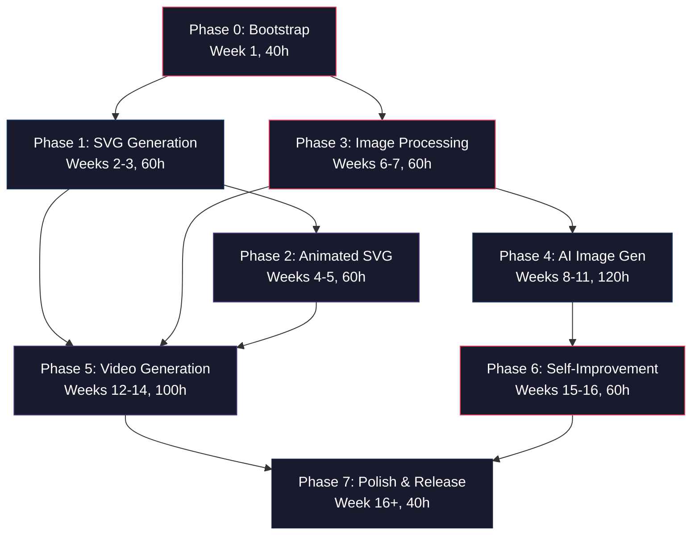

# OpenMedia-RS — Implementation Plan

> **Document Version**: 1.0  
> **Created**: 2026-06-22  
> **Status**: Active  
> **Estimated Duration**: 16 weeks solo / 6–8 weeks with 2–3 contributors  
> **Total Estimated Hours**: ~540h  

---

## Table of Contents

1. [Overview](#1-overview)
2. [Phase 0: Bootstrap](#2-phase-0-bootstrap-week-1-40h)
3. [Phase 1: SVG Generation](#3-phase-1-svg-generation-weeks-2-3-60h)
4. [Phase 2: Animated SVG](#4-phase-2-animated-svg-weeks-4-5-60h)
5. [Phase 3: Image Processing](#5-phase-3-image-processing-weeks-6-7-60h)
6. [Phase 4: AI Image Generation](#6-phase-4-ai-image-generation-weeks-8-11-120h)
7. [Phase 5: Video Generation](#7-phase-5-video-generation-weeks-12-14-100h)
8. [Phase 6: Self-Improvement](#8-phase-6-self-improvement-weeks-15-16-60h)
9. [Phase 7: Polish & Release](#9-phase-7-polish--release-week-16-40h)
10. [Phase Dependency Graph](#10-phase-dependency-graph)
11. [Risk Register](#11-risk-register)
12. [Testing Strategy](#12-testing-strategy)

---

## 1. Overview

### Vision

OpenMedia-RS is a **Rust-native, GPU-accelerated media creation toolkit** exposed as a Model Context Protocol (MCP) server. It provides AI agents with the ability to generate SVGs, process images, create AI-generated imagery, compose videos, and self-improve output quality — all through a unified, tool-based interface.

### Guiding Principles

| Principle | Description |
|-----------|-------------|
| **Incremental Delivery** | Each phase ends with working, testable MCP tools. No "big bang" integration. |
| **Fail-Safe Defaults** | Every GPU-accelerated path has a CPU fallback. Every AI model backend has graceful degradation. |
| **Zero-Config Start** | The server starts with `cargo run` and works without any external dependencies for SVG tools. |
| **Progressive Enhancement** | AI features activate only when models are downloaded. Users opt-in to heavy dependencies. |
| **Performance Budget** | SVG generation <50ms, image processing <500ms for 1080p, AI generation <30s on consumer GPU. |

### Timeline Summary

| Phase | Name | Duration | Hours | Deliverables |
|-------|------|----------|-------|---------------|
| 0 | Bootstrap | Week 1 | ~40h | Workspace, CI/CD, core config, MCP skeleton |
| 1 | SVG Generation | Weeks 2–3 | ~60h | SvgBuilder API, icons, charts, diagrams, 6 MCP tools |
| 2 | Animated SVG | Weeks 4–5 | ~60h | SMIL/CSS animations, timeline, Lottie, 6 MCP tools |
| 3 | Image Processing | Weeks 6–7 | ~60h | wgpu pipeline, shaders, transforms, 6 MCP tools |
| 4 | AI Image Gen | Weeks 8–11 | ~120h | SD 1.5/SDXL/Turbo, diffusion_rs, ONNX, 6 MCP tools |
| 5 | Video Generation | Weeks 12–14 | ~100h | Scene DSL, renderers, transitions, encoding, 8 MCP tools |
| 6 | Self-Improvement | Weeks 15–16 | ~60h | CLIP scorer, aesthetic predictor, auto-refine, 5 MCP tools |
| 7 | Polish & Release | Week 16+ | ~40h | Docs, optimization, Docker, release |

### Methodology

- **Each phase** produces a working binary with new MCP tools callable from any MCP client.
- **Every task** includes hours, dependencies, and acceptance criteria.
- **Integration tests** run against real MCP tool calls after each phase.
- **CI gates**: `cargo clippy`, `cargo test`, `cargo fmt --check`, MSRV 1.82+.
- **Feature flags** isolate heavy dependencies (`candle`, `wgpu`, `ffmpeg`).

---

## 2. Phase 0: Bootstrap (Week 1, ~40h)

> **Goal**: A compiling Cargo workspace with CI/CD, shared types, configuration loading, hardware detection, and an MCP server skeleton that registers placeholder tools via `rmcp`.

### Task 0.1: Workspace Scaffolding

| Field | Value |
|-------|-------|
| **Hours** | 4h |
| **Dependencies** | None |
| **Description** | Create the Cargo workspace with all planned crate stubs. Set up directory structure for `crates/`, `docs/`, `tests/`, `assets/`, `models/`. |
| **Acceptance Criteria** | `cargo check --workspace` succeeds. All crate stubs compile as empty libs. Workspace members list matches architecture doc. |

**Subtasks**:
- Create root `Cargo.toml` with `[workspace]` and member paths
- Scaffold `crates/openmedia-core/` with `lib.rs` stub
- Scaffold `crates/openmedia-svg/` with `lib.rs` stub
- Scaffold `crates/openmedia-svg-animate/` with `lib.rs` stub
- Scaffold `crates/openmedia-image/` with `lib.rs` stub
- Scaffold `crates/openmedia-image-ai/` with `lib.rs` stub
- Scaffold `crates/openmedia-video/` with `lib.rs` stub
- Scaffold `crates/openmedia-improve/` with `lib.rs` stub
- Scaffold `crates/openmedia-mcp/` with `main.rs` stub (binary crate)
- Create `docs/`, `tests/integration/`, `assets/templates/`, `models/.gitkeep`
- Create `.gitignore` with build artifacts, model files, IDE configs

### Task 0.2: CI/CD Pipeline

| Field | Value |
|-------|-------|
| **Hours** | 4h |
| **Dependencies** | Task 0.1 |
| **Description** | GitHub Actions workflow for lint, test, build on Linux/macOS/Windows. Separate workflows for PR checks and release builds. |
| **Acceptance Criteria** | PR merge blocked without passing checks. Matrix builds across 3 OS. Clippy with `-D warnings`. |

**Subtasks**:
- Create `.github/workflows/ci.yml` — triggered on PR and push to main
  - Job: `lint` — `cargo fmt --check`, `cargo clippy -- -D warnings`
  - Job: `test` — `cargo test --workspace` across OS matrix
  - Job: `build` — `cargo build --release --workspace`
- Create `.github/workflows/release.yml` — triggered on version tags
  - Job: `build-binaries` — cross-compile for x86_64-linux, aarch64-linux, x86_64-macos, aarch64-macos, x86_64-windows
  - Job: `create-release` — upload binaries as GitHub release assets
- Add badge to `README.md`
- Set branch protection rules requiring CI pass

### Task 0.3: Core Configuration System

| Field | Value |
|-------|-------|
| **Hours** | 6h |
| **Dependencies** | Task 0.1 |
| **Description** | Implement layered configuration: defaults → config file (`~/.openmedia/config.toml`) → environment variables → CLI args. Using `serde` + `toml` + `clap`. |
| **Acceptance Criteria** | Config loads from all 4 sources with correct precedence. Missing config file doesn't crash. All paths expandable (`~`, env vars). Unit tests for merge logic. |

**Subtasks**:
- Define `OpenMediaConfig` struct in `openmedia-core/src/config.rs`
  - Fields: `output_dir`, `models_dir`, `cache_dir`, `log_level`, `max_concurrent`, `gpu_preference`
  - Nested: `SvgConfig`, `ImageConfig`, `AiConfig`, `VideoConfig`
- Implement `ConfigLoader` with layered merge strategy
- Add `clap` argument definitions in `openmedia-mcp/src/cli.rs`
- Implement TOML parsing with `serde` defaults for every field
- Environment variable overlay (`OPENMEDIA_OUTPUT_DIR`, `OPENMEDIA_MODELS_DIR`, etc.)
- Config validation — ensure directories exist or can be created
- Write unit tests for each layer and merge precedence
- Write integration test: load from temp config file, verify values

### Task 0.4: Hardware Detection & Capability Registry

| Field | Value |
|-------|-------|
| **Hours** | 6h |
| **Dependencies** | Task 0.1 |
| **Description** | Detect GPU vendor/model/VRAM, CPU cores/features, available RAM. Determine which backends (CUDA, Metal, Vulkan, CPU) are available. Store as `HardwareProfile`. |
| **Acceptance Criteria** | Correctly detects GPU on Linux (Vulkan), macOS (Metal), Windows (DirectX/Vulkan). Gracefully returns CPU-only profile when no GPU found. |

**Subtasks**:
- Create `openmedia-core/src/hardware.rs`
- Define `HardwareProfile` struct:
  ```rust
  pub struct HardwareProfile {
      pub gpus: Vec<GpuInfo>,
      pub cpu: CpuInfo,
      pub memory: MemoryInfo,
      pub available_backends: Vec<ComputeBackend>,
      pub recommended_backend: ComputeBackend,
  }
  ```
- Implement GPU detection via `wgpu::Instance::enumerate_adapters()`
- Parse GPU vendor, device name, VRAM from adapter info
- Detect CUDA availability via `nvml-wrapper` or `which nvcc`
- Detect Metal on macOS via `wgpu` backend check
- CPU detection: `num_cpus::get()`, `std::arch::is_x86_feature_detected!` for AVX2/AVX-512
- Memory detection: `sysinfo` crate for total/available RAM
- Backend ranking: CUDA > Metal > Vulkan > DirectX > CPU
- Pretty-print hardware summary for startup log
- Unit tests with mock adapters

### Task 0.5: Shared Types & Error System

| Field | Value |
|-------|-------|
| **Hours** | 5h |
| **Dependencies** | Task 0.1 |
| **Description** | Define all shared types, error enums, and result aliases used across crates. Use `thiserror` for structured errors. |
| **Acceptance Criteria** | All error types implement `std::error::Error`. Errors carry context (file paths, model names). MCP-facing errors serialize to JSON with error codes. |

**Subtasks**:
- Create `openmedia-core/src/error.rs` with top-level `OpenMediaError` enum
  - Variants: `Config`, `Io`, `Svg`, `Image`, `Ai`, `Video`, `Mcp`, `Hardware`, `Model`, `Encoding`
  - Each variant wraps a domain-specific error type
- Create domain error types in each crate:
  - `SvgError`: `InvalidShape`, `InvalidColor`, `TemplateMissing`, `OptimizationFailed`, `RasterizationFailed`
  - `ImageError`: `FormatUnsupported`, `ShaderCompileFailed`, `GpuUnavailable`, `DecodeFailed`, `EncodeFailed`
  - `AiError`: `ModelNotFound`, `ModelLoadFailed`, `InferenceFailed`, `OomError`, `BackendUnavailable`, `SchedulerError`
  - `VideoError`: `SceneParseFailed`, `RenderFailed`, `EncodeFailed`, `AudioMixFailed`, `FfmpegNotFound`
  - `ImproveError`: `ScoringFailed`, `DatabaseError`, `ClipModelFailed`, `PromptRefineFailed`
- Define `pub type Result<T> = std::result::Result<T, OpenMediaError>;`
- Implement `From` conversions between domain errors and top-level error
- Implement `Serialize` for all errors with JSON error codes
- Add `ErrorCode` enum for MCP error responses (numeric codes)
- Write unit tests for error serialization and conversions

### Task 0.6: Model Registry Stub

| Field | Value |
|-------|-------|
| **Hours** | 5h |
| **Dependencies** | Task 0.3, Task 0.5 |
| **Description** | Create the `ModelRegistry` that will manage AI model lifecycle (download, verify, cache, load). Phase 0 implements the trait and registry structure with stub implementations. |
| **Acceptance Criteria** | `ModelRegistry` compiles. `list_models()` returns empty vec. `get_model()` returns `ModelNotFound`. Interface is stable for Phase 4 to implement. |

**Subtasks**:
- Create `openmedia-core/src/models/mod.rs`
- Define `ModelInfo` struct:
  ```rust
  pub struct ModelInfo {
      pub id: ModelId,
      pub name: String,
      pub variant: ModelVariant,
      pub format: ModelFormat,     // SafeTensors, GGUF, ONNX
      pub size_bytes: u64,
      pub sha256: String,
      pub source_url: String,
      pub local_path: Option<PathBuf>,
      pub status: ModelStatus,     // NotDownloaded, Downloading, Ready, Corrupted
  }
  ```
- Define `ModelVariant` enum: `Sd15`, `Sd21`, `SdxlBase`, `SdxlRefiner`, `SdxlTurbo`, `RealEsrgan`, `U2Net`, `Clip`, `AestheticPredictor`
- Define `ModelFormat` enum: `SafeTensors`, `Gguf`, `Onnx`
- Define `ModelRegistry` trait:
  ```rust
  pub trait ModelRegistry: Send + Sync {
      async fn list_models(&self) -> Vec<ModelInfo>;
      async fn get_model(&self, id: &ModelId) -> Result<ModelInfo>;
      async fn download_model(&self, id: &ModelId, progress: ProgressCallback) -> Result<PathBuf>;
      async fn verify_model(&self, id: &ModelId) -> Result<bool>;
      async fn delete_model(&self, id: &ModelId) -> Result<()>;
  }
  ```
- Implement `StubModelRegistry` that returns empty/error for all methods
- Define `ProgressCallback` type for download/generation progress
- Create `models/registry.json` — manifest of all known models with URLs and checksums
- Write unit tests for `ModelInfo` serialization

### Task 0.7: MCP Server Skeleton

| Field | Value |
|-------|-------|
| **Hours** | 8h |
| **Dependencies** | Task 0.3, Task 0.4, Task 0.5 |
| **Description** | Wire up the `rmcp` server with stdio transport. Register placeholder tools that return "not yet implemented". Implement server metadata, capability advertisement, and graceful shutdown. |
| **Acceptance Criteria** | Server starts via `cargo run`. MCP client can connect over stdio. `tools/list` returns all placeholder tools. Calling any tool returns structured error. Server logs startup with hardware profile. |

**Subtasks**:
- Set up `openmedia-mcp/src/main.rs` with `#[tokio::main]`
- Initialize `tracing` subscriber with configured log level
- Load configuration via `ConfigLoader`
- Run hardware detection and log profile
- Create `McpServer` struct implementing `rmcp::ServerHandler`
  ```rust
  #[derive(Debug, Clone)]
  pub struct OpenMediaServer {
      config: Arc<OpenMediaConfig>,
      hardware: Arc<HardwareProfile>,
  }
  ```
- Implement `ServerHandler` trait:
  - `name()` → "openmedia"
  - `version()` → from `CARGO_PKG_VERSION`
  - `instructions()` → capability description for AI agents
  - `list_tools()` → all planned tools with JSON schemas
  - `call_tool()` → dispatch to handler or return "not implemented"
- Define tool schemas for all 35+ planned tools using `#[tool]` macros
- Group tools by namespace: `svg_*`, `animate_*`, `image_*`, `ai_*`, `video_*`, `improve_*`
- Implement MCP resources:
  - `openmedia://capabilities` — hardware and available features
  - `openmedia://models` — list of available/downloaded models
  - `openmedia://history` — recent generation history
  - `openmedia://config` — current configuration
- Implement graceful shutdown on SIGINT/SIGTERM
- Add startup banner with version, hardware, available features
- Write integration test: start server, call `tools/list`, verify response

### Task 0.8: Progress Reporting Infrastructure

| Field | Value |
|-------|-------|
| **Hours** | 2h |
| **Dependencies** | Task 0.7 |
| **Description** | Implement progress notification system using MCP's progress tokens. Allow long-running operations to report incremental progress to the client. |
| **Acceptance Criteria** | Progress notifications send valid MCP progress tokens. Progress includes percentage, step description, and ETA. Works across async task boundaries. |

**Subtasks**:
- Define `ProgressReporter` trait in `openmedia-core`
  ```rust
  pub trait ProgressReporter: Send + Sync {
      fn report(&self, progress: f32, message: &str);
      fn report_step(&self, step: usize, total: usize, message: &str);
  }
  ```
- Implement `McpProgressReporter` that sends MCP notifications
- Implement `NoopProgressReporter` for non-MCP contexts (tests, CLI)
- Implement `LogProgressReporter` that logs to tracing
- Wire progress reporter into `call_tool` context
- Unit test: verify progress percentages are clamped to 0.0–1.0

---

### Phase 0 Summary

| Metric | Target |
|--------|--------|
| Crates compiling | 8/8 |
| CI passing | ✅ |
| MCP tools registered | 35+ (placeholder) |
| MCP resources | 4 |
| Config sources | 4 (defaults, file, env, CLI) |
| Test count | ~30 |

---

## 3. Phase 1: SVG Generation (Weeks 2–3, ~60h)

> **Goal**: Full-featured SVG generation with a fluent builder API, 20+ icon templates, chart types, diagram types, optimization, and rasterization. 6 MCP tools go live.

### Task 1.1: SvgBuilder Core API

| Field | Value |
|-------|-------|
| **Hours** | 10h |
| **Dependencies** | Phase 0 complete |
| **Description** | Implement the fluent builder API for constructing SVG documents. Support all SVG primitive shapes, paths, text, groups, and document-level attributes. |
| **Acceptance Criteria** | Can build any SVG document programmatically. Output validates against SVG 1.1 spec. Builder is ergonomic with method chaining. |

**Subtasks**:
- Implement `SvgDocument` struct with viewBox, dimensions, namespace declarations
- Implement shape elements:
  - `rect()` — x, y, width, height, rx, ry
  - `circle()` — cx, cy, r
  - `ellipse()` — cx, cy, rx, ry
  - `line()` — x1, y1, x2, y2
  - `polyline()` — points
  - `polygon()` — points
  - `path()` — d (path data string)
- Implement path builder:
  - `move_to()`, `line_to()`, `h_line_to()`, `v_line_to()`
  - `curve_to()` (cubic bezier), `smooth_curve_to()`
  - `quad_to()` (quadratic bezier), `smooth_quad_to()`
  - `arc_to()` — rx, ry, rotation, large_arc, sweep, x, y
  - `close()`
- Implement `text()` — content, x, y, font-family, font-size, font-weight, text-anchor, dominant-baseline
- Implement `group()` — nested elements with shared transforms/styles
- Implement `use_element()` — reference reusable `<defs>` elements
- Implement `image()` — embedded raster images (base64 or external href)
- Implement `SvgDocument::to_string()` — serialize to valid SVG XML
- Implement `SvgDocument::to_pretty_string()` — indented output for debugging
- Unit tests for each element type — verify output XML structure

### Task 1.2: Styles, Defs & Advanced Features

| Field | Value |
|-------|-------|
| **Hours** | 8h |
| **Dependencies** | Task 1.1 |
| **Description** | Add styling system (inline, class-based), gradients, patterns, filters, clip paths, masks, and transforms. |
| **Acceptance Criteria** | Gradients render correctly. Filters produce expected visual effects. Clip paths and masks work. All features produce valid SVG. |

**Subtasks**:
- Implement `Style` builder:
  - Fill: color, opacity, rule (evenodd/nonzero)
  - Stroke: color, width, opacity, linecap, linejoin, dasharray, dashoffset
  - Font: family, size, weight, style
  - Opacity, visibility, display
- Implement `<defs>` section:
  - `LinearGradient` — id, x1, y1, x2, y2, stops (offset, color, opacity), gradientTransform
  - `RadialGradient` — id, cx, cy, r, fx, fy, stops, gradientTransform
  - `Pattern` — id, patternUnits, width, height, child elements
- Implement SVG filters:
  - `feGaussianBlur` — stdDeviation
  - `feDropShadow` — dx, dy, stdDeviation, flood-color
  - `feColorMatrix` — type (saturate, hueRotate, luminanceToAlpha), values
  - `feComposite` — operator (over, in, out, atop, xor)
  - `feMorphology` — operator (erode, dilate), radius
  - `feOffset` — dx, dy
  - `feTurbulence` — type, baseFrequency, numOctaves
  - Filter chains via `<filter>` with `<feMerge>`
- Implement clip paths: `<clipPath>` with arbitrary shape children
- Implement masks: `<mask>` with gradient-based transparency
- Implement transforms: `translate`, `rotate`, `scale`, `skewX`, `skewY`, `matrix`
- Class-based styling via `<style>` element with CSS rules
- Unit tests for gradient serialization, filter chains, transform composition

### Task 1.3: Icon Template System

| Field | Value |
|-------|-------|
| **Hours** | 10h |
| **Dependencies** | Task 1.1, Task 1.2 |
| **Description** | Create 20+ parameterized icon templates across 3 styles (outline, filled, duotone). Icons are generated programmatically, not from static SVG files. |
| **Acceptance Criteria** | Each icon renders correctly in all 3 styles. Colors, sizes, stroke widths are customizable. Icons are visually consistent within each style. |

**Icon List** (minimum 20):
1. Home / House
2. User / Person
3. Settings / Gear
4. Search / Magnifying Glass
5. Mail / Envelope
6. Phone / Telephone
7. Calendar / Date
8. Clock / Time
9. Camera / Photo
10. Heart / Favorite
11. Star / Rating
12. Lock / Security
13. Notification / Bell
14. Download / Arrow Down
15. Upload / Arrow Up
16. Share / External Link
17. Edit / Pencil
18. Delete / Trash
19. Check / Checkmark
20. Close / X Mark
21. Menu / Hamburger
22. Arrow Left / Back
23. Arrow Right / Forward
24. Plus / Add
25. Folder / Directory

**Subtasks**:
- Define `IconTemplate` trait with `render(style, size, color, stroke_width) -> SvgDocument`
- Implement `IconStyle` enum: `Outline`, `Filled`, `Duotone`
- Create `IconRegistry` to lookup templates by name
- Implement each icon as a struct implementing `IconTemplate`
- Ensure consistent grid system (24x24 default viewBox)
- Add color customization: primary color, secondary color (for duotone)
- Add size scaling with proportional stroke width adjustment
- Visual regression tests: render each icon at each style, compare against golden files
- Create sample gallery HTML page that renders all icons

### Task 1.4: Chart Generation

| Field | Value |
|-------|-------|
| **Hours** | 12h |
| **Dependencies** | Task 1.1, Task 1.2 |
| **Description** | Generate 6 chart types from data input. Charts include axes, labels, legends, gridlines, tooltips (title elements), and responsive sizing. |
| **Acceptance Criteria** | Each chart type renders with correct data visualization. Axes scale properly to data range. Labels don't overlap. Colors are accessible. |

**Chart Types**:

1. **Bar Chart** (3h)
   - Vertical and horizontal orientation
   - Grouped and stacked variants
   - Configurable bar width, spacing, colors
   - Y-axis with auto-scaling, gridlines
   - X-axis with category labels (auto-rotation for long labels)
   - Optional value labels on bars
   - Legend for multi-series

2. **Line Chart** (2h)
   - Single and multi-series support
   - Smooth (cubic bezier) and straight line modes
   - Data point markers (circle, square, diamond)
   - Area fill option (with gradient)
   - Axis scaling: linear, logarithmic
   - Gridlines and axis labels

3. **Pie Chart** (2h)
   - Standard pie and donut variants
   - Configurable inner radius (for donut)
   - Label placement: inside, outside with leader lines
   - Percentage and value labels
   - Color palette with accessibility considerations
   - Optional exploded slice

4. **Scatter Plot** (2h)
   - X-Y data points with configurable markers
   - Point size encoding (bubble chart variant)
   - Color encoding for categorical data
   - Trend line (linear regression)
   - Axis scaling and labels

5. **Radar Chart** (1.5h)
   - Multi-axis polygon chart
   - Configurable axis count and labels
   - Fill area with transparency
   - Multi-series overlay
   - Concentric gridlines

6. **Gauge Chart** (1.5h)
   - Semicircle or full-circle gauge
   - Configurable min/max/value
   - Color zones (green/yellow/red)
   - Needle indicator
   - Value label in center

**Shared Subtasks**:
- Define `ChartConfig` struct: width, height, margins, title, colors, font
- Define `DataSeries` struct: name, values, color
- Implement axis auto-scaling: `nice_numbers()` algorithm for tick marks
- Implement color palette system with 10+ accessible colors
- Implement legend renderer: horizontal/vertical layout
- Unit tests for each chart type with sample data
- Visual regression tests with golden images

### Task 1.5: Diagram Generation

| Field | Value |
|-------|-------|
| **Hours** | 10h |
| **Dependencies** | Task 1.1, Task 1.2 |
| **Description** | Generate 4 diagram types from structured input. Diagrams use auto-layout algorithms to position elements. |
| **Acceptance Criteria** | Each diagram type auto-layouts without overlapping elements. Connections route cleanly. Labels are readable. |

**Diagram Types**:

1. **Flowchart** (3h)
   - Node types: rectangle, diamond (decision), rounded rect, parallelogram, circle (start/end)
   - Directed edges with labels
   - Auto-layout: top-to-bottom or left-to-right (Sugiyama-style layered layout)
   - Edge routing: orthogonal or curved
   - Swimlanes (optional)

2. **Architecture Diagram** (3h)
   - Component boxes with icons and labels
   - Nested groups/boundaries (e.g., "Cloud", "VPC", "Subnet")
   - Connection types: solid, dashed, dotted with arrows
   - Protocol/label annotations on connections
   - Auto-layout with group containment

3. **Sequence Diagram** (2h)
   - Actor/participant lifelines
   - Message types: sync, async, return, self
   - Activation bars
   - Alt/opt/loop fragments
   - Auto-spacing based on message count

4. **Mindmap** (2h)
   - Central node with radial branching
   - Hierarchical levels with distinct colors
   - Curved branch connections
   - Auto-layout: radial tree layout
   - Collapsible nodes (via CSS classes)

**Shared Subtasks**:
- Define `DiagramSpec` enum wrapping each diagram type's input format
- Implement simple graph layout algorithm (layered for flowchart, force-directed for architecture)
- Edge routing: orthogonal path finding with bend minimization
- Bounding box calculation for auto-sizing SVG viewBox
- Unit tests for layout algorithms
- Integration tests: parse spec → generate SVG → validate structure

### Task 1.6: SVG Optimizer

| Field | Value |
|-------|-------|
| **Hours** | 4h |
| **Dependencies** | Task 1.1 |
| **Description** | Optimize SVG output for minimal file size. Apply structural optimizations without changing visual output. |
| **Acceptance Criteria** | Optimized SVGs are 30-60% smaller. Visual output is identical. No information loss on round-trip. |

**Subtasks**:
- Remove unnecessary whitespace and newlines
- Remove default attribute values (e.g., `fill="black"` is default)
- Merge identical `<defs>` elements
- Collapse unnecessary groups (single-child groups)
- Shorten color values (`#ffffff` → `#fff`, `rgb(0,0,0)` → `#000`)
- Round numeric values to configurable precision (default 2 decimal places)
- Remove empty elements and unused defs
- Minify path data (remove redundant commands, shorten coordinates)
- Remove XML comments and processing instructions
- Optional: convert inline styles to attributes where shorter
- Benchmark: measure size reduction on generated icons and charts
- Unit tests: verify output is valid SVG after optimization

### Task 1.7: SVG Rasterizer

| Field | Value |
|-------|-------|
| **Hours** | 3h |
| **Dependencies** | Task 1.1 |
| **Description** | Convert SVG to raster formats (PNG, JPEG, WebP) using `resvg`. Support custom resolution, DPI, and background color. |
| **Acceptance Criteria** | Rasterized output matches SVG visual at specified resolution. Supports transparency (PNG). Supports custom DPI for print. |

**Subtasks**:
- Integrate `resvg` and `usvg` for SVG parsing and rendering
- Implement `rasterize(svg, format, width, height, dpi, background)` function
- Support output formats: PNG (with alpha), JPEG (quality setting), WebP (quality setting)
- Support DPI settings: 72 (screen), 150 (web), 300 (print)
- Handle font loading via `fontdb` — system fonts + bundled fallback
- Implement `@2x` / `@3x` retina output modes
- Write to file or return as bytes
- Unit tests: rasterize simple SVG, verify dimensions and format
- Performance benchmark: rasterize 1000x1000 SVG with complex content

### Task 1.8: MCP Tool Integration

| Field | Value |
|-------|-------|
| **Hours** | 3h |
| **Dependencies** | Tasks 1.1–1.7 |
| **Description** | Wire up 6 MCP tools that expose SVG functionality to AI agents. |
| **Acceptance Criteria** | All 6 tools callable via MCP. Input validation with helpful error messages. Output includes SVG string and optional file path. |

**MCP Tools**:

1. **`svg_generate_icon`** — Generate an icon by name, style, size, colors
2. **`svg_generate_chart`** — Generate a chart from data series and chart type
3. **`svg_generate_diagram`** — Generate a diagram from a structured spec
4. **`svg_create_custom`** — Create SVG from a builder instruction set (JSON)
5. **`svg_optimize`** — Optimize an existing SVG string
6. **`svg_rasterize`** — Convert SVG to PNG/JPEG/WebP

**Subtasks per tool**:
- Define JSON schema for tool input
- Implement input validation with descriptive errors
- Wire to underlying SVG engine functions
- Return structured output: `{ svg: string, file_path?: string, size_bytes: number }`
- Integration test: call tool via MCP, verify valid SVG output

---

### Phase 1 Summary

| Metric | Target |
|--------|--------|
| MCP tools live | 6 |
| Icon templates | 25 (3 styles each = 75 variants) |
| Chart types | 6 |
| Diagram types | 4 |
| Test count | ~80 new |

---

## 4. Phase 2: Animated SVG (Weeks 4–5, ~60h)

> **Goal**: Add animation capabilities to SVG output — SMIL, CSS keyframes, easing functions, timeline sequencing, path morphing, presets, and Lottie import/export. 6 MCP tools.

### Task 2.1: SMIL Animation Generator

| Field | Value |
|-------|-------|
| **Hours** | 8h |
| **Dependencies** | Phase 1 complete |
| **Description** | Generate SMIL animation elements (`<animate>`, `<animateTransform>`, `<animateMotion>`, `<set>`) with full attribute support. |
| **Acceptance Criteria** | Generated SMIL animations play correctly in browsers. All 4 element types work. Timing attributes (begin, dur, repeatCount) function properly. |

**Subtasks**:
- Implement `<animate>` — attributeName, from, to, values, dur, begin, repeatCount, fill
- Implement `<animateTransform>` — type (translate, rotate, scale, skewX, skewY), from, to, additive
- Implement `<animateMotion>` — path, keyPoints, keyTimes, rotate (auto, auto-reverse, number)
- Implement `<set>` — attributeName, to, begin, dur
- Support `begin` timing: offset, event-based (`click`, `mouseover`), syncbase (`id.begin`, `id.end`)
- Support `calcMode`: discrete, linear, paced, spline (with keySplines)
- Support `accumulate` and `additive` for composing animations
- Attach animations to any SVG element in the builder
- Unit tests for each animation element type
- Browser rendering tests (visual regression)

### Task 2.2: CSS @keyframes Generator

| Field | Value |
|-------|-------|
| **Hours** | 6h |
| **Dependencies** | Phase 1 complete |
| **Description** | Generate CSS `@keyframes` animations with full property support. Output as `<style>` block within SVG or as external CSS. |
| **Acceptance Criteria** | Generated CSS animations work in all modern browsers. Support percentage-based keyframes. Support animation shorthand and individual properties. |

**Subtasks**:
- Implement `KeyframeAnimation` builder:
  - Name, duration, timing-function, delay, iteration-count, direction, fill-mode, play-state
  - Keyframe steps: `from`/`to` or percentage-based (0%, 25%, 50%, etc.)
  - Properties per keyframe: transform, opacity, fill, stroke, stroke-dashoffset, d (path morph)
- Generate `@keyframes` CSS block
- Generate `.class { animation: ... }` CSS block
- Support `animation-composition` for layering animations
- Support `animation-timeline` for scroll-driven animations (CSS spec)
- Embed in SVG `<style>` element or output as standalone CSS
- Unit tests: verify CSS output syntax
- Integration test: embed in SVG, render, verify animation frame at t=0 and t=50%

### Task 2.3: Easing Functions Library

| Field | Value |
|-------|-------|
| **Hours** | 6h |
| **Dependencies** | None (used by Tasks 2.1 & 2.2) |
| **Description** | Implement comprehensive easing function library. All standard easing types plus custom cubic-bezier and spring physics. |
| **Acceptance Criteria** | All easing functions produce correct curves. Spring physics settle within tolerance. Cubic-bezier matches CSS `cubic-bezier()`. |

**Easing Functions**:
- **Linear**: `linear`
- **Ease**: `ease`, `ease-in`, `ease-out`, `ease-in-out`
- **Sine**: `ease-in-sine`, `ease-out-sine`, `ease-in-out-sine`
- **Quad**: `ease-in-quad`, `ease-out-quad`, `ease-in-out-quad`
- **Cubic**: `ease-in-cubic`, `ease-out-cubic`, `ease-in-out-cubic`
- **Quart**: `ease-in-quart`, `ease-out-quart`, `ease-in-out-quart`
- **Quint**: `ease-in-quint`, `ease-out-quint`, `ease-in-out-quint`
- **Expo**: `ease-in-expo`, `ease-out-expo`, `ease-in-out-expo`
- **Circ**: `ease-in-circ`, `ease-out-circ`, `ease-in-out-circ`
- **Back**: `ease-in-back`, `ease-out-back`, `ease-in-out-back`
- **Elastic**: `ease-in-elastic`, `ease-out-elastic`, `ease-in-out-elastic`
- **Bounce**: `ease-in-bounce`, `ease-out-bounce`, `ease-in-out-bounce`
- **Custom**: `cubic-bezier(x1, y1, x2, y2)` — arbitrary control points
- **Spring**: `spring(mass, stiffness, damping)` — physics-based spring simulation

**Subtasks**:
- Define `EasingFunction` enum with all variants
- Implement `fn evaluate(&self, t: f64) -> f64` for each easing
- Implement cubic-bezier solver using Newton-Raphson method
- Implement spring physics simulation with configurable parameters
- Implement `to_css()` for CSS-compatible easing strings
- Implement `to_smil_key_splines()` for SMIL calcMode="spline"
- Generate lookup tables for complex easing (spring, elastic) for performance
- Unit tests: verify known values at t=0, 0.25, 0.5, 0.75, 1.0
- Unit tests: spring settles to 1.0 within tolerance

### Task 2.4: Timeline & Sequencing Engine

| Field | Value |
|-------|-------|
| **Hours** | 8h |
| **Dependencies** | Tasks 2.1, 2.2, 2.3 |
| **Description** | Compose multiple animations into coordinated timelines. Support sequential, parallel, and staggered playback modes. |
| **Acceptance Criteria** | Timeline correctly sequences animations. Stagger delays are computed correctly. Parallel animations start simultaneously. Total duration is computed. |

**Subtasks**:
- Define `Timeline` struct:
  ```rust
  pub struct Timeline {
      tracks: Vec<AnimationTrack>,
      mode: TimelineMode,      // Sequential, Parallel, Stagger
      stagger_delay: Duration,
      repeat: RepeatMode,
      speed: f64,
  }
  ```
- Define `AnimationTrack`:
  ```rust
  pub struct AnimationTrack {
      target: ElementId,
      animation: Animation,   // SMIL or CSS
      delay: Duration,
      duration: Duration,
  }
  ```
- Implement `TimelineMode::Sequential` — each animation starts after previous ends
- Implement `TimelineMode::Parallel` — all animations start at the same time
- Implement `TimelineMode::Stagger` — each animation starts with incremental delay
- Compute total timeline duration
- Resolve timing: convert relative delays to absolute `begin` values
- Output as SMIL (using syncbase timing: `id.end+0.2s`)
- Output as CSS (using `animation-delay` offsets)
- Support nested timelines (timeline within a timeline)
- Support labels/markers for seek points
- Unit tests for timing resolution in each mode
- Integration test: generate SVG with timeline, verify animation order

### Task 2.5: Path Morphing Engine

| Field | Value |
|-------|-------|
| **Hours** | 6h |
| **Dependencies** | Task 1.1 (SVG paths) |
| **Description** | Morph between two SVG paths by interpolating path data. Handle paths with different segment counts by adding interpolation points. |
| **Acceptance Criteria** | Morphing between any two paths produces smooth intermediate shapes. Segment count normalization works for unequal paths. |

**Subtasks**:
- Parse SVG path `d` attribute into structured path segments
- Normalize paths: convert all segments to cubic bezier curves
- Handle unequal segment counts:
  - Split longer path segments to match shorter path
  - Or subdivide shorter path to match longer
- Implement `interpolate_paths(from, to, t: f64) -> PathData`
- Generate `<animate attributeName="d" values="..." />` SMIL element
- Generate CSS `@keyframes` with `d: path(...)` property
- Support multiple morph steps (A → B → C → A) for looping
- Unit tests: morph circle to square, verify intermediate frame
- Visual regression test: render morph at 0%, 25%, 50%, 75%, 100%

### Task 2.6: Animation Presets Library

| Field | Value |
|-------|-------|
| **Hours** | 6h |
| **Dependencies** | Tasks 2.1–2.5 |
| **Description** | Create 15+ ready-to-use animation presets that can be applied to any SVG element. Inspired by animate.css and motion libraries. |
| **Acceptance Criteria** | Each preset applies a visually polished animation. Presets are configurable (duration, delay, easing). Presets compose with manual animations. |

**Presets** (minimum 15):
1. `fade_in` — opacity 0 → 1
2. `fade_out` — opacity 1 → 0
3. `slide_in_left` — translateX(-100%) → 0
4. `slide_in_right` — translateX(100%) → 0
5. `slide_in_up` — translateY(100%) → 0
6. `slide_in_down` — translateY(-100%) → 0
7. `zoom_in` — scale(0) → scale(1) with fade
8. `zoom_out` — scale(1) → scale(0) with fade
9. `bounce` — translateY with elastic easing
10. `pulse` — scale(1) → scale(1.1) → scale(1) loop
11. `shake` — translateX oscillation
12. `spin` — rotate(0deg) → rotate(360deg) loop
13. `flip_x` — rotateX(0) → rotateX(360deg)
14. `flip_y` — rotateY(0) → rotateY(360deg)
15. `typewriter` — stroke-dashoffset reveal for text
16. `draw_path` — stroke-dashoffset for path drawing effect
17. `gradient_shift` — animate gradient stop positions
18. `morph_loop` — path morph A → B → A

**Subtasks**:
- Define `AnimationPreset` enum with all variants
- Implement `apply(preset, element, config) -> Vec<Animation>` function
- `PresetConfig`: duration, delay, easing, iteration_count, direction
- Each preset generates appropriate SMIL or CSS animation
- Catalog page: HTML file showing all presets in action
- Unit tests for each preset

### Task 2.7: Lottie Parser & Converter

| Field | Value |
|-------|-------|
| **Hours** | 8h |
| **Dependencies** | Tasks 2.1–2.5 |
| **Description** | Parse Lottie JSON files and convert to animated SVG. Support core Lottie features: shapes, transforms, opacity, path keyframes. |
| **Acceptance Criteria** | Can parse Lottie files from LottieFiles.com. Converted SVG plays animations matching original. Covers 80%+ of common Lottie features. |

**Subtasks**:
- Parse Lottie JSON format using `serde_json`:
  - Composition: width, height, frame rate, in/out points
  - Layers: shape, solid, null, precomp
  - Shapes: rectangle, ellipse, path, fill, stroke, group, transform
  - Keyframes: position, scale, rotation, opacity, path vertices
- Convert Lottie shapes to SVG elements
- Convert Lottie keyframes to SMIL animations or CSS @keyframes
- Handle Lottie easing curves → cubic-bezier conversion
- Handle layer parenting (transform inheritance)
- Handle trim paths (stroke-dasharray animation)
- Handle masks and mattes (basic support)
- Implement `lottie_to_svg(json: &str) -> SvgDocument`
- Implement `svg_to_lottie(svg: &SvgDocument) -> LottieJson` (basic reverse conversion)
- Integration tests with sample Lottie files
- Document supported/unsupported Lottie features

### Task 2.8: MCP Tool Integration

| Field | Value |
|-------|-------|
| **Hours** | 2h |
| **Dependencies** | Tasks 2.1–2.7 |
| **Description** | Wire up 6 MCP tools for animation capabilities. |
| **Acceptance Criteria** | All 6 tools callable via MCP. Animated SVGs play in browsers. Lottie conversion works end-to-end. |

**MCP Tools**:
1. **`animate_svg`** — Apply animation presets to SVG elements
2. **`animate_create_timeline`** — Create a sequenced animation timeline
3. **`animate_morph_paths`** — Morph between two SVG paths
4. **`animate_generate_spinner`** — Generate animated loading spinners
5. **`animate_from_lottie`** — Convert Lottie JSON to animated SVG
6. **`animate_to_lottie`** — Convert animated SVG to Lottie JSON

---

### Phase 2 Summary

| Metric | Target |
|--------|--------|
| MCP tools live | 12 (6 SVG + 6 animation) |
| Easing functions | 30+ |
| Animation presets | 18 |
| Lottie support | ~80% of common features |
| Test count | ~60 new |

---

## 5. Phase 3: Image Processing (Weeks 6–7, ~60h)

> **Goal**: GPU-accelerated image processing pipeline with wgpu, WGSL shaders, CPU fallback, format conversion, and batch processing. 6 MCP tools.

### Task 3.1: wgpu Pipeline Setup

| Field | Value |
|-------|-------|
| **Hours** | 10h |
| **Dependencies** | Phase 0 (hardware detection) |
| **Description** | Set up the wgpu compute pipeline for image processing. Create the GPU context, buffer management, and shader compilation infrastructure. |
| **Acceptance Criteria** | wgpu initializes on supported hardware. Compute shaders compile and execute. Buffer upload/download works for RGBA images. Falls back to CPU gracefully. |

**Subtasks**:
- Initialize `wgpu::Instance` with Vulkan/Metal/DX12 backends
- Request adapter with power preference from config
- Create device and queue with compute pipeline support
- Implement `GpuContext` struct managing device lifecycle
- Implement `ImageBuffer` — upload RGBA pixels to GPU storage buffer
- Implement `ImageBuffer::download()` — read back processed pixels
- Create compute pipeline builder: load WGSL → create pipeline → create bind groups
- Implement shader hot-reload for development (watch WGSL files)
- Handle GPU device lost: re-initialize and retry
- Benchmark: round-trip upload → noop shader → download for 1080p image
- Unit tests with `wgpu::Backends::GL` for CI (headless GPU)

### Task 3.2: WGSL Shader Library

| Field | Value |
|-------|-------|
| **Hours** | 12h |
| **Dependencies** | Task 3.1 |
| **Description** | Implement 12+ image processing shaders in WGSL. Each shader is a compute shader operating on RGBA pixel buffers. |
| **Acceptance Criteria** | Each shader produces correct output. Shaders handle edge cases (image edges, alpha channels). Performance within budget on mid-range GPU. |

**Shaders**:

1. **Gaussian Blur** — Separable horizontal + vertical passes, configurable radius (1–100px), sigma parameter
2. **Box Blur** — Fast blur with configurable radius, used for previews
3. **Sharpen** — Unsharp mask: blur → subtract → add, configurable amount and radius
4. **Brightness/Contrast** — Linear adjustment with clamping, preserves alpha
5. **Hue/Saturation/Lightness** — HSL color space adjustment, per-pixel conversion
6. **Color Temperature** — Warm/cool shift using Kelvin-to-RGB conversion
7. **Grayscale** — Luminance-weighted desaturation (BT.709 coefficients)
8. **Sepia** — Color matrix transformation with configurable intensity
9. **Invert** — Per-channel inversion, optional alpha preservation
10. **Threshold** — Binary black/white based on luminance threshold
11. **Posterize** — Reduce color levels per channel (2–256 levels)
12. **Vignette** — Radial darkening from center, configurable radius and softness
13. **Edge Detection** — Sobel operator, output as grayscale edge map
14. **Emboss** — Directional convolution with configurable angle and depth
15. **Composite** — Porter-Duff compositing operations (over, in, out, atop, xor)

**Subtasks per shader**:
- Write WGSL compute shader with `@workgroup_size(16, 16)` tiling
- Implement uniform buffer for shader parameters
- Handle image boundaries (clamp-to-edge for blur kernels)
- Preserve alpha channel unless explicitly modifying it
- Unit test: process known input image, compare output against reference
- Performance benchmark: measure throughput for 1080p and 4K images

### Task 3.3: CPU Fallback Implementations

| Field | Value |
|-------|-------|
| **Hours** | 8h |
| **Dependencies** | Task 3.2 |
| **Description** | Implement CPU versions of all shaders for systems without GPU support. Use SIMD (AVX2/NEON) where beneficial. |
| **Acceptance Criteria** | CPU output is pixel-identical to GPU output. CPU path activates automatically when GPU unavailable. SIMD path used when available. |

**Subtasks**:
- Implement CPU versions of all 15 shaders using `image` crate pixel buffers
- Optimize blur with separable kernel and SIMD for horizontal pass
- Optimize color operations with batch processing (4 pixels at a time via SIMD)
- Use `rayon` for parallel processing: split image into horizontal strips
- Implement `ProcessingBackend` trait with `Gpu` and `Cpu` variants
- Auto-select backend based on `HardwareProfile`
- Allow manual backend override via config/tool parameter
- Correctness tests: compare CPU vs GPU output, max 1-bit difference per channel (rounding)
- Benchmark: compare CPU vs GPU throughput for each shader

### Task 3.4: Image Transforms

| Field | Value |
|-------|-------|
| **Hours** | 6h |
| **Dependencies** | Task 3.1 |
| **Description** | Implement geometric image transformations: resize, crop, rotate, flip. Support multiple resize algorithms. |
| **Acceptance Criteria** | Resize produces high-quality output with correct aspect ratio. Crop handles bounds correctly. Rotate works at arbitrary angles. |

**Subtasks**:
- **Resize**: Nearest-neighbor, bilinear, Lanczos3, CatmullRom
  - Modes: fit (preserve aspect), fill (crop to fit), stretch, contain (letterbox)
  - Support percentage-based and absolute pixel dimensions
- **Crop**: Absolute coordinates (x, y, w, h) and relative (center crop, rule-of-thirds)
- **Rotate**: 90°, 180°, 270° (lossless), arbitrary angle with background fill
- **Flip**: Horizontal, vertical, both
- Implement via `image` crate for CPU, custom WGSL for GPU
- All transforms preserve EXIF orientation data
- Unit tests for each transform with known input/output
- Edge cases: crop larger than image, rotate with transparency

### Task 3.5: Format Conversion & I/O

| Field | Value |
|-------|-------|
| **Hours** | 4h |
| **Dependencies** | Task 3.1 |
| **Description** | Read and write images in multiple formats. Support quality settings and metadata preservation. |
| **Acceptance Criteria** | All listed formats read and write correctly. Quality settings produce expected file sizes. EXIF data preserved where supported. |

**Supported Formats**:
- **Read/Write**: PNG, JPEG, WebP, BMP, TIFF, GIF (first frame), AVIF
- **Read Only**: ICO, PSD (flattened), HDR (Radiance)
- **Write Only**: SVG (via rasterize-in-reverse — embed as `<image>`)

**Subtasks**:
- Integrate `image` crate for PNG, JPEG, BMP, TIFF, GIF, ICO decoding/encoding
- Integrate `webp` crate for WebP support with quality control
- Integrate `ravif` for AVIF encoding with quality and speed settings
- Implement format detection from magic bytes (don't rely on extension)
- JPEG quality: 1–100 scale
- PNG compression: 0–9 scale, interlacing option
- WebP: lossy (quality) and lossless modes
- AVIF: quality, speed (1–10), chroma subsampling
- EXIF handling: read with `kamadak-exif`, copy to output where format supports
- Unit tests: round-trip encode/decode for each format

### Task 3.6: Batch Processing & Filter Chains

| Field | Value |
|-------|-------|
| **Hours** | 4h |
| **Dependencies** | Tasks 3.2–3.5 |
| **Description** | Process multiple images and chain multiple operations into a pipeline. |
| **Acceptance Criteria** | Batch processes N images concurrently. Filter chains apply in correct order. Progress reported per image. |

**Subtasks**:
- Implement `FilterChain` — ordered list of operations applied sequentially
  - Optimize: keep data on GPU between operations (avoid upload/download per step)
- Implement batch processing with `tokio::spawn` for concurrency
- Configurable concurrency limit (default: number of CPU cores or 1 for GPU)
- Progress reporting: per-image and per-operation progress
- Error handling: continue on individual image failure, collect errors
- Implement glob pattern support for input files
- Output naming: template-based (`{name}_processed.{ext}`)
- Unit tests for chain composition and batch error handling

### Task 3.7: Benchmarks & MCP Tools

| Field | Value |
|-------|-------|
| **Hours** | 6h |
| **Dependencies** | Tasks 3.1–3.6 |
| **Description** | Create benchmark suite and wire up 6 MCP tools. |
| **Acceptance Criteria** | Benchmarks run on CI. All 6 tools produce correct output. Performance meets budget. |

**MCP Tools**:
1. **`image_apply_filter`** — Apply a filter (blur, sharpen, color adjust, etc.) to an image
2. **`image_resize`** — Resize an image with configurable algorithm and mode
3. **`image_crop`** — Crop an image with absolute or relative coordinates
4. **`image_transform`** — Apply geometric transforms (rotate, flip)
5. **`image_convert`** — Convert between image formats
6. **`image_batch_process`** — Apply a filter chain to multiple images

**Benchmark subtasks**:
- Criterion benchmarks for each shader at 720p, 1080p, 4K
- Compare GPU vs CPU throughput
- Compare resize algorithms quality vs speed
- Measure filter chain overhead vs individual operations
- Record baseline numbers for regression detection

---

### Phase 3 Summary

| Metric | Target |
|--------|--------|
| MCP tools live | 18 (6 + 6 + 6) |
| WGSL shaders | 15 |
| Image formats | 10+ |
| GPU backends | Vulkan, Metal, DX12 |
| Test count | ~50 new |

---

## 6. Phase 4: AI Image Generation (Weeks 8–11, ~120h)

> **Goal**: Multi-backend AI image generation with Stable Diffusion models, supporting text-to-image, image-to-image, inpainting, upscaling, and background removal. 6 MCP tools.

### Task 4.1: Model Registry Implementation

| Field | Value |
|-------|-------|
| **Hours** | 12h |
| **Dependencies** | Phase 0 (registry stub) |
| **Description** | Implement the full model registry with download, verification, caching, and lifecycle management. Support Hugging Face Hub downloads. |
| **Acceptance Criteria** | Models download from HF Hub with progress reporting. SHA-256 verification passes. Corrupted downloads auto-retry. Cache eviction works. |

**Subtasks**:
- Implement `HuggingFaceRegistry` struct implementing `ModelRegistry` trait
- Download with `reqwest` streaming + progress callbacks
- SHA-256 verification using `sha2` crate after download
- Atomic file writes: download to `.tmp` → verify → rename
- Resume interrupted downloads via HTTP Range header
- Cache management: LRU eviction when total model size exceeds configurable limit
- Model status tracking: `NotDownloaded` → `Downloading(progress)` → `Ready` → `Loaded`
- Concurrent download limiting (max 2 simultaneous downloads)
- Model catalog: parse `registry.json` for known models
- Custom model support: register user-provided model files
- Unit tests for download logic, verification, cache eviction
- Integration test: download a small test model, verify checksum

### Task 4.2: Scheduler Implementations

| Field | Value |
|-------|-------|
| **Hours** | 12h |
| **Dependencies** | None (pure math) |
| **Description** | Implement 6 diffusion noise schedulers. Each scheduler controls the denoising process during image generation. |
| **Acceptance Criteria** | Each scheduler produces high-quality images. Step counts are configurable (1–100). Schedulers match reference implementations numerically. |

**Schedulers**:

1. **DDIM** (Denoising Diffusion Implicit Models)
   - Deterministic sampling
   - Support eta parameter (0 = deterministic, 1 = DDPM-like)
   - Fast: good quality at 20–50 steps

2. **DPM++ 2M** (DPM-Solver++ 2nd order, midpoint)
   - Multi-step solver with Karras sigmas
   - High quality at 15–30 steps
   - Support both discrete and continuous noise schedules

3. **DPM++ 2M Karras** (with Karras sigma schedule)
   - Modified noise schedule for better detail
   - Recommended default for SDXL

4. **Euler** (Euler method)
   - Simple first-order ODE solver
   - Good baseline quality at 25–50 steps
   - Ancestral variant (Euler A) with stochastic noise injection

5. **Euler Ancestral** (Euler with ancestral sampling)
   - Adds noise at each step for diversity
   - More creative/varied outputs
   - Less deterministic than DDIM

6. **LCM** (Latent Consistency Models)
   - Ultra-fast: 1–8 step generation
   - Requires LCM-specific model or LoRA
   - Configurable guidance scale (typically lower: 1–2)

**Subtasks per scheduler**:
- Implement `Scheduler` trait: `init()`, `step()`, `add_noise()`, `sigma_schedule()`
- Implement noise schedule computation (linear, cosine, Karras)
- Implement timestep spacing (linspace, trailing, leading)
- Validate against reference NumPy implementations
- Unit tests: known input → known output for each step

### Task 4.3: Candle Stable Diffusion Backend

| Field | Value |
|-------|-------|
| **Hours** | 30h |
| **Dependencies** | Tasks 4.1, 4.2 |
| **Description** | Implement text-to-image generation using Candle (Rust ML framework) with Stable Diffusion 1.5, SDXL, and SDXL Turbo models. |
| **Acceptance Criteria** | Generates 512x512 images from text prompts in <30s on consumer GPU. Supports CPU fallback (slower). SDXL generates 1024x1024. SDXL Turbo generates in 1–4 steps. |

**Subtasks**:
- Define `DiffusionPipeline` trait:
  ```rust
  pub trait DiffusionPipeline: Send + Sync {
      async fn generate(&self, params: GenerationParams) -> Result<DynamicImage>;
      fn supported_models(&self) -> Vec<ModelVariant>;
      fn estimated_vram(&self, params: &GenerationParams) -> u64;
  }
  ```
- Implement `CandlePipeline` struct:
  - Load CLIP text encoder from SafeTensors
  - Load UNet from SafeTensors with dtype selection (f32, f16, bf16)
  - Load VAE decoder from SafeTensors
  - Implement text encoding: tokenize → CLIP → embeddings
  - Implement latent generation: random noise at specified seed
  - Implement denoising loop: UNet inference × N steps
  - Implement VAE decode: latents → pixel space
  - Support CPU, CUDA, and Metal devices
- SD 1.5 support:
  - 512x512 default resolution
  - 77 token context length
  - ~4GB VRAM requirement
- SDXL support:
  - 1024x1024 default resolution
  - Dual text encoders (CLIP + OpenCLIP)
  - Base + refiner pipeline (optional)
  - ~8GB VRAM requirement
- SDXL Turbo support:
  - 512x512 default resolution
  - 1–4 step generation (LCM scheduler)
  - No CFG needed (guidance_scale = 0)
  - ~6GB VRAM requirement
- Implement `GenerationParams`:
  - `prompt`, `negative_prompt`, `width`, `height`, `steps`, `cfg_scale`, `seed`, `scheduler`
  - `num_images`, `output_format`, `output_path`
- VRAM management: unload models when not in use, reload on demand
- Progress reporting: per-step progress with ETA
- Integration tests with small test models (if available)

### Task 4.4: diffusion_rs GGUF Backend

| Field | Value |
|-------|-------|
| **Hours** | 15h |
| **Dependencies** | Tasks 4.1, 4.2 |
| **Description** | Integrate `diffusion_rs` crate for running GGUF-quantized Stable Diffusion models. Enables generation on lower VRAM GPUs via quantization. |
| **Acceptance Criteria** | Generates images from GGUF Q4_K_M and Q8_0 models. Quality acceptable for Q8. Runs on 4GB VRAM GPUs. Vulkan backend works on Windows/Linux. |

**Subtasks**:
- Integrate `diffusion_rs` crate as optional dependency (`feature = "diffusion-rs"`)
- Implement `GgufPipeline` implementing `DiffusionPipeline` trait
- Support quantization levels: Q4_0, Q4_K_M, Q5_K_M, Q8_0
- Support backends: CPU, CUDA, Vulkan, Metal
- Map `GenerationParams` to `diffusion_rs` API
- Download GGUF models from HF Hub (register in model catalog)
- Benchmark: compare quality and speed vs Candle f16
- Compare VRAM usage across quantization levels
- Integration test: generate image with Q8_0 model

### Task 4.5: ONNX Runtime Backend

| Field | Value |
|-------|-------|
| **Hours** | 12h |
| **Dependencies** | Tasks 4.1, 4.2 |
| **Description** | Integrate ONNX Runtime for running Stable Diffusion models exported as ONNX. Enables DirectML (Windows), OpenVINO (Intel), and CoreML (macOS) execution providers. |
| **Acceptance Criteria** | Generates images via ONNX Runtime. DirectML works on Windows with any GPU. OpenVINO works on Intel GPUs. CoreML works on macOS. |

**Subtasks**:
- Integrate `ort` crate (ONNX Runtime Rust bindings) as optional dependency
- Implement `OnnxPipeline` implementing `DiffusionPipeline` trait
- Load ONNX model files (text encoder, UNet, VAE separately)
- Configure execution providers:
  - `DirectMLExecutionProvider` for Windows GPU
  - `OpenVINOExecutionProvider` for Intel GPUs/NPUs
  - `CoreMLExecutionProvider` for macOS Neural Engine
  - `CUDAExecutionProvider` as fallback
  - `CPUExecutionProvider` as final fallback
- Implement session management: load/unload models to manage memory
- Map tensor I/O between `ort` and internal types
- Download ONNX models from Hugging Face (Olive-optimized variants)
- Benchmark: compare ONNX vs Candle speed on same hardware
- Platform-specific CI tests (Windows for DirectML, Linux for OpenVINO)

### Task 4.6: Image-to-Image & Inpainting

| Field | Value |
|-------|-------|
| **Hours** | 12h |
| **Dependencies** | Task 4.3 |
| **Description** | Extend the diffusion pipeline for img2img (modify existing images) and inpainting (fill masked regions). |
| **Acceptance Criteria** | img2img preserves structure at strength <0.5, transforms at strength >0.8. Inpainting fills masks seamlessly. Works with all backends. |

**Subtasks**:
- **img2img**:
  - Encode input image through VAE encoder → latents
  - Add noise proportional to `strength` parameter (0.0–1.0)
  - Start denoising from noisy latents instead of random noise
  - `strength` controls how many steps to denoise (lower = more similar to input)
  - Support all models: SD 1.5, SDXL, SDXL Turbo
- **Inpainting**:
  - Accept input image + binary mask (white = inpaint region)
  - Option 1: Use dedicated inpainting model (SD 1.5 Inpainting)
  - Option 2: Mask-aware denoising (blend latents at each step)
  - Auto-expand mask with feathering for seamless edges
  - Support mask input: image file, base64, or bounding box
- Implement mask processing: load, resize to latent space, feather edges
- Add `img2img` and `inpaint` modes to `GenerationParams`
- Unit tests: verify latent encoding/decoding round-trip
- Integration tests: img2img with strength=0 should match input

### Task 4.7: Upscaler & Background Removal

| Field | Value |
|-------|-------|
| **Hours** | 12h |
| **Dependencies** | Task 4.1 |
| **Description** | Implement Real-ESRGAN for image upscaling (2x, 4x) and U2-Net for background removal/segmentation. |
| **Acceptance Criteria** | Upscaler produces 4x resolution with visible quality improvement. Background removal produces clean alpha mattes. |

**Subtasks**:
- **Real-ESRGAN Upscaler**:
  - Load Real-ESRGAN model (ONNX or Candle)
  - Tile-based processing for large images (avoid VRAM overflow)
  - Tile overlap and blending for seamless output
  - 2x and 4x upscaling modes
  - Support face enhancement model variant
  - Benchmark: speed and quality at 720p → 4K
- **U2-Net Background Removal**:
  - Load U2-Net model (ONNX or Candle)
  - Preprocessing: resize to model input (320x320), normalize
  - Inference: generate probability map
  - Post-processing: threshold, refine edges, apply as alpha channel
  - Output: PNG with transparency, or separate mask image
  - Support foreground extraction (crop to bounding box)
- Implement `Upscaler` trait and `BackgroundRemover` trait
- Unit tests for pre/post processing pipelines

### Task 4.8: Backend Auto-Selection & MCP Tools

| Field | Value |
|-------|-------|
| **Hours** | 15h |
| **Dependencies** | Tasks 4.3–4.7 |
| **Description** | Implement intelligent backend selection based on hardware, model availability, and user preferences. Wire up 6 MCP tools. |
| **Acceptance Criteria** | Auto-selection chooses optimal backend for hardware. User can override. All 6 tools produce images. Progress reported during generation. |

**Backend Selection Logic**:
```
1. Check requested model format availability
2. If CUDA available + SafeTensors model → Candle CUDA
3. If Metal available + SafeTensors model → Candle Metal
4. If Vulkan available + GGUF model → diffusion_rs Vulkan
5. If DirectML available + ONNX model → ONNX DirectML
6. If OpenVINO available + ONNX model → ONNX OpenVINO
7. If CoreML available + ONNX model → ONNX CoreML
8. Fallback → Candle CPU (slow, warn user)
```

**MCP Tools**:
1. **`ai_generate_image`** — Text-to-image generation with full parameter control
2. **`ai_image_to_image`** — Transform existing image with text guidance
3. **`ai_inpaint`** — Fill masked region of image with AI-generated content
4. **`ai_upscale`** — Upscale image 2x or 4x with Real-ESRGAN
5. **`ai_remove_background`** — Remove image background, output PNG with alpha
6. **`ai_list_models`** — List available models, download status, and capabilities

---

### Phase 4 Summary

| Metric | Target |
|--------|--------|
| MCP tools live | 24 (18 + 6) |
| AI backends | 3 (Candle, diffusion_rs, ONNX) |
| Supported models | SD 1.5, SD 2.1, SDXL, SDXL Turbo |
| Schedulers | 6 |
| Quantization | Q4, Q5, Q8 |
| Test count | ~40 new |

---

## 7. Phase 5: Video Generation (Weeks 12–14, ~100h)

> **Goal**: Compose videos from SVG frames, HTML scenes, or browser-rendered content. Support transitions, audio, and export to H.264/VP9/AV1. 8 MCP tools.

### Task 5.1: Scene DSL & Data Model

| Field | Value |
|-------|-------|
| **Hours** | 8h |
| **Dependencies** | Phase 1 (SVG), Phase 3 (images) |
| **Description** | Define the JSON-based Scene DSL for describing video compositions. Parse and validate scene descriptions into an internal representation. |
| **Acceptance Criteria** | Scene DSL is expressive enough for slideshows, animated infographics, and templated videos. Parser provides helpful error messages. Schema is documented. |

**Subtasks**:
- Define `Scene` struct:
  ```rust
  pub struct Scene {
      pub width: u32,
      pub height: u32,
      pub fps: u32,
      pub background: Background,
      pub tracks: Vec<Track>,
      pub audio: Option<AudioTrack>,
  }
  ```
- Define `Track` — layer of content with timing:
  - `clips: Vec<Clip>` — content segments with start/end times
  - `transitions: Vec<Transition>` — between clips
- Define `Clip` variants:
  - `SvgClip` — render SVG (static or animated) for duration
  - `ImageClip` — display image with optional Ken Burns effect
  - `HtmlClip` — render HTML/CSS content
  - `TextClip` — animated text with style
  - `ColorClip` — solid color or gradient background
  - `VideoClip` — embed existing video segment (future)
- Define transition types: `Fade`, `SlideLeft`, `SlideRight`, `SlideUp`, `SlideDown`, `ZoomIn`, `ZoomOut`, `Wipe`, `Dissolve`
- Implement JSON schema for Scene DSL
- Implement parser with `serde_json` + validation
- Implement duration calculation for entire scene
- Unit tests for parsing valid/invalid scenes

### Task 5.2: FrameRenderer Trait & SVG Renderer

| Field | Value |
|-------|-------|
| **Hours** | 8h |
| **Dependencies** | Task 5.1, Phase 1 (SVG rasterizer) |
| **Description** | Define the `FrameRenderer` trait and implement the SVG-based renderer. This is the simplest renderer — rasterize SVGs to frames. |
| **Acceptance Criteria** | SVG renderer produces correct frames at specified FPS. Animation state interpolated correctly at each frame time. Alpha compositing works for layered clips. |

**Subtasks**:
- Define `FrameRenderer` trait:
  ```rust
  pub trait FrameRenderer: Send + Sync {
      fn render_frame(&self, clip: &Clip, time: f64, width: u32, height: u32) -> Result<RgbaImage>;
      fn supports_clip_type(&self, clip_type: &ClipType) -> bool;
  }
  ```
- Implement `SvgFrameRenderer`:
  - For static SVGs: rasterize once, reuse frame
  - For animated SVGs: evaluate SMIL/CSS animation at time `t`, rasterize
  - Handle SVG viewBox scaling to target resolution
- Implement animation state interpolation:
  - Parse SMIL timing: resolve `begin`, `dur`, `repeatCount` to absolute time
  - Evaluate `<animate>` values at time `t` using easing functions
  - Apply `<animateTransform>` at time `t`
- Implement frame compositing:
  - Layer multiple clips using alpha compositing (Porter-Duff over)
  - Background rendering (solid color, gradient, transparent)
- Unit tests: render specific frame, compare against reference
- Benchmark: rendering throughput in FPS

### Task 5.3: Native HTML Renderer

| Field | Value |
|-------|-------|
| **Hours** | 12h |
| **Dependencies** | Task 5.2 |
| **Description** | Render HTML/CSS content to frames without a browser using `hyper_render` (native Rust HTML renderer) or Blitz (Taffy-based). |
| **Acceptance Criteria** | Basic HTML/CSS renders to pixel output. Supports common CSS properties. Fast rendering for simple layouts. Falls back to browser renderer for complex CSS. |

**Subtasks**:
- Evaluate and integrate `hyper_render` or Blitz layout engine
- Implement `HtmlFrameRenderer` implementing `FrameRenderer`
- Support HTML elements: div, span, p, h1-h6, img, table
- Support CSS: flexbox, colors, fonts, borders, padding, margin, background
- Support embedded images (base64 or file paths)
- Implement font rendering with system fonts
- CSS animation interpolation at time `t`:
  - Parse `@keyframes` rules
  - Evaluate property values at frame time
  - Apply transforms, opacity, color changes
- Handle unsupported CSS gracefully (log warning, use defaults)
- Capability detection: report which CSS features are supported
- Unit tests: render simple HTML, verify pixel output
- Benchmark: compare rendering speed vs browser renderer

### Task 5.4: Browser Renderer (Headless Chrome CDP)

| Field | Value |
|-------|-------|
| **Hours** | 12h |
| **Dependencies** | Task 5.2 |
| **Description** | Render HTML/CSS/JS content to frames using headless Chrome via Chrome DevTools Protocol. Full browser rendering fidelity at the cost of speed. |
| **Acceptance Criteria** | Any web content renders pixel-perfect. Chrome launches and captures screenshots programmatically. Frame capture rate ≥10 FPS for simple content. |

**Subtasks**:
- Integrate `chromiumoxide` or `headless_chrome` crate
- Implement `BrowserFrameRenderer` implementing `FrameRenderer`
- Chrome lifecycle management:
  - Find or download Chrome/Chromium binary
  - Launch headless with `--disable-gpu` and security flags
  - Create browser context and page
  - Navigate to content (file:// URL or data: URL)
- Screenshot capture:
  - `Page.captureScreenshot` via CDP
  - Configure viewport to match video resolution
  - Device pixel ratio for retina rendering
- Animation frame capture:
  - Use `Animation.setPlaybackRate(0)` to pause
  - `Animation.seekAnimations()` to specific time
  - Capture screenshot at each frame time
  - Alternative: use `Page.screencastFrameAck` for real-time capture
- Resource cleanup: close pages and browser on completion
- Timeout handling: detect and recover from hung renders
- Graceful degradation when Chrome is not available
- Integration tests: render known HTML, compare screenshots

### Task 5.5: Renderer Auto-Selection

| Field | Value |
|-------|-------|
| **Hours** | 4h |
| **Dependencies** | Tasks 5.2, 5.3, 5.4 |
| **Description** | Automatically select the best renderer based on clip content complexity and available renderers. |
| **Acceptance Criteria** | Selection logic chooses optimal renderer. User can override. Graceful fallback chain. |

**Selection Logic**:
```
1. SVG content → SvgFrameRenderer (fastest)
2. Simple HTML (no JS, basic CSS) → HtmlFrameRenderer (fast, no Chrome needed)
3. Complex HTML/CSS/JS → BrowserFrameRenderer (Chrome required)
4. User override → use specified renderer
```

**Subtasks**:
- Implement content complexity analyzer: detect JS, complex CSS, iframes
- Implement renderer availability check (is Chrome installed?)
- Implement `RendererSelector` with fallback chain
- Log renderer selection with reasoning
- Unit tests for selection logic with various content types

### Task 5.6: Transition Engine

| Field | Value |
|-------|-------|
| **Hours** | 8h |
| **Dependencies** | Task 5.2 |
| **Description** | Implement video transitions between clips. Transitions blend outgoing and incoming frames. |
| **Acceptance Criteria** | Each transition type produces smooth visual blending. Transition duration is configurable. Transitions work between any clip types. |

**Transitions**:
1. **Fade** — Cross-dissolve via alpha blending
2. **Slide Left/Right/Up/Down** — Incoming clip slides over outgoing
3. **Zoom In** — Outgoing zooms in while fading, incoming appears
4. **Zoom Out** — Camera pulls back to reveal incoming
5. **Wipe** — Directional reveal (left-to-right, top-to-bottom, radial)
6. **Dissolve** — Pixelated cross-fade with configurable block size

**Subtasks per transition**:
- Implement frame blending function: `blend(outgoing, incoming, progress: f64) -> RgbaImage`
- Support easing functions for transition progress curve
- Support configurable duration (default 0.5s)
- Unit tests: verify blend at progress 0.0, 0.5, 1.0

### Task 5.7: Video Encoding

| Field | Value |
|-------|-------|
| **Hours** | 12h |
| **Dependencies** | Tasks 5.1–5.6 |
| **Description** | Encode rendered frames into video files. Support H.264, VP9, and AV1 codecs. Audio mixing for background music/narration. |
| **Acceptance Criteria** | Produces playable MP4/WebM files. Audio syncs with video. Quality settings work. Encoding speed acceptable. |

**Subtasks**:
- **FFmpeg Encoding** (primary):
  - Locate FFmpeg binary (system PATH or bundled)
  - Pipe raw frames to FFmpeg stdin via `tokio::process::Command`
  - H.264 encoding: CRF quality (0–51, default 23), preset (ultrafast → veryslow)
  - VP9 encoding: CRF quality, row-mt for multi-threading
  - Configure pixel format, color space, bitrate
  - Audio mixing: merge audio track with video (-filter_complex amerge)
  - Output containers: MP4 (H.264), WebM (VP9)
- **AV1 Encoding** (native Rust via `rav1e`):
  - Integrate `rav1e` crate for native AV1 encoding
  - Quality settings: quantizer (0–255), speed (0–10)
  - Tile-based parallelism
  - Output: MP4 or WebM container
- **Audio handling**:
  - Load audio files: MP3, WAV, OGG, FLAC
  - Trim/pad audio to match video duration
  - Volume normalization
  - Fade in/out at start/end
  - Mix multiple audio tracks
- Progress reporting: frame count, encoding speed (fps), ETA
- Integration tests: generate short video, verify playable

### Task 5.8: Templates & MCP Tools

| Field | Value |
|-------|-------|
| **Hours** | 6h |
| **Dependencies** | Tasks 5.1–5.7 |
| **Description** | Create 5+ video templates and wire up 8 MCP tools. |
| **Acceptance Criteria** | Templates produce polished videos from minimal input. All 8 MCP tools function correctly. |

**Templates**:
1. **Slideshow** — Images with transitions and background music
2. **Text Explainer** — Animated text with bullet points appearing sequentially
3. **Data Dashboard** — Animated charts appearing with data
4. **Social Media Clip** — 9:16 vertical with text overlay and call-to-action
5. **Product Showcase** — Zoom on product images with feature callouts

**MCP Tools**:
1. **`video_create`** — Create video from Scene DSL
2. **`video_create_slideshow`** — Quick slideshow from images
3. **`video_add_transition`** — Add transition between clips
4. **`video_add_audio`** — Add audio track to video
5. **`video_from_template`** — Generate video from template with parameters
6. **`video_preview`** — Generate preview frames (not full video)
7. **`video_extract_frames`** — Extract frames from existing video
8. **`video_trim`** — Trim video to time range

---

### Phase 5 Summary

| Metric | Target |
|--------|--------|
| MCP tools live | 32 (24 + 8) |
| Renderers | 3 (SVG, HTML, Browser) |
| Transitions | 6 |
| Codecs | 3 (H.264, VP9, AV1) |
| Templates | 5 |
| Test count | ~45 new |

---

## 8. Phase 6: Self-Improvement (Weeks 15–16, ~60h)

> **Goal**: Score generated media quality, learn from history, refine prompts, and auto-improve output through feedback loops. 5 MCP tools.

### Task 6.1: CLIP Scorer

| Field | Value |
|-------|-------|
| **Hours** | 12h |
| **Dependencies** | Phase 4 (model loading) |
| **Description** | Load CLIP model (ViT-B/32 or ViT-L/14) and compute image-text similarity scores. Used to evaluate how well a generated image matches its prompt. |
| **Acceptance Criteria** | CLIP similarity scores correlate with human judgment. Scoring takes <1s per image. Works on CPU and GPU. |

**Subtasks**:
- Load CLIP image encoder (ViT) via Candle or ONNX
- Load CLIP text encoder via Candle or ONNX
- Implement image preprocessing: resize to 224x224, normalize (CLIP-specific mean/std)
- Implement text tokenization: CLIP BPE tokenizer
- Encode image → 512/768-dim embedding vector
- Encode text → 512/768-dim embedding vector
- Compute cosine similarity between embeddings
- Normalize score to 0.0–1.0 range (based on empirical CLIP score distribution)
- Batch scoring: score multiple images against one prompt
- Comparison scoring: rank multiple images by relevance to prompt
- Unit tests: known image-text pairs with expected similarity ranges
- Benchmark: scoring throughput (images/second)

### Task 6.2: Aesthetic Scorer

| Field | Value |
|-------|-------|
| **Hours** | 10h |
| **Dependencies** | Task 6.1 |
| **Description** | Predict aesthetic quality of generated images using the LAION aesthetic predictor model. Independent of text prompt — measures general image quality. |
| **Acceptance Criteria** | Aesthetic scores correlate with image quality (composition, color, sharpness). Score range 1–10. Model loads and inferences correctly. |

**Subtasks**:
- Load LAION aesthetic predictor (linear probe on CLIP embeddings)
- Reuse CLIP image encoder from Task 6.1
- Feed CLIP image embedding into aesthetic predictor (MLP head)
- Output: aesthetic score 1.0–10.0
- Calibrate scores: <4 = poor, 4–6 = average, 6–8 = good, 8+ = excellent
- Implement `QualityReport` struct:
  ```rust
  pub struct QualityReport {
      pub clip_score: f32,        // image-text relevance
      pub aesthetic_score: f32,   // visual quality
      pub overall_score: f32,     // weighted combination
      pub dimensions: ImageDimensions,
      pub model_used: String,
      pub generation_time: Duration,
      pub suggestions: Vec<String>,
  }
  ```
- Generate suggestions based on scores (e.g., "Try adding more detail to prompt", "Consider higher step count")
- Unit tests: verify scoring pipeline with reference images

### Task 6.3: SQLite History System

| Field | Value |
|-------|-------|
| **Hours** | 8h |
| **Dependencies** | Tasks 6.1, 6.2 |
| **Description** | Store all generation history in SQLite. Track prompts, parameters, scores, and user feedback. Enable querying for analytics and learning. |
| **Acceptance Criteria** | All generations logged automatically. Query by prompt, score, model, date. History survives server restarts. Database doesn't grow unbounded. |

**Subtasks**:
- Schema design:
  ```sql
  CREATE TABLE generations (
      id TEXT PRIMARY KEY,
      timestamp DATETIME DEFAULT CURRENT_TIMESTAMP,
      tool_name TEXT NOT NULL,
      prompt TEXT,
      negative_prompt TEXT,
      parameters JSON NOT NULL,
      model_variant TEXT,
      backend TEXT,
      output_path TEXT,
      clip_score REAL,
      aesthetic_score REAL,
      overall_score REAL,
      generation_time_ms INTEGER,
      user_feedback TEXT,         -- 'good', 'bad', 'neutral'
      user_notes TEXT,
      refined_from TEXT REFERENCES generations(id)
  );
  CREATE INDEX idx_prompt ON generations(prompt);
  CREATE INDEX idx_score ON generations(overall_score);
  CREATE INDEX idx_timestamp ON generations(timestamp);
  ```
- Implement CRUD operations using `rusqlite`
- Auto-log every generation (all tools, not just AI)
- Query API: filter by tool, score range, date range, model, feedback
- Aggregation: average scores per model, per prompt pattern
- History pruning: configurable max entries, auto-delete oldest
- Export: JSON dump of history for analysis
- Unit tests for all CRUD operations and queries
- Integration test: generate → log → query → verify

### Task 6.4: Prompt Refiner

| Field | Value |
|-------|-------|
| **Hours** | 8h |
| **Dependencies** | Task 6.3 |
| **Description** | Analyze prompt patterns from history to suggest improvements. Use statistical analysis of prompt features vs. quality scores. |
| **Acceptance Criteria** | Suggestions measurably improve average quality score. Refiner doesn't hallucinate — uses only observed patterns. Suggestions are specific and actionable. |

**Subtasks**:
- Analyze prompt features: length, keyword presence, specificity
- Build feature-score correlation database from history
- Token-level analysis: which words/phrases correlate with higher scores
- Style keyword database: "masterpiece", "4k", "detailed" → track actual impact
- Negative prompt analysis: effective negative prompts from history
- Implement `refine_prompt(prompt: &str) -> Vec<PromptSuggestion>`:
  - Add quality boosters that historically helped
  - Suggest negative prompts that historically helped
  - Adjust specificity level
  - Warn about prompt length issues (too short, too long)
- A/B tracking: when suggestion is used, track if score improved
- Unit tests with mock history data

### Task 6.5: Feedback System & Auto-Refine Loop

| Field | Value |
|-------|-------|
| **Hours** | 10h |
| **Dependencies** | Tasks 6.1–6.4 |
| **Description** | Implement the complete feedback loop: generate → score → refine → regenerate. Support manual feedback and automated refinement. |
| **Acceptance Criteria** | Auto-refine improves average score over 3 iterations. Feedback persists across sessions. Refinement loop terminates (doesn't spin forever). |

**Subtasks**:
- Manual feedback API: rate generation as good/bad/neutral with notes
- Store feedback in SQLite linked to generation ID
- Auto-refine loop:
  1. Generate image with original prompt
  2. Score with CLIP + aesthetic scorer
  3. If score < threshold (configurable, default 6.0):
     a. Get prompt suggestions from refiner
     b. Apply top suggestion
     c. Regenerate with refined prompt
     d. Score new generation
     e. Keep the better result
  4. Max iterations: 3 (configurable)
  5. Return best result with quality report
- Store refinement chain: link refined generations to originals
- Analytics: track improvement rates, effective refinement strategies
- Implement `AutoRefineConfig`: threshold, max_iterations, strategy
- Unit tests for refinement loop logic (mock generation)
- Integration test: full auto-refine cycle

### Task 6.6: Quality Reports & MCP Tools

| Field | Value |
|-------|-------|
| **Hours** | 12h |
| **Dependencies** | Tasks 6.1–6.5 |
| **Description** | Generate comprehensive quality reports and wire up 5 MCP tools. |
| **Acceptance Criteria** | Reports include all metrics with visualizations. All 5 tools function correctly. |

**Report Contents**:
- Score distributions (histogram)
- Score trends over time (line chart)
- Best/worst generations with parameters
- Prompt effectiveness analysis
- Model comparison (which model scores highest)
- Recommendations for improvement

**MCP Tools**:
1. **`improve_score_image`** — Score an image with CLIP + aesthetic metrics
2. **`improve_refine_prompt`** — Get prompt improvement suggestions
3. **`improve_auto_refine`** — Generate with automatic refinement loop
4. **`improve_feedback`** — Submit feedback on a generation
5. **`improve_quality_report`** — Generate quality analytics report

---

### Phase 6 Summary

| Metric | Target |
|--------|--------|
| MCP tools live | 37 (32 + 5) |
| Scoring models | 2 (CLIP, Aesthetic) |
| History queries | 5+ filter types |
| Auto-refine iterations | Configurable (default 3) |
| Test count | ~35 new |

---

## 9. Phase 7: Polish & Release (Week 16+, ~40h)

> **Goal**: Production-ready release with cross-platform binaries, documentation, performance optimization, and Docker support.

### Task 7.1: Cross-Platform Builds (6h)

- GitHub Actions release workflow for Linux (x86_64, aarch64), macOS (x86_64, aarch64), Windows (x86_64)
- Static linking where possible (musl for Linux)
- Binary size optimization: strip debug symbols, LTO
- Test binaries on each platform (smoke test)
- Create install scripts: `curl -fsSL ... | sh` for Linux/macOS, MSI for Windows

### Task 7.2: Model Auto-Download (6h)

- First-run experience: detect missing models, offer to download
- Download progress with ETA in terminal
- Verify checksums after download
- Support offline mode: skip model checks, use only local models
- Model storage location: respect XDG_DATA_HOME / platform conventions

### Task 7.3: Documentation (10h)

- API documentation: `cargo doc` with examples for all public types
- MCP Tool Reference: every tool with input schema, example calls, expected output
- Architecture Guide: crate dependency graph, data flow diagrams
- Getting Started Guide: install, configure, first tool call
- Model Guide: which models to download, hardware requirements, quality comparison
- Troubleshooting Guide: common errors and solutions
- Performance Tuning Guide: GPU selection, batch sizes, quality vs speed tradeoffs
- Contributing Guide: dev setup, PR process, code style
- CHANGELOG.md: all changes per version

### Task 7.4: Performance Optimization (10h)

- Profile with `cargo flamegraph` — identify hotspots
- Optimize SVG serialization (avoid unnecessary allocations)
- Optimize image processing pipeline (minimize GPU-CPU transfers)
- Optimize model loading (lazy initialization, memory mapping)
- Implement connection pooling for Chrome renderer
- Benchmark suite: automated performance regression detection
- Measure and document cold-start time (target <2s without models)
- Memory usage profiling: ensure no leaks during long-running sessions

### Task 7.5: Docker & Distribution (8h)

- Multi-stage Dockerfile:
  - Build stage: Rust toolchain + system deps
  - Runtime stage: minimal base image + binary + system libs
  - GPU variant: NVIDIA CUDA base image
- Docker Compose for development (with model volume mount)
- Docker Hub publishing in CI
- Nix flake for reproducible builds
- Homebrew formula for macOS
- AUR package for Arch Linux
- crates.io publishing for library crates

---

### Phase 7 Summary

| Metric | Target |
|--------|--------|
| MCP tools live | 37 |
| Platforms | 5 (Linux x86/arm, macOS x86/arm, Windows) |
| Docker images | 2 (CPU, GPU) |
| Documentation pages | 9 |
| Cold start time | <2s |

---

## 10. Phase Dependency Graph



### Critical Path

```
P0 → P1 → P2 → P5 → P7  (SVG → Animation → Video → Release)
P0 → P3 → P4 → P6 → P7  (Image → AI → Self-Improve → Release)
```

### Parallelization Opportunities

| Parallel Track A | Parallel Track B | Sync Point |
|------------------|------------------|------------|
| Phase 1 (SVG) | Phase 3 (Image) | Both needed for Phase 5 |
| Phase 2 (Animation) | Phase 4 (AI Gen) | Both contribute independently to Phase 5 & 6 |
| Task 4.3 (Candle) | Task 4.4 (diffusion_rs) | Same trait, independent implementations |
| Task 4.5 (ONNX) | Task 4.6 (img2img) | ONNX is independent backend |
| Task 5.3 (HTML renderer) | Task 5.4 (Browser renderer) | Both implement FrameRenderer |

---

## 11. Risk Register

| # | Risk | Probability | Impact | Mitigation |
|---|------|------------|--------|------------|
| R1 | **wgpu compute shaders don't work on CI** (headless, no GPU) | High | Medium | Use `wgpu::Backends::GL` for CI. Maintain CPU fallback for all shaders. GPU tests only in manual/nightly CI. |
| R2 | **VRAM exhaustion during AI generation** | High | High | Implement tiled processing, model offloading, automatic resolution downscaling. Monitor VRAM and warn before OOM. |
| R3 | **Candle API breaking changes** | Medium | High | Pin Candle version. Abstract behind `DiffusionPipeline` trait. Monitor Candle releases. Have diffusion_rs as backup. |
| R4 | **FFmpeg not installed on user system** | High | Medium | Auto-detect FFmpeg. Provide download instructions. Implement native AV1 via rav1e as fallback. Consider bundling static FFmpeg. |
| R5 | **Chrome not available for browser renderer** | Medium | Medium | Make Chrome renderer optional. Native HTML renderer handles 80% of cases. Provide Chromium download helper. |
| R6 | **Model download bandwidth/size** | High | Medium | GGUF quantized models (2-4GB vs 6-12GB). Progress reporting with ETA. Resume interrupted downloads. Local model support. |
| R7 | **ONNX Runtime platform-specific issues** | Medium | Medium | ONNX is optional feature flag. Test on all platforms in CI. Document platform-specific setup. |
| R8 | **SVG animation browser compatibility** | Medium | Low | Test on Chrome, Firefox, Safari. Prefer CSS animations over SMIL (wider support). Document known limitations. |
| R9 | **Scope creep across phases** | High | High | Strict phase boundaries. Each phase has explicit acceptance criteria. "Nice-to-have" items tracked separately. Weekly scope review. |
| R10 | **Single developer bottleneck** | High | High | Document everything for future contributors. Modular crate architecture enables parallel development. Automate testing and CI. |
| R11 | **Lottie format complexity** | Medium | Medium | Support 80% of common features, document unsupported. Focus on After Effects-exported Lottie. Skip Bodymovin edge cases. |
| R12 | **Cross-platform font rendering differences** | Medium | Low | Bundle fallback fonts (Inter, Noto). Use fontdb with system font enumeration. Document platform differences. |

---

## 12. Testing Strategy

### Testing Pyramid

```
          ┌──────────────┐
          │  E2E / MCP   │  ← Full MCP tool calls with real output
          │   (~20)      │
         ┌┴──────────────┴┐
         │  Integration   │  ← Multi-component workflows
         │    (~50)       │
        ┌┴────────────────┴┐
        │   Unit Tests     │  ← Per-function correctness
        │    (~300)        │
       ┌┴──────────────────┴┐
       │  Visual Regression │  ← Golden image comparison
       │     (~50)          │
      ┌┴────────────────────┴┐
      │    Benchmarks        │  ← Performance regression
      │      (~30)           │
      └──────────────────────┘
```

### Per-Phase Testing

| Phase | Unit Tests | Integration | Visual Regression | Benchmarks |
|-------|-----------|-------------|-------------------|------------|
| P0: Bootstrap | Config, errors, hardware | MCP server start/stop | — | — |
| P1: SVG | Builder, optimizer, shapes | SVG → rasterize chain | Icons, charts, diagrams | SVG generation throughput |
| P2: Animation | Easing functions, timeline | Lottie → SVG chain | Animation frames at t=0,50,100% | Timeline resolution |
| P3: Image | Shader output, transforms | Filter chain pipeline | Before/after comparisons | GPU vs CPU throughput |
| P4: AI Gen | Scheduler math, model info | Download → generate chain | Generated image scoring | Generation speed (it/s) |
| P5: Video | Scene parsing, transitions | Scene → frames → encode | Transition frames | Encoding speed (fps) |
| P6: Improve | Score calculation, queries | Generate → score → refine | — | Scoring throughput |

### Visual Regression Framework

- **Tool**: Custom using `image` crate pixel comparison
- **Threshold**: Max 1% pixel difference (accounts for platform rendering differences)
- **Golden files**: Stored in `tests/golden/` committed to git (LFS for large files)
- **Update**: `OPENMEDIA_UPDATE_GOLDEN=1 cargo test` regenerates golden files
- **CI**: Compare against committed golden files

### Benchmark Framework

- **Tool**: Criterion.rs for statistical benchmarks
- **Tracked metrics**: Throughput (ops/s), latency (p50, p95, p99), memory usage
- **Regression detection**: >5% regression fails CI (configurable)
- **Hardware**: Document benchmark hardware for reproducibility
- **Reports**: HTML reports generated by Criterion, stored as CI artifacts

### Test Data

- **SVG inputs**: Curated set of 10 SVGs varying complexity
- **Image inputs**: 5 test images at various resolutions (720p, 1080p, 4K)
- **Lottie inputs**: 5 Lottie files from LottieFiles.com (with attribution)
- **Prompt inputs**: 10 test prompts covering various styles and subjects
- **Scene inputs**: 3 Scene DSL files for video tests

---

## Appendix: Hours Summary

| Phase | Estimated Hours | % of Total |
|-------|----------------|------------|
| Phase 0: Bootstrap | 40h | 7.4% |
| Phase 1: SVG Generation | 60h | 11.1% |
| Phase 2: Animated SVG | 60h | 11.1% |
| Phase 3: Image Processing | 60h | 11.1% |
| Phase 4: AI Image Generation | 120h | 22.2% |
| Phase 5: Video Generation | 100h | 18.5% |
| Phase 6: Self-Improvement | 60h | 11.1% |
| Phase 7: Polish & Release | 40h | 7.4% |
| **Total** | **540h** | **100%** |

### Buffer

- **Contingency**: +20% buffer = 108h for unknowns, debugging, scope adjustments
- **Grand total with buffer**: ~648h ≈ 16 weeks at 40h/week

---

> **Next Steps**: Begin Phase 0 by scaffolding the workspace. Review this plan weekly and adjust estimates based on actual velocity.
