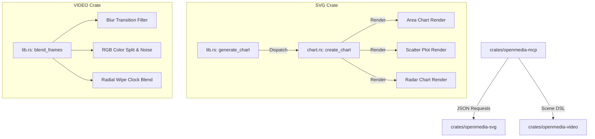

# Advanced Transitions and Chart Types Design Specification

This design specification details the additions of three new chart types (`Area`, `Scatter`, `Radar`) and three new advanced transitions (`Blur`, `Glitch`, `RadialWipe`) to the OpenMedia-RS codebase.

---

## 1. Architectural Overview

The changes are scoped across three crates:
1. **`openmedia-svg`**: Implements the mathematical layouts and SVG rendering paths for the new charts.
2. **`openmedia-video`**: Implements the pixel-blending algorithms for the new transitions inside the CPU rendering pipeline.
3. **`openmedia-mcp`**: Extends the MCP schemas, request structs, and routing macros to expose the new chart and transition options to calling agents.



---

## 2. Chart Types Specification (`crates/openmedia-svg/src/chart.rs`)

### 2.1 Area Chart (`area`)
The Area Chart shares coordinate mapping logic with the Line Chart but closed down to the base X-axis line.
* **Line Path**: Same stroke path `M {x0} {y0} L {x1} {y1} ...`.
* **Area Path**: Generated by closing the path boundaries.
  * Start: `M {x0} {y_base}` (where `y_base` represents the zero value or bottom axis).
  * Line Segment: `L {x0} {y0} L {x1} {y1} ... L {x_n} {y_n}`.
  * Bottom Close: `L {x_n} {y_base} Z`.
* **Styling**: Fills the closed polygon with the primary theme color at `0.30` opacity or uses a linear gradient fading down to zero opacity at the X-axis.

### 2.2 Scatter Plot (`scatter`)
The Scatter Plot isolates point coordinate values without connecting line pathways.
* **Point Markers**: For each coordinate $(x_i, y_i)$, an SVG circle element is appended:
  ```xml
  <circle cx="{x_i}" cy="{y_i}" r="6" fill="{color}" stroke="#ffffff" stroke-width="1.5" />
  ```
* **Labels**: Draws numeric labels and key identifiers slightly offset above the markers (e.g., at $y_i - 12$).

### 2.3 Radar Chart (`radar`)
The Radar (or Spider) chart plots multivariate data on axes starting from a common center point.
* **Polar Coordinate Mapping**:
  * Center $C = (cx, cy)$ where $cx = \frac{\text{width}}{2}$ and $cy = \frac{\text{height}}{2} + 10$.
  * Max Radius $R = \min(\text{width}, \text{height}) \times 0.35$.
  * Spacing Angle: $\Delta\theta = \frac{2\pi}{N}$ (where $N$ is the number of data points).
* **Concentric Grids**: Draws 5 nested regular polygons representing $20\%, 40\%, 60\%, 80\%,$ and $100\%$ thresholds.
* **Spokes**: Draws lines from the center $C$ to the outer vertices of the $100\%$ grid.
* **Data Value Polygon**: Maps values to radii $r_i = R \times \left(\frac{\text{value}_i}{\text{max\_value}}\right)$. The coordinates are:
  $$x_i = cx + r_i \cos\left(i \cdot \Delta\theta - \frac{\pi}{2}\right)$$
  $$y_i = cy + r_i \sin\left(i \cdot \Delta\theta - \frac{\pi}{2}\right)$$
  These vertices are connected to form a closed polygon path, filled with theme color at `0.35` opacity.

---

## 3. Transition Types Specification (`crates/openmedia-video/src/lib.rs`)

### 3.1 Blur Transition (`blur`)
Applies a box-blur peak at $progress = 0.5$ during a crossfade.
* **Radius Calculation**:
  $$R_{t} = \text{round}\left((1.0 - |progress - 0.5| \times 2.0) \times 10.0\right)$$
* **Separable Box Blur**:
  * Horizontal pass: Computes a running window average of color channels across each row.
  * Vertical pass: Computes a running window average of color channels across each column.
* **Blending**: Performs a crossfade blend between the blurred `from` and `to` images.

### 3.2 Glitch Transition (`glitch`)
Applies color channel shifts and row displacements peaking at $progress = 0.5$.
* **Intensity Curve**:
  $$I_{t} = 1.0 - |progress - 0.5| \times 2.0$$
* **Row Offset**: Deterministic scanline tearing offsets applied based on $I_t$.
* **RGB Channel Split**:
  * Red channel read offset: $+offset_x$
  * Green channel read offset: $0$
  * Blue channel read offset: $-offset_x$
* **Noise Overlay**: Subtle random luminance variations added to pixels based on intensity.

### 3.3 Radial Wipe (`radial_wipe`)
Clocks a clockwise angular boundary around a center point.
* **Center**: $C = (cx, cy) = \left(\frac{\text{width}}{2}, \frac{\text{height}}{2}\right)$.
* **Angle Calculation**: For pixel $(x, y)$, $\theta = \text{atan2}(y - cy, x - cx) + \pi$.
* **Boundary check**: If $\left(\frac{\theta}{2\pi}\right) < progress$, copy pixel from target `to` image; otherwise, preserve pixel from source `from` image.

---

## 4. Schema Changes & API Compatibility

### 4.1 `crates/openmedia-svg/src/lib.rs`
* Update `ChartType` enum:
  ```rust
  #[derive(Debug, Clone, Copy, Serialize, Deserialize)]
  #[serde(rename_all = "snake_case")]
  pub enum ChartType {
      Bar,
      Line,
      Pie,
      Area,
      Scatter,
      Radar,
  }
  ```

### 4.2 `crates/openmedia-video/src/lib.rs`
* Update `TransitionType` enum:
  ```rust
  #[derive(Debug, Clone, Serialize, Deserialize)]
  #[serde(rename_all = "snake_case")]
  pub enum TransitionType {
      None,
      Crossfade,
      SlideLeft,
      SlideRight,
      SlideUp,
      SlideDown,
      ZoomIn,
      ZoomOut,
      WipeLeft,
      WipeRight,
      Blur,
      Glitch,
      RadialWipe,
  }
  ```

### 4.3 `crates/openmedia-mcp/src/lib.rs`
* Update internal preset parser functions to support case-insensitive matching of `blur`, `glitch`, and `radial_wipe` in transition parameters.
